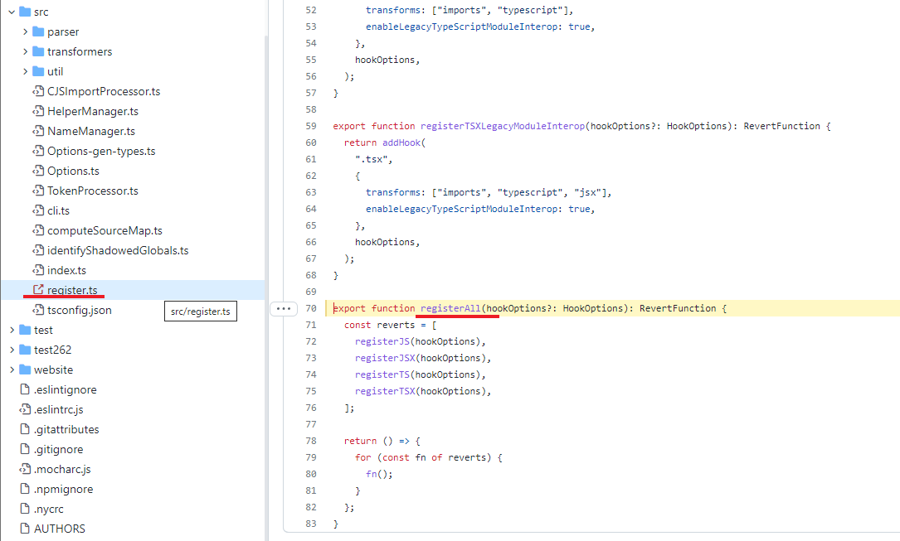
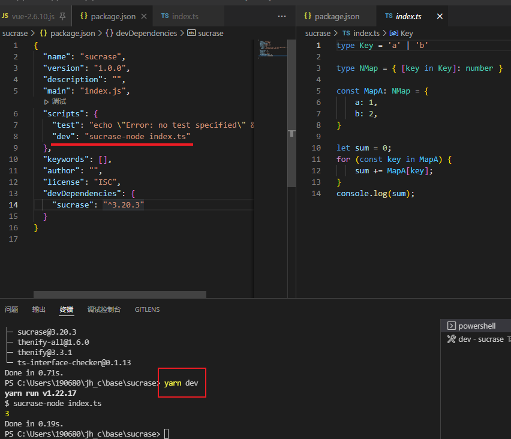
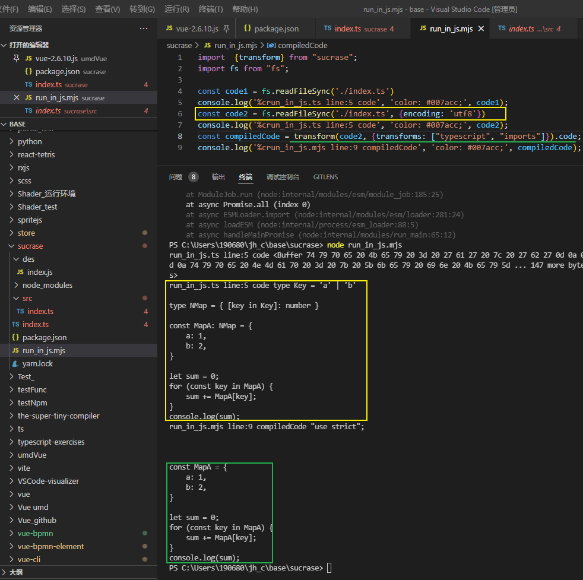
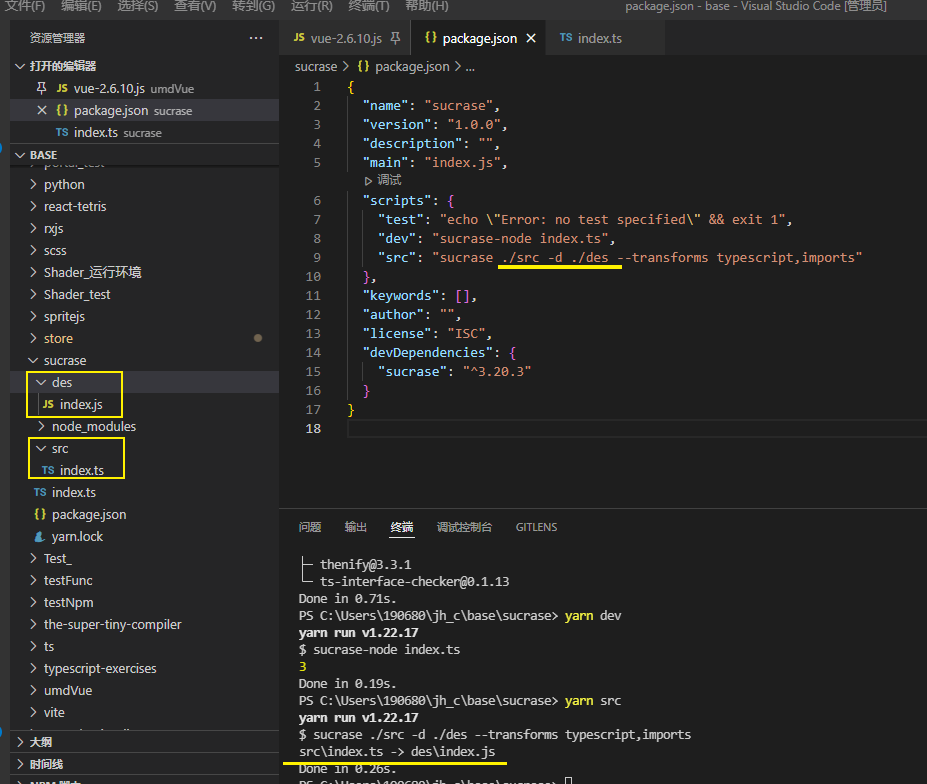
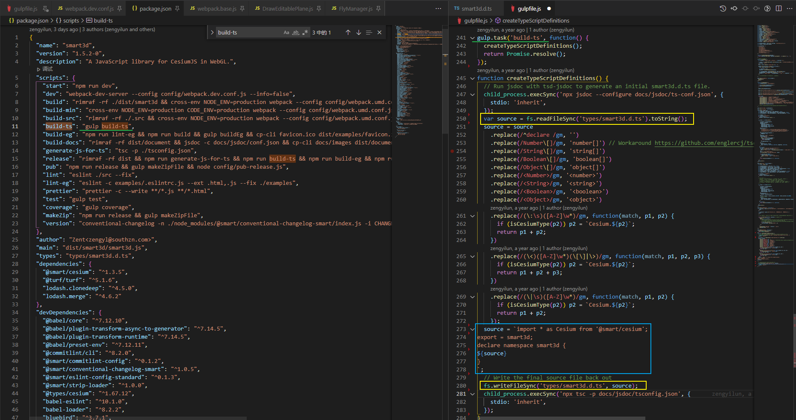

[TOC]

### 今日神句

这个世界上有一个最基本的道理，就是真正赚钱的东西都是偷偷赚、亲兄弟都不想说，但凡是到处宣扬能赚钱的，那一定是他想从你身上抠钱。

包括并不限于：非法吸收公众存款、集资诈骗、某些投资、庞氏骗局、传销、直销等等。

这些跳的最欢的、到处宣传我这个东西多赚钱的，他一定一定有问题啊！

他一定是想得到你的本金啊！真赚钱他不会告诉你的啊！！


### iScene-warning

曾沂轮(329595539) 2021/12/8 10:29:59

- CDK由于Pnpm安装依赖生成TS声明有问题，所以后续将切换到Yarn来管理

- 大家在新安装前请先移除之前工作区几个目录安装的node_modules

曾沂轮(329595539) 9:56:05

- CDK已经全新替换使用Yarn管理包，并且发布v1.0.0-alpha.1版本，并创建dev默认开发分支。记得更新
  http://npm.southsmart.com/-/web/detail/smart3d-vue
  http://www.southsmart.com/smartmap/smart3d-vue/

### iScene-next 早期构建代码理解

master  ---- 490c5562


#### 使用到的库

[sucrase - npm (npmjs.com)](https://www.npmjs.com/package/sucrase)

[GitHub - alangpierce/sucrase: Super-fast alternative to Babel for when you can target modern JS runtimes](https://github.com/alangpierce/sucrase#readme)

[Sucrase](https://sucrase.io/)是一款 **JavaScript/TypeScript 编译器**，目标是提供比标准**[Babel](https://babeljs.io/)编译器**更快的构建速度。

更快的构建意味着更快的迭代，特别是在大型代码基上进行测试的时候。一些测量结果显示，与 Babel 相比，Sucrase 速度提高了 4 至 20 倍。

```txt
        	Time            Speed
Sucrase     1.64 seconds    220221 lines per second
swc         2.13 seconds    169502 lines per second
esbuild     3.02 seconds    119738 lines per second
TypeScript  24.18 seconds   14937 lines per second
Babel       27.22 seconds   13270 lines per second
```


#### Usage:

Installation:

```
yarn add --dev sucrase  # Or npm install --save-dev sucrase
```

Often, you'll want to use one of the **build tool integrations (构建工具集成)**: [Webpack](https://github.com/alangpierce/sucrase/tree/main/integrations/webpack-loader), [Gulp](https://github.com/alangpierce/sucrase/tree/main/integrations/gulp-plugin), [Jest](https://github.com/alangpierce/sucrase/tree/main/integrations/jest-plugin), [Rollup](https://github.com/rollup/plugins/tree/master/packages/sucrase), [Broccoli](https://github.com/stefanpenner/broccoli-sucrase).

Compile on-the-fly via a require **hook** with some [reasonable defaults](https://github.com/alangpierce/sucrase/blob/main/src/register.ts):

```JS
// Register just one extension.
require("sucrase/register/ts");
// Or register all at once.
require("sucrase/register");
```

```js
// register/index.js
require("../dist/register").registerAll();
```



```ts
// src/register.ts
export type RevertFunction = () => void;
export function addHook(
  extension: string,
  options: Options,
  hookOptions?: HookOptions,
): RevertFunction {
  return pirates.addHook(
    (code: string, filePath: string): string => {
      const {code: transformedCode, sourceMap} = transform(code, {
        ...options,
        sourceMapOptions: {compiledFilename: filePath},
        filePath,
      });
      const mapBase64 = Buffer.from(JSON.stringify(sourceMap)).toString("base64");
      const suffix = `//# sourceMappingURL=data:application/json;charset=utf-8;base64,${mapBase64}`;
      return `${transformedCode}\n${suffix}`;
    },
    {...hookOptions, exts: [extension]},
  );
}
export function registerTS(hookOptions?: HookOptions): RevertFunction {
  return addHook(".ts", {transforms: ["imports", "typescript"]}, hookOptions);
}

// ...
export function registerAll(hookOptions?: HookOptions): RevertFunction {
  const reverts = [
    registerJS(hookOptions),
    registerJSX(hookOptions),
    registerTS(hookOptions),
    registerTSX(hookOptions),
  ];

  return () => {
    for (const fn of reverts) {
      fn();
    }
  };
}
```


Compile on-the-fly via a drop-in replacement for node:

```
sucrase-node index.ts
```



在node环境编译 ts 后并执行编译后的 js 文件


Call from JS directly:

```js
import {transform} from "sucrase";
const compiledCode = transform(code, {transforms: ["typescript", "imports"]}).code;
```





Run on a directory:

```
sucrase ./srcDir -d ./outDir --transforms typescript,imports
```

`-d`  后面跟的是输出路径




## What Sucrase is not

Sucrase is intended to be useful for the most common cases, but it does not aim to have nearly the scope and versatility of Babel. Some specific examples:

- Sucrase does not check your code for errors. Sucrase's contract is that if you give it valid code, it will produce valid JS code. If you give it invalid code, it might produce invalid code, it might produce valid code, or it might give an error. Always use Sucrase with a linter or typechecker, which is more suited for error-checking.
- Sucrase is not pluginizable. With the current architecture, transforms need to be explicitly written to cooperate with each other, so each additional transform takes significant extra work.
- Sucrase is not good for prototyping language extensions and upcoming language features. Its faster architecture makes new transforms more difficult to write and more fragile.
- Sucrase will never produce code for old browsers like IE. Compiling code down to ES5 is much more complicated than any transformation that Sucrase needs to do.
- Sucrase is hesitant to implement upcoming JS features, although some of them make sense to implement for pragmatic reasons. Its main focus is on language extensions (JSX, TypeScript, Flow) that will never be supported by JS runtimes.
- Like Babel, Sucrase is not a typechecker, and must process each file in isolation. For example, TypeScript s are treated as regular s rather than inlining across files.`const enum``enum`
- You should think carefully before using Sucrase in production. Sucrase is mostly beneficial in development, and in many cases, Babel or tsc will be more suitable for production builds.

------

Sucrase旨在用于最常见的情况，但它的目标**并不是要具有Babel那样的范围和多功能性**。一些具体的例子：

- Sucrase 不会**检查**您的代码是否存在**错误**。

  Sucrase的契约是：如果你给它有效的代码，它将产生有效的JS代码。如果为其提供无效代码，则可能会生成无效代码、生成有效代码或错误。

  **始终将Sucrase与linter或typechecker一起使用，这更适合错误检查。**

- Sucrase是（not pluginizable）不可插拔的。在当前体系结构中，需要显式编写转换以相互协作，因此每个额外的转换都需要大量的额外工作。

- Sucrase不适合（ prototyping language extensions ）原型语言扩展和（upcoming language features）即将推出的语言功能。其更快的体系结构使新转换更难以编写且更加脆弱。

- Sucrase永远不会为IE这样的旧浏览器生成代码。**将代码编译为ES5比Sucrase需要执行的任何转换都要复杂得多。**

- Sucrase 对（hesitant to implement）实现即将推出的 JS 特性犹豫不决，尽管出于实用原因，其中一些特性是有意义的。它的主要重点是JS运行时永远不会支持的语言扩展（JSX，TypeScript，Flow）。

- 与 Babel 一样，Sucrase 不是类型检查器，必须单独处理每个文件。例如，TypeScript 被视为常规 s，而不是跨文件内联。`const enum` `enum`

- 在生产中使用Sucrase之前，您应该仔细考虑。**Sucrase在开发中大多是有益的，在许多情况下，Babel或tsc将更适合生产版本。**

See the [Project Vision](https://github.com/alangpierce/sucrase/blob/main/docs/PROJECT_VISION.md) document for more details on the philosophy behind Sucrase.

## Motivation

As JavaScript implementations mature, it becomes more and more reasonable to disable Babel transforms, especially in development when you know that you're targeting a modern runtime. You might hope that you could simplify and speed up the build step by eventually disabling Babel entirely, but this isn't possible if you're using a non-standard language extension like JSX, TypeScript, or Flow. Unfortunately, disabling most transforms in Babel doesn't speed it up as much as you might expect. To understand, let's take a look at how Babel works:

1. Tokenize the input source code into a token stream.
2. Parse the token stream into an AST.
3. Walk the AST to compute the scope information for each variable.
4. Apply all transform plugins in a single traversal, resulting in a new AST.
5. Print the resulting AST.

Only step 4 gets faster when disabling plugins, so there's always a fixed cost to running Babel regardless of how many transforms are enabled.

Sucrase bypasses most of these steps, and works like this:

1. Tokenize the input source code into a token stream using **a trimmed-down fork** of the Babel parser. This fork does not produce a full AST, but still produces meaningful token metadata specifically designed for the later transforms.
2. Scan through the tokens, computing preliminary information like all imported/exported names.
3. Run the transform by doing a pass through the tokens and **performing** a number of careful find-and-replace **operations**, like replacing with .``React.createElement(Foo`

Because Sucrase works on a lower level and uses a custom parser for its use case, it is much faster than Babel.

------

随着 JavaScript 实现的成熟，禁用 Babel 转换变得越来越合理，尤其是在开发中，当您知道自己面向的是现代 runtime 时。

您可能希望通过最终完全禁用 Babel 来简化和加快构建步骤，但是如果您使用的是 JSX、TypeScript 或 Flow 等 （non-standard language extension）**非标准语言扩展**，则无法做到这一点。

不幸的是，在 Babel 中禁用大多数转换并不会像您预期的那样加快速度。

为了理解，让我们来看看Babel是如何工作的：

1. 将输入源代码 Tokenize  为  token stream。
2. 将 token stream 解析为 AST。
3. 遍历 AST 以计算每个变量的作用域信息。
4. 在单个遍历中应用所有转换插件，从而生成新的 AST。
5. 打印生成的 AST。

在禁用插件时，只有步骤 4 会更快，因此无论启用了多少次转换，**运行 Babel 始终存在固定的成本**。

Sucrase**绕过了这些步骤中的大多数**，并且的工作方式如下：

1. 使用 Babel 解析器的**精简分支**将输入源代码 Tokenize  为  token stream。此分叉不会生成完整的 AST，但仍会生成专门为后续转换设计的有意义的 token metadata。
2. 扫描令牌，计算初步信息（preliminary information ）， 如所有导入/导出的名称。
3. 通过遍历 tokens 并 **执行**许多仔细的**查找和替换**操作来运行转换， （如替换为 ） 。``React.createElement(Foo`

由于Sucrase在**较低级别上**工作，并且**在其用例中使用自定义解析器，因此它比Babel快得多**。


### smart3d ts类型声明的方式



使用gulp从types/smart3d.d.ts => 替换匹配到的字符串又重新写入该文件


source 始终为**从执行jsdoc命令生成的smart3d.d.ts文件**;

配置ts-config.json的内容:

```json
{
    "tags": {
        "allowUnknownTags": false
    },
    "source": {
        "include": [
            "src"
        ],
        "exclude": [
            "src/base/cesiumMixin.js",
            "src/thirdParty",
            "src/assets",
            "src/styles",
            "src/utils",
            "src/base/rectangularSensor",
            "src/index.js"
        ],
        "includePattern": ".+\\.js(doc)?$",
        "excludePattern": "(^|\\/|\\\\)_"
    },
    "plugins": [
        "node_modules/jsdoc-export-default-interop/dist/index",
        "tsd-jsdoc/dist/plugin"
    ],
    "templates": {
        "cleverLinks": true,
        "default": {
            "outputSourceFiles": false
        },
        "sourceUrl": ""
    },
    "opts": {
        "destination": "types",
        "template": "tsd-jsdoc/dist",
        "outFile": "smart3d.d.ts",
        "recurse": true
    }
}
```


smart3d.d.ts: 始终监听 workspace的注释内容的更改会重新生成文件内容 (不过在gitignore中忽略追踪) 


### jsdoc

[JSDoc 介绍 - 在线文档 - 手册网 (shouce.ren)](https://www.shouce.ren/api/view/a/13232)

[Use JSDoc: Index](https://jsdoc.app/index.html)

[用conf.json配置JSDoc - 在线文档 - 手册网 (shouce.ren)](https://www.shouce.ren/api/view/a/13235)  ---- smart3d 使用该方式生成声明文件

[使用 jsDoc 提升我们的开发效率 - 知乎 (zhihu.com)](https://zhuanlan.zhihu.com/p/391713131)

[配置项解释](https://jsdoc.zcopy.site/about-configuring-jsdoc.html)


### object.asssign

`Object.assign()`方法的第一个参数是目标对象，后面的参数都是源对象。

注意，如果目标对象与源对象有同名属性，或多个源对象有同名属性，则后面的属性会覆盖前面的属性。


### Vue3 computed 如何手动标记类型

**类型声明 `computed`**

计算值将根据返回值自动推断类型

```ts
import { defineComponent, ref, computed } from 'vue'

export default defineComponent({
  name: 'CounterButton',
  setup() {
    let count = ref(0)

    // 只读
    const doubleCount = computed(() => count.value * 2)

    const result = doubleCount.value.split('') // => Property 'split' does not exist on type 'number'
  }
})
```

接受一个 getter 函数，并根据 getter 的返回值返回一个不可变的响应式 [ref](https://v3.cn.vuejs.org/api/refs-api.html#ref) 对象。

```js
const count = ref(1)
const plusOne = computed(() => count.value + 1)

console.log(plusOne.value) // 2

plusOne.value++ // 错误
```


或者，接受一个具有 `get` 和 `set` 函数的对象，用来创建可写的 ref 对象。

```js
const count = ref(1)
const plusOne = computed({
  get: () => count.value + 1,
  set: val => {
    count.value = val - 1
  }
})

plusOne.value = 1
console.log(count.value) // 0
```


**类型声明：**

```ts
// 只读的
function computed<T>(
  getter: () => T,
  debuggerOptions?: DebuggerOptions
): Readonly<Ref<Readonly<T>>>

// 可写的
function computed<T>(
  options: {
    get: () => T
    set: (value: T) => void
  },
  debuggerOptions?: DebuggerOptions
): Ref<T>
interface DebuggerOptions {
  onTrack?: (event: DebuggerEvent) => void
  onTrigger?: (event: DebuggerEvent) => void
}
interface DebuggerEvent {
  effect: ReactiveEffect
  target: any
  type: OperationTypes
  key: string | symbol | undefined
}
```


### Vue3 reactive

reactive(ref({}))

返回的是(ref原对象)
