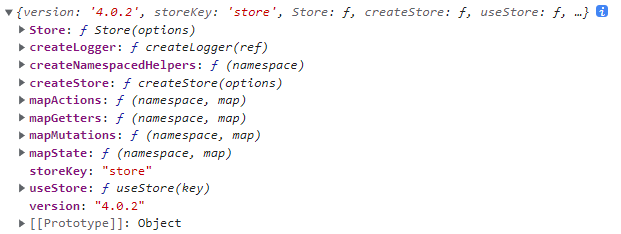

移动端修复bug

1. 地形的显示隐藏
2. WMTS 加载数据
   1. '/mapserver/manager/getServiceBound'
   2. 添加range范围并加载图层
3. 矢量的样式 (dataSource)
   1. 图层配置样式  (layerTree请求里获取)


### 如何在js文件中使用store

```js
import store from 'vuex'
store.createStore()
// 等同于
import {createStore} from 'vuex';
createStore();
```



但是这是新建了一个store实例, **不能引用到Vue组件中的state**


通过vue组件中useStore获取store实例(单例) 传参的方式 放入到js文件中

```js
store.watch(
    state => state.configScheme,
    val => {
        this.configScheme = val
    },
    { immediate: true }
)
```

