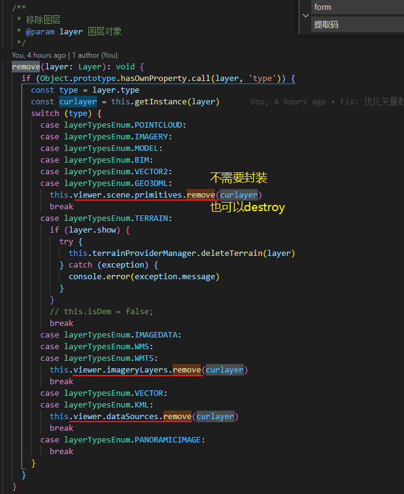

vuex commit 更改后watch监听的回调是异步执行的, 因为要获取到最新的state, 

那么如果想让其同步执行watch怎么操作


### Vuex 的更新同步异步?

https://www.jianshu.com/p/acc13ab1a279

在vuex中，通过提交commit，触发mutations中的方法，来改变state中的状态。Mutation必须是同步函数，异步方法需要写在Action中，在Action中提交commit来改变state的状态，这点在[Mutation | Vuex (vuejs.org)](https://links.jianshu.com/go?to=https%3A%2F%2Fvuex.vuejs.org%2Fzh%2Fguide%2Fmutations.html%23mutation-%E5%BF%85%E9%A1%BB%E6%98%AF%E5%90%8C%E6%AD%A5%E5%87%BD%E6%95%B0)中都有说明。


### 移除图层




```
content-type: application/octet-stream
```


**服务器有好几种原因返回HTML而不是JSON：**

- **请求的url不存在，服务器以HTML的方式返回404页面。**你可能在请求时代码写错（像把/user写成了/users）,或者服务端的代码的错误。
- **当添加了新的路由时，服务器需要重启。**比如你在用Express写的服务器时，刚刚新加了一个`app.get('/users', ...)`路由，但是没有重启，服务器就不会对新的路由地址有反应。
- **客户端的代理没有设置**： 如果在使用像Create React App的Webpack dev server时，你可以设置一个指向后端服务器的代理。
- **API的根url是`/`**,如果你在通过Webpack 或Create React App使用代理,要确认你的API路由不在根的层级`/`。这样会时代理服务器混淆，你将得到一个HTML而不是你的API请求的返回。你可以在如有前面加个前缀像`/api/`。


# 无效的JSON

> JSON应该以有效的JSON值开始 —— 一个object, array, string, number, 或者是
> false/true/null。以`<`开始的返回值会有`Unexpected token <`这样的提示。
> `<`这个符号意味着返回值是HTML而不是JSON。
> 引起这个错误的根源是服务端返回的是HTML或者其他不是Json的字符串。

**为什么会这样呢？**
“Unexpected token o in JSON at position 1” 或者其他变量。
错误的提示一些差别会随着服务器返回的不同而不同

它所提示的符号或者位置可能不同，但是引起它的原因是相同的： 你的代码所有解析的Json不是真的有效的Json。
下面是一些我所看见的错误的提示：

- `Unexpected token < in JSON at position 1`
- `Unexpected token p in JSON at position 0`
- `Unexpected token d in JSON at position 0`
