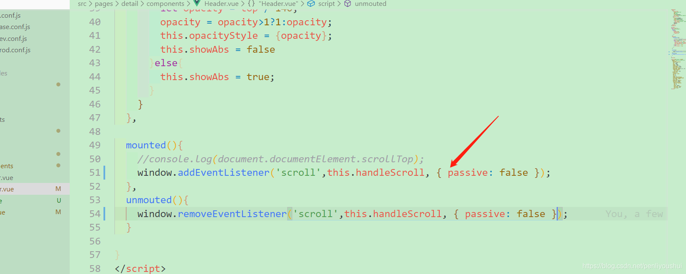

### 浅墨_毛星云 

[毛星云](https://www.zhihu.com/search?q=毛星云&search_source=Entity&hybrid_search_source=Entity&hybrid_search_extra={"sourceType"%3A"answer"%2C"sourceId"%3A2270703632})是真大神，出版的**《逐梦旅程：Windows游戏编程之从零开始》《OpenCV3编程入门 》**，是很多人入行都会看的门槛书，获得过微软最有价值专家奖称号。

游戏开发话题下的优秀答主

[文章_毛星云 - 知乎 (zhihu.com)](https://www.zhihu.com/people/mao-xing-yun/posts?page=2)

[【《Real-Time Rendering 3rd》 提炼总结】(二) 第二章 · 图形渲染管线 The Graphics Rendering Pipeline - 知乎 (zhihu.com)](https://zhuanlan.zhihu.com/p/26527776)

浅墨翻译凝练的rtr3总结绝对是我图形学入门的经典书籍，无论是配图还是讲解都凝练了他的心血……

Windows游戏编程之从零开始 ---- 毛星云

**详细研究过游戏编程的朋友们都应该有这样的共识：“中国人写的书水平上不去，外国人写的书水平有了，但是翻译得往往都强差人意，理解不了”。也许正是这个原因，国内游戏编程的入门门槛一直很高，DirectX一直被人们认为是很难学的。很多怀揣游戏开发梦想的热血青年们，信誓旦旦地开始着手学习游戏编程的时候，却被晦涩难懂的游戏编程教材拒之梦想门外，碰了一鼻子灰，从此和最初的梦想失之交臂。我想，这正是导致国产游戏业界的萎靡，国产游戏一直很难成长起来的原因之一。**

**在这样的环境的激励下，这本倾注我一年多心血的书出现了，它的创作初衷便是渴望能够改变这样的现状。**

**愿这本书，能帮到那些热爱游戏编程、怀揣游戏开发梦想，却苦于难以入门的人们，让他们少走弯路。**

**愿这本书，能为国产游戏、国产游戏引擎的崛起，开启一扇门，迎接新的黎明。**

**我有一个梦想，将来的某一天，大家都能玩到蕴含着中国上下五千年本土文化的优质游戏大作。**

**我有一个梦想，有一天，西游记能出ACT，让老外去体会中国文化西游记中”斗战胜佛”的打击快感，那一定比西方的动作巅峰之作《战神》、《鬼泣》更加深邃。**

**我有一个梦想，有一天，上海滩能出沙盒游戏，而不是玩《GTA》感受美国梦，亦或是玩着《热血无赖》体验国外公司强行塞给我们的“中国文化”。**

**我有一个梦想，有一天，不少3A大作不需要汉化，因为是我们自己的游戏，配音是中文，文化也是中国的。**

**我有一个梦想，将来的某一天，国产游戏能像中国的其他产业一样，以一个领跑者的姿态，面对全世界，面对全宇宙，器宇轩昂，扬眉吐气。**

**这会是由我们一起去完成的梦想。**

**我等着我们的好消息。**

**浅墨 2013年5月于乌克兰**


人生不如意十有八九。 每个人都是普通人，成功只是一时的，失败才是人生的主旋律。


### iScene-mobile

取消了helper, 更改了内存参数, 优化了下样式


### 兼容性组合

iphoneXr => 无内容

iphone13 + firefox => 无内容


### Bug: 企业微信上的浏览器只作用上了一条样式规则


### Bug: iscene-mobile滚不动图层列表

报错: [Intervention] Unable to preventDefault inside passive event listener due to


描述：违反：没有添加被动事件监听器来阻止’touchstart’事件，请考虑添加事件管理者’passive’，以使页面更加流畅。出现如上提示这可能是由于console的过滤器选择了Verbose

由于浏览器必须要在执行事件处理函数之后，才能知道有没有掉用过 preventDefault() ，这就导致了浏览器不能及时响应滚动，略有延迟。



所以为了让页面滚动的效果如丝般顺滑，从 chrome56 开始，在 window、document 和 body 上注册的 touchstart 和 touchmove 事件处理函数，会默认为是 passive: true。浏览器忽略 preventDefault() 就可以第一时间滚动了。


页面不能滑动无非就是css和js两个方面的问题


有的人说如果我写很多个p标签不写任何样式看能不能滑动，如果能滑动说明是样式的原因，要是也不能滑动那就应该是js的原因，是有一定的道理的，但是先别忘了看一下你的html或body是不是加了height：100%；overflow：hidden；

1.下面分先说css的问题，主要排查overflow：hidden；

检查也有一定的顺序，检查超出高度的标签是否用了overflow：hidden；最好先检查html或body是不是加了height：100%；overflow：hidden；然后再看包裹在最外边的元素是否加了overflow：hidden;


2.再说下js方面的问题，主要是有在touchstart、touchmove或touchend等事件中的阻止默认事件的原因

例如：

    $("#myCarousel").on("touchstart", function (e) {
    e.preventDefault();   
    startX = e.originalEvent.changedTouches[0].pageX,
    startY = e.originalEvent.changedTouches[0].pageY;
    })；

这种代码其中e.preventDefault();会阻止掉默认的滚动行为。


### addEventListener的第三个参数

第三个参数还可以是对象

element.addEventListener("touchstart",fn, options)

```
{capture: Boolean, passive: Boolean, once: Boolean}
```

第一个参数 capture ~ true|false ~ 事件捕获阶段冒泡阶段

第二个参数 passive ~ true|flase ~ 不能调用 | 可以调用preventDefault()

第三个参数 once ~ true|false ~ 只能执行一次fn | 不限制


## 触摸事件的种类

触摸引发的事件，有以下几种。可以通过`TouchEvent.type`属性，查看到底发生的是哪一种事件。

- `touchstart`：用户开始触摸时触发，它的`target`属性返回发生触摸的元素节点。
- `touchend`：用户不再接触触摸屏时（或者移出屏幕边缘时）触发，它的`target`属性与`touchstart`事件一致的，就是开始触摸时所在的元素节点。它的`changedTouches`属性返回一个`TouchList`实例，包含所有不再触摸的触摸点（即`Touch`实例对象）。
- `touchmove`：用户移动触摸点时触发，它的`target`属性与`touchstart`事件一致。如果触摸的半径、角度、力度发生变化，也会触发该事件。
- `touchcancel`：触摸点取消时触发，比如在触摸区域跳出一个情态窗口（modal window）、触摸点离开了文档区域（进入浏览器菜单栏）、用户的触摸点太多，超过了支持的上限（自动取消早先的触摸点）
