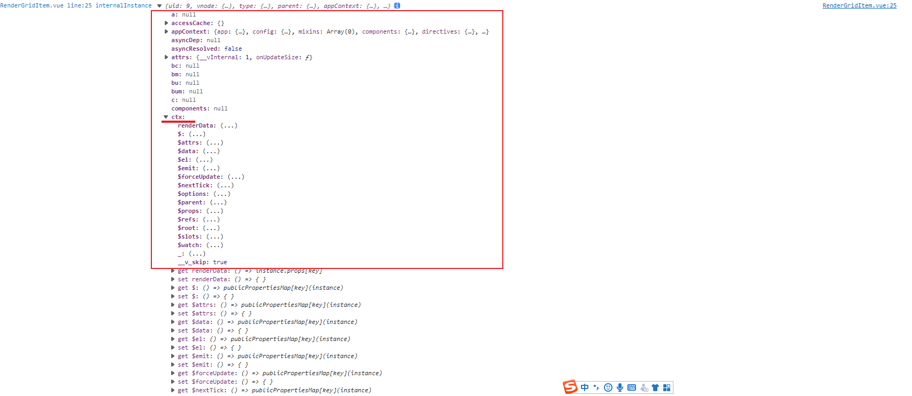

[TOC]

### addEventListener 第三个参数

```
target.addEventListener(type, listener, options);
```

options 可选

一个指定有关 `listener `属性的可选参数**对象**。可用的选项如下：

- `capture`:  [`Boolean`](https://developer.mozilla.org/zh-CN/docs/Web/JavaScript/Reference/Global_Objects/Boolean)，表示 `listener` 会在该类型的事件捕获阶段传播到该 `EventTarget` 时触发。

- `once`:  [`Boolean`](https://developer.mozilla.org/zh-CN/docs/Web/JavaScript/Reference/Global_Objects/Boolean)，表示 listener 在添加之后最多只调用一次。如果是`true`， `listener` 会在其被调用之后自动移除。

- `passive`: [`Boolean`](https://developer.mozilla.org/zh-CN/docs/Web/JavaScript/Reference/Global_Objects/Boolean)，设置为true时，表示 `listener` 永远不会调用 `preventDefault()`。如果 listener 仍然调用了这个函数，客户端将会忽略它并抛出一个控制台警告。查看 [使用 passive 改善的滚屏性能](https://developer.mozilla.org/zh-CN/docs/Web/API/EventTarget/addEventListener#使用_passive_改善的滚屏性能) 了解更多.

  ----------- 以下参数不需要额外关注

- `signal`：[`AbortSignal`](https://developer.mozilla.org/zh-CN/docs/Web/API/AbortSignal)，该 `AbortSignal` 的 [`abort()`](https://developer.mozilla.org/zh-CN/docs/Web/API/AbortController/abort) 方法被调用时，监听器会被移除。

- ` mozSystemGroup`: 只能在 XBL 或者是 Firefox' chrome 使用，这是个 [`Boolean`](https://developer.mozilla.org/zh-CN/docs/Web/JavaScript/Reference/Global_Objects/Boolean)，表示 `listener `被添加到 system group。


### [使用 passive 改善的滚屏性能](https://developer.mozilla.org/zh-CN/docs/Web/API/EventTarget/addEventListener#使用_passive_改善的滚屏性能)

根据规范，`passive` 选项的默认值始终为false。但是，这引入了处理某些触摸事件（以及其他）的事件监听器在**尝试处理滚动时阻止浏览器的主线程**的可能性，从而导致滚动处理期间性能可能大大降低。

为防止出现此问题，某些浏览器（特别是Chrome和Firefox）已将文档级节点 [`Window`](https://developer.mozilla.org/zh-CN/docs/Web/API/Window)，[`Document`](https://developer.mozilla.org/zh-CN/docs/Web/API/Document)和[`Document.body`](https://developer.mozilla.org/zh-CN/docs/Web/API/Document/body)的`touchstart (en-US)`和`touchmove (en-US)`事件的`passive`选项的默认值更改为true。这可以防止调用事件监听器，因此在用户滚动时无法阻止页面呈现。

```
var elem = document.getElementById('elem');
elem.addEventListener('touchmove', function listener() { /* do something */ }, { passive: true });
```


添加passive参数后，`touchmove`事件不会阻塞页面的滚动（同样适用于鼠标的滚轮事件）。在这里查看[demo](https://developers.google.com/web/updates/2016/06/passive-event-listeners)（需要翻墙）。

**注意：**那些不支持参数`options`的浏览器，会把第三个参数默认为`useCapture`，即设置`useCapture`为true

您可以通过将`passive`的值显式设置为`false`来覆盖此行为，如下所示：

```
/* Feature detection */
/*特征检测*/
var passiveIfSupported = false;

try {
  window.addEventListener("test", null, Object.defineProperty({}, "passive", { get: function() { passiveIfSupported = { passive: true }; } }));
} catch(err) {}

window.addEventListener('scroll', function(event) {
  /* do something */
  // can't use event.preventDefault();
  // 不能使用 event.preventDefault()
}, passiveIfSupported );
```

在不支持`addEventListener()`的`options`参数的旧浏览器上，尝试使用它会阻止使用`useCapture`参数而不正确使用特征检测。

您无需担心基本`scroll (en-US)` 事件的`passive`值。由于无法取消，因此事件监听器无法阻止页面呈现。


### demo

New to Chrome 51, passive event listeners are an emerging web standard that provide a major potential boost to scroll performance, especially on mobile. Check out the video below for a side-by-side demo of the improvements in action:


**Note:** The basic `scroll` event cannot be canceled, so it does not need to be set passive. However, you should still [prevent expensive work](https://developer.mozilla.org/en-US/docs/Web/Events/scroll#Example) from being completed in the handler.

> 注意：无法取消基本滚动事件，因此不需要设置被动。
>
>  但是，您仍然应该防止在处理程序中完成昂贵的工作。

When you scroll a page and there's such a delay that the page doesn't feel anchored to your finger, that's called scroll jank. Many times when you encounter scroll jank, the culprit is a touch event listener. Touch event listeners are often useful for tracking user interactions and creating custom scroll experiences, such as cancelling the scroll altogether when interacting with an embedded Google Map. Currently, browsers can't know if a touch event listener is going to cancel the scroll, so they always wait for the listener to finish before scrolling the page. Passive event listeners solve this problem by enabling you to set a flag in the `options` parameter of `addEventListener` indicating that the listener will never cancel the scroll. That information enables browsers to scroll the page immediately, rather than after the listener has finished.

> 翻译
>
> 当您滚动页面并且出现延迟，以至于页面感觉不到您的手指固定时，这称为滚动卡顿。
>
> 很多时候，当您遇到滚动卡顿时，罪魁祸首是触摸事件侦听器。
>
> 触摸事件侦听器通常可用于跟踪用户交互和创建自定义滚动体验，例如在与嵌入式 Google 地图交互时完全取消滚动。
>
> 目前，**浏览器无法知道触摸事件侦听器是否会取消滚动，因此它们总是在滚动页面之前等待侦听器完成**。
>
> 被动事件侦听器通过允许您在`options`参数中设置标志来解决此问题 `addEventListener` 表示侦听器永远不会取消滚动。该信息使浏览器能够立即滚动页面，而不是在侦听器完成之后。


### iScene 带 查询参数的访问方式

后台运维中的服务预览

服务预览地址: 

`http://172.16.11.71:8011/web3d/iScene/#/brower/1110749070?url=http:%2F%2F172.16.11.71:8070%2Fsgeocserver%2Fmapserver%2Frest%2Fseaweedfs%2FFZ2011011021%2Ff95a711f40f64cf1af8d99d411a46baf%2Fdata%2Flayer&type=KML&serviceId=0ac570f6-4686-41f1-bb97-e3a00f1e375c`


### bug: kml/kmz定位失效

?


### 大屏自适应

通过更改rem来设置

**1rem等于html根元素设定的font-size的px值**

如果css里面没有设定html的font-size，则默认浏览器以1rem=16px来换算。

 

下面说说谷歌浏览器使用rem时要注意的地方：

　　谷歌浏览器默认字体大小最小是12px,如果为了计算方便而将html根元素字体设置为10px,即`html{font-size:10px;}`

　　此时子元素使用rem时来设置字体大小以及height\width等要注意:

　　　　1.当字体大小小于12px时浏览器一律显示12px,如`p{font-size:0.9rem;}`，实际浏览器将p元素内字体大小以1.2rem显示

　　　　2.当rem设置height\width时rem和px转换比是1：12，并非1:10。原因：谷歌浏览器默认字体大小最小是12px


#### getCurrentInstance

https://v3.cn.vuejs.org/api/composition-api.html#getcurrentinstance

> WARNING
>
> `getCurrentInstance` 只暴露给**高阶使用场景**，典型的比如在**库**中。
>
> 强烈反对在**应用**的代码中使用 `getCurrentInstance`。
>
> 请**不要**把它当作在组合式 API 中获取 `this` 的替代方案来使用。

`getCurrentInstance` **只能**在 [setup](https://v3.cn.vuejs.org/api/composition-api.html#setup) 或[生命周期钩子](https://v3.cn.vuejs.org/api/composition-api.html#生命周期钩子)中调用。


