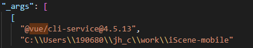
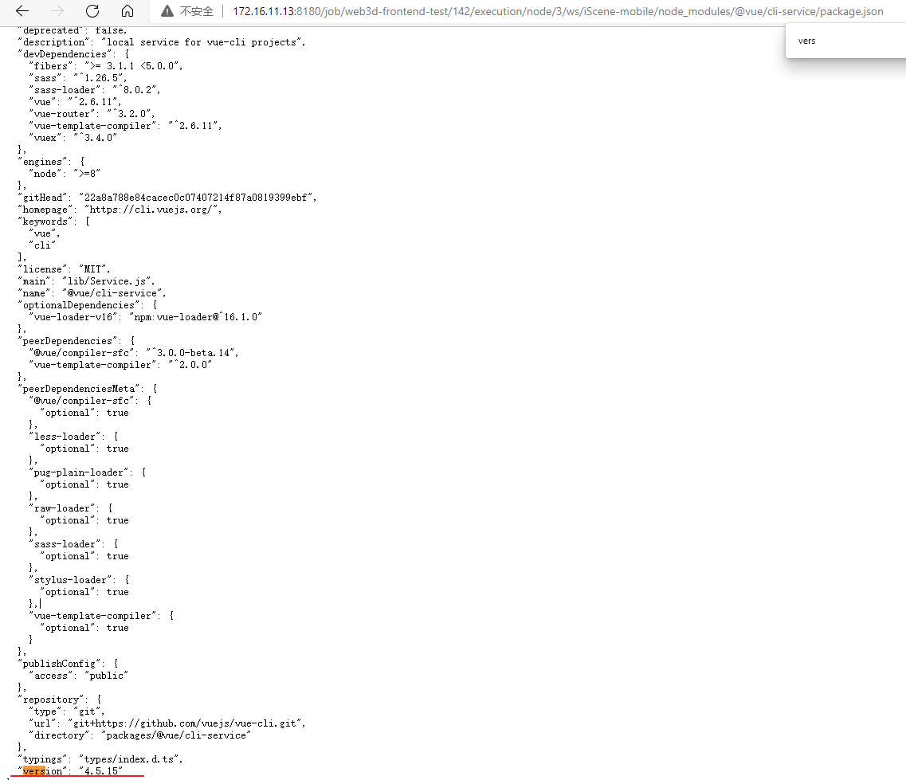
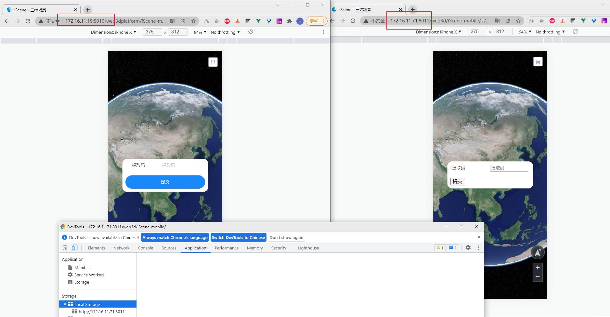

# vue-cli 3.0 引入 vant 打包后样式丢失

https://www.it610.com/article/1203487376656146432.htm

UI库版本已经固定

需要排查的是打包工具 vite/vue-cli

本地4.5.13 

生产环境 4.5.15

### 本地升级版本

update @vue/cli-service

然后再重新install (因为更新的cli增加了新的依赖)

build-docker => 检测样式文件是否正常... 还是正常的

### 检查其他模块

1. ts-import-plugin 版本相同
2. 

### 思考--是否只需要关注package中的dependencies

devdependcies是开发依赖, 是不是不需要关注呢

打包过程出现问题, 应该是要一起关注吧

### 排查环境

### 11

### splitchunks.cachegroups

https://webpack.docschina.org/plugins/split-chunks-plugin/#splitchunkscachegroups
