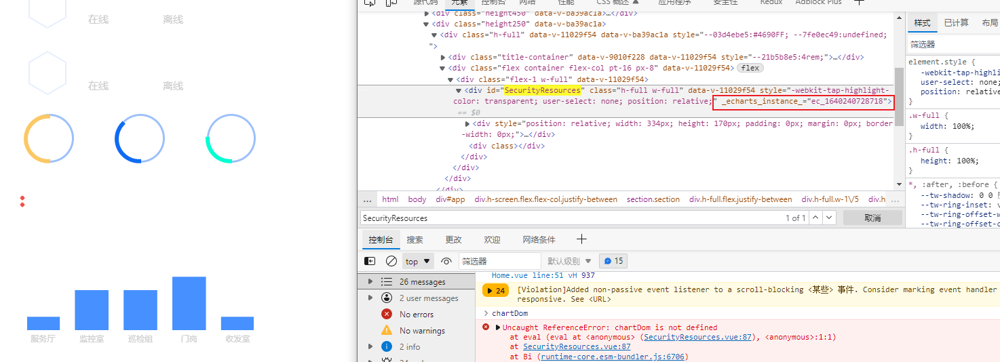

### echart 在路由切换后不渲染了(打包后)

1. 开发环境没问题

2. 打包后, 出现问题解决方式:

3. 移除对应echart容器的echart_instance属性

   


### ue4内置的谷歌浏览器中无法通过video标签播放视频

1. 如果是相对路径引入, 则是file协议, 请求状态码为`canceled`
2. 如果是访问http/s的资源, 则是请求成功, 状态码为'206', 但是无法播放


### 三种标签播放视频资源

```html
      <video src="./media/movie.mp4"></video>
      <embed width="200" height="200" src="./media/movie.mp4"></embed>
      <object width="200" height="200" data="./media/movie.mp4"></object>
```


### 查看浏览器版本及内核信息

打开浏览器 - F12 - 控制台 -
查看浏览器产品代号`navigator.appCodeName`
查看版本号，操作系统和应用程序版本号`navigator.appVersion`
