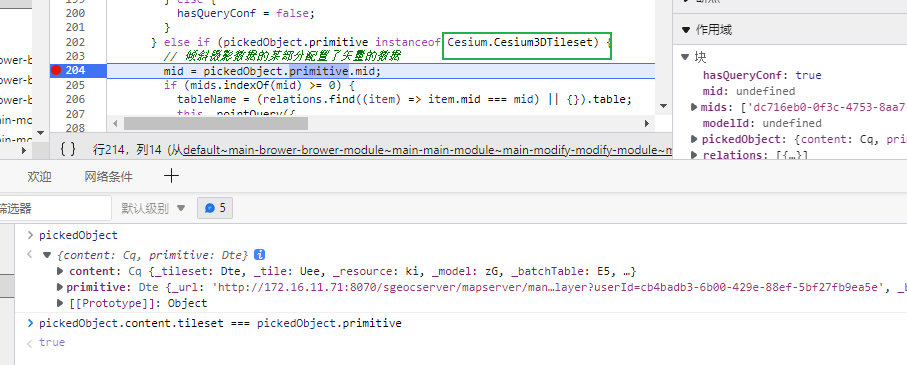
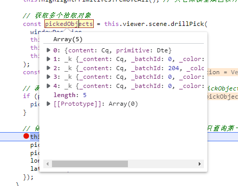

### Cesium3DTileFeature

[Cesium3DTileFeature - Cesium Documentation](https://cesium.com/learn/cesiumjs/ref-doc/Cesium3DTileFeature.html?classFilter=Cesium3DTileFeature)

[本地#](../_Cesium/Cesium3DTileFeature.md)

### 属性查询

按类型分

mid => modelId

### modelId

### 拾取多个对象

