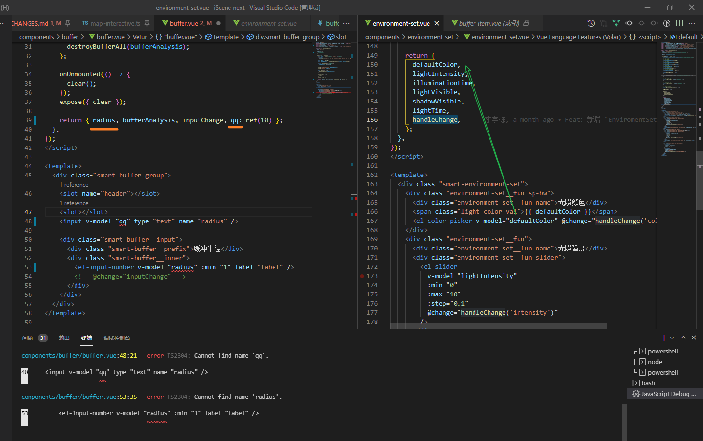
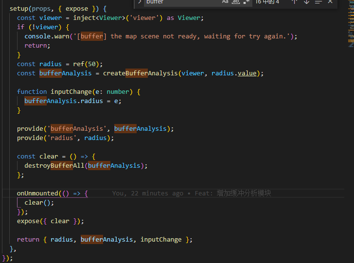
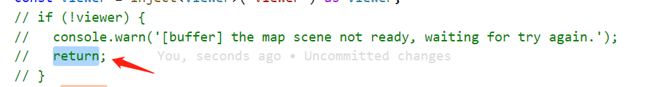

[前端工程师生产环境 debugger 技巧 (qq.com)](https://mp.weixin.qq.com/s/zTH6uxDT8xy-_saMJpJTwQ)

["Cannot find name" and other problems with TypeScript-SFC · Issue #1388 · vuejs/vetur (github.com)](https://github.com/vuejs/vetur/issues/1388)

原因是setup函数提前return

这里不能加return 会把这个sfc上下文推出
