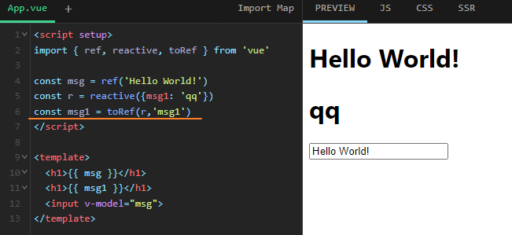
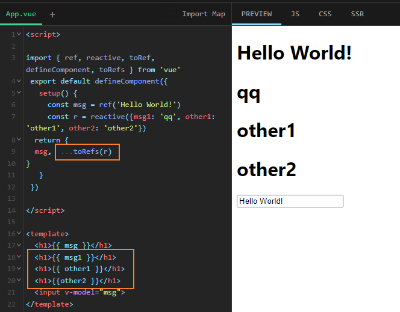

## 对象解构&导入解构

重命名对象

如果变量名与属性名不一致，必须写成下面这样。

```javascript
let { foo: baz } = { foo: 'aaa', bar: 'bbb' };
baz // "aaa"

let obj = { first: 'hello', last: 'world' };
let { first: f, last: l } = obj;
f // 'hello'
l // 'world'
```

对象的解构赋值的内部机制，是先找到同名属性，然后再赋给对应的变量。**真正被赋值的是后者**，而不是前者。

[对象的解构赋值](https://es6.ruanyifeng.com/#docs/destructuring#%E5%AF%B9%E8%B1%A1%E7%9A%84%E8%A7%A3%E6%9E%84%E8%B5%8B%E5%80%BC)


模块的接口改名，也可以采用这种写法。

```javascript
// 接口改名
export { foo as myFoo } from 'my_module';
```

[export-与-import-的复合写法](https://es6.ruanyifeng.com/#docs/module#export-%E4%B8%8E-import-%E7%9A%84%E5%A4%8D%E5%90%88%E5%86%99%E6%B3%95)


### 如何重置reactive中的属性

let obj = reactive({})

这个时候会生成一个地址，然后通过return的方式，告诉模板，于是模板记住了这个地址。

obj = {}

这个时候，又产生了一个新的地址，原地址没有变化。

而**模板还在盯着原地址，并不知道换了新地址，所以模板没有变化。**

想要清空，一个是用你的那种遍历delete的方法。

另一个是用ref。

还有就是，一般需要清空的需求，都是数组。

如果是数组的话，可以这样

let obj = reactive([])

obj.length=0

obj.push(新数组元素)


**所以不要改变obj的地址, 不要用新的对象来覆盖**


### reactive 定义的变量属性在模板中使用的方法





直接在setup的return结果中使用 toRefs 将reactive中的属性转成 ref 

https://v3.cn.vuejs.org/api/refs-api.html#torefs


**但是在ts中报错怎么办?**

识别other1, other2出错...


| 属性名             | 类型                                                         | 默认值           | 描述                          |
| ------------------ | ------------------------------------------------------------ | ---------------- | ----------------------------- |
| `horizontalAngle`  | Number                                                       | `120`            | *optional*水平张角            |
| `verticalAngle`    | Number                                                       | `90`             | *optional*垂直张角            |
| `frustum`          | Boolean                                                      | `true`           | *optional*视椎体是否显示      |
| `visibleAreaColor` | [Color](http://www.southsmart.com/smartmap/smart3d/cesiumdoc/Color.html) | `Color(0, 1, 0)` | *optional*可视颜色            |
| `hiddenAreaColor`  | [Color](http://www.southsmart.com/smartmap/smart3d/cesiumdoc/Color.html) | `Color(1, 0, 0)` | *optional*不可视颜色          |
| `alpha`            | Number                                                       | `0.5`            | *optional*透明度，[0-1]区间值 |

