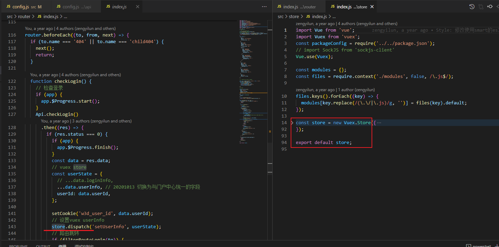

## [系统架构的一些原则](https://coolshell.cn/articles/21672.html)

(左耳听风)


### rxdb

[慢速索引数据库 ·RxDB - 文档](https://rxdb.info/slow-indexeddb.html)


# [ Dock Life: Using Docker for All The Things!](https://nystudio107.com/blog/dock-life-using-docker-for-all-the-things)

Docker 使用的"容器化"方法有许多优点：

- **Docker 映像是一次性的**。如果出现问题，您可以将它们扔掉，而不会影响您的实际计算机
- **您可以运行特定版本**。您不会被锁定在计算机上安装的工具的版本，您可以启动所需工具的任何版本
- **切换到新计算机很容易**。您不必花费数小时精心重新配置闪亮的新款MacBook Pro，其中包含您需要的所有互连工具和软件包
- **你可以用 aplomb 来实验**。如果您对新工具或技术感到好奇，可以给它一个旋风。如果它不起作用，只需丢弃图像
- **Docker 映像是自包含的**。您不必为了让它们正常工作而争先恐后地下载一组互连的依赖项

...还有很多其他的。


### vuex store在js中使用




### b3dm是一个缩写，它的全称是：Batched 3D Mode(批量化3d模型)

b3dm也是一种数据格式，这种格式符合3d tiles规范，能够做一些操作，比如说查询，分层设色等。b3dm格式的数据通常都是城市的批量化的建筑模型，例如倾斜摄影模型。在实际的生产应用中，倾斜摄影（或者别的格式的大批量模型）的格式并不是b3dm格式的，绝大多数的倾斜摄影模型格式是osgb，还有一部分是obj，所以我们需要把它转化成b3dm格式的数据，才能进行进一步的操作。


### Features

```js
feature._content instanceof Cesium.Batched3DModel3DTileContent // b3dm
feature._content instanceof Cesium.Instanced3DModel3DTileContent //i3dm
feature._content instanceof Cesium.Composite3DTileContent //cmpt
```

