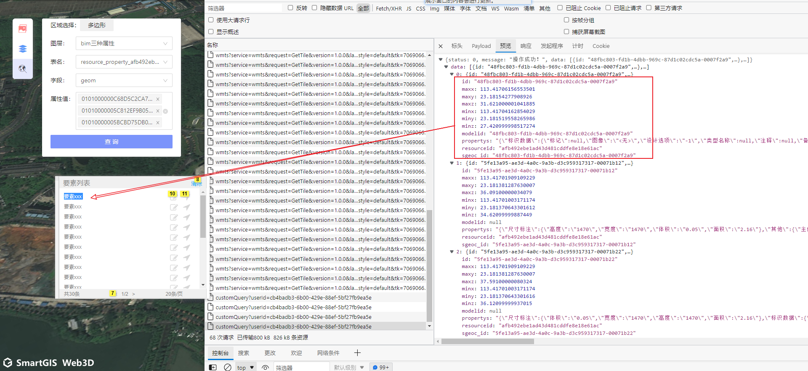
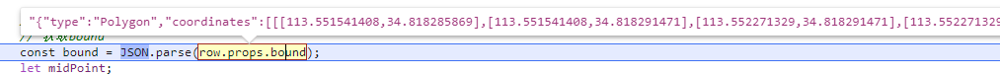
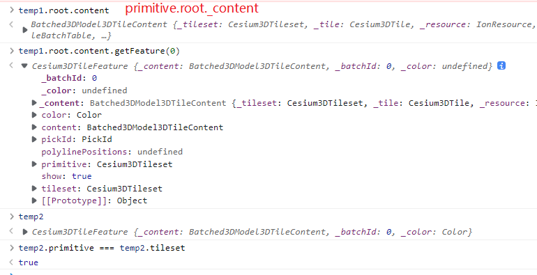
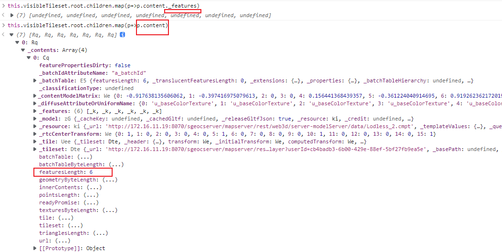

## [中国山水画生成器](https://zverok.github.io/blog/2021-12-28-grok-shan-shui.html)

[中国山水画生成器](https://github.com/LingDong-/shan-shui-inf)是一个很有名的软件，一个老外用户很惊叹，希望把它彻底搞懂，就写了这个由24篇文章组成的系列，逐一分析代码，看看能否自己重新实现。

[彻底理解中国山水画生成器](https://zverok.github.io/blog/2021-12-28-grok-shan-shui.html)


### 京港澳高速

京港澳高速的起点是北京，终点是深圳。

京港澳高速公路有很多省份的不同路段


广连高速项目全长231.7公里，起于广州市花都区花东镇，终于清远连州市大路边镇。


## [Why you should check-in your node dependencies - Jack Franklin](https://www.jackfranklin.co.uk/blog/check-in-your-node-dependencies/)

**是否需要将node_modules添加到版本管理工具**

不要添加进去的原因: 

This seemed like solid advice for multiple reasons:

- The code within `node_modules` isn't **authored** by the team directly.
- The code within `node_modules` is often quite **large** and would cause a lot of noise in git diffs and pull requests.(会在 git diffs 和拉取请求中引起很多噪音。)
- The code within `node_modules` can easily be replicated with an `npm` install.


work at Google on the Chrome DevTools team and we check our `node_modules` folder into source control. 

谷歌的开发团队会将node_modules添加到版本控制中.

有一些主要的好处，我认为更多的人应该考虑:

### 无需 npm 安装

there's no need to run an install step before you can get up and running on the codebase.

 a big boost for any bots you might have running on a Continuous Integration platform (e.g. CircleCI, GitHub Actions, and so on).  (在持续集成平台上运行的任何机器人（例如CircleCI，GitHub Actions等）来说都是一个很大的推动力)

### **有保证的复制版本**

two developers running the code are running the exact same code with the exact same set of dependencies. (可以保证运行代码的两个开发人员正在运行完全相同的代码，并具有完全相同的依赖项集)

this can be managed by a package-lock.json file, or other tools, but I've seen all of them slip up rarely or allow a slight variation in a minor version number that causes issues.  (可以保证运行代码的两个开发人员正在运行完全相同的代码，并具有完全相同的依赖项集)

Once the dependencies are in git, you cannot possibly run with anything other than those and each developer will be running the exact codebase. (一旦依赖项在git中，你就不可能使用除这些依赖项以外的任何东西运行，每个开发人员都将运行确切的代码库)

### Better awareness of the code you're shipping

I've been surprised at how more aware I am of adding dependencies when the git diff shows me the entirety of the code that is being added to the project. This has lead us to make contributions to tools to help reduce their file size on disk and have a better awareness of the impact a dependency will have on our bundle size.

> ## 更好地了解您要发送的代码
>
> 令我惊讶的是，当git diff向我显示要添加到项目中的整个代码时，我对添加依赖项的意识越来越强。
>
> 这促使我们对工具做出了贡献，以帮助减小它们在磁盘上的文件大小，并更好地了解依赖关系将对我们的捆绑包大小产生的影响。


## More consideration to adding a dependency because it's not invisible

I mentioned earlier that people see the noise in a git diff as a downside to adding dependencies to version control, and I do acknowledge that it can be a downside to this approach, but I've found that noise to often be a useful signal. Adding that one extra dependency because I don't want to write a few lines of code myself is something I used to do frequently - but now I'm much more considered because I can see the code that's being added and can reflect on if it's worth it.

*Note: this doesn't mean that we don't have dependencies!* There are times where it is worth it to add a dependency - but seeing the code in version control has made me more considered about doing it - the cost is no longer invisible.

> ## 添加依赖项时需要考虑更多因素，因为它不可见
>
> 我之前提到过，人们将git diff中的噪声视为向版本控制添加依赖项的缺点，我确实承认这可能是这种方法的缺点，但我发现噪声通常是一个有用的信号。
>
> 添加一个额外的依赖项，因为我不想自己编写几行代码，这是我以前经常做的事情 - 但现在我考虑得更多，因为我可以看到正在添加的代码，并且可以反思它是否值得。
>
> *注意：这并不意味着我们没有依赖关系！*有时添加依赖项是值得的 - **但是在版本控制中看到代码使我更加考虑这样做 - 成本不再是看不见的。**


### You can manage the large diffs

There is no shying away from the fact that if a developer works on a change that adds a new dependency, there could be a lot of noise in the diff. One of our dependencies that we check in is TypeScript, and every time we update that, the git diff is huge and frankly not worth looking at (beyond the CHANGELOG). We've come up with a rule that helps us here: a change that updates `node_modules` may not touch any other code in the codebase. So if I update `node_modules/typescript` with its latest version, I will be warned by our tooling if any other folder outside of `node_modules` is changed.

This rule serves us well the majority of the time, because any work that relies on a new or updated dependency can be split into two changes:

1. Update the dependency
2. Use the dependency in the code

There are times where this doesn't work; updating TypeScript may require us to update some code to fix errors that the new version of TypeScript is now detecting. In that case we have the ability to override the rule.

> ## 可以管理大型差异
>
> 如果开发人员处理添加新依赖项的更改，则差异中可能会有很多噪音。
>
> 我们签入的依赖项之一是TypeScript，每次我们更新它时，git diff都是巨大的，坦率地说不值得一看（除了CHANGELOG之外）
>
> 我们提出了一个规则，可以在这里帮助我们：更新`node_modules`的更改可能不会触及代码库中的任何其他代码
>
> 如果我使用`node_modules/typescript`最新版本进行更新，如果更改了其他文件夹，我们的工具将警告我。
>
> 此规则在大多数情况下都对我们很有帮助，因为任何依赖于新的或更新的依赖项的工作都可以分为两个更改：
>
> 1. 更新依赖项
> 2. 在代码中使用依赖项
>
> 有时这不起作用;更新 TypeScript 可能需要我们更新一些代码来修复新版本 TypeScript 现在检测到的错误。在这种情况下，我们有能力覆盖规则。


### Protection from another left pad

The [now infamous left_pad incident](https://qz.com/646467/how-one-programmer-broke-the-internet-by-deleting-a-tiny-piece-of-code/), where a popular npm package was removed from the repository all of a sudden, causing builds everywhere to break, would not have impacted a team who checked all their dependencies into git. They would still have to deal with the long term impact of "what do we do with this now unsupported dependency", but in the short term their builds wouldn't break and they wouldn't be blocked on shipping new features.

> 一个流行的npm包突然从存储库中删除，导致各地的构建中断
>
> 不会影响将所有依赖项检查到git的团队。

## Conclusion

If I was starting a new codebase this week, or joining a small start-up just getting their first version off the ground, I would advocate strongly for checking `node_modules` into version control. It absolutely takes some getting used to, but in my experience over the last two years of working this way the benefits I've listed above strongly outweigh the additional git noise and slight overhead.

> 如果我本周开始一个新的代码库，或者加入一个刚刚开始他们的第一个版本的小型初创公司，我会强烈建议添加`node_modules`版本控制。这绝对需要一些时间来适应，但根据我过去两年以这种方式工作的经验，我上面列出的好处远远超过了额外的git噪音和轻微的开销


#### 个人总结

把node_modules添加到版本管理工具, 无疑是很大的工作量; 具体会体现在依赖的添加和更新时; 在某些时候会为了让依赖项不再复杂会在加入/更新依赖时考虑更多;

对个人的要求会更严格


### 空间查询数据处理



如何高亮&定位:  参考以前的空间查询?

通过id(modelid)高亮, 没有id的呢? nodeid?

通过设置tileset的style的判断条件筛选; 筛选上色demo [3D Tiles Feature Styling - Cesium Sandcastle](https://sandcastle.cesium.com/?src=3D Tiles Feature Styling.html)

​	条件是需要额外的判断...


依赖后台的geom数据

高亮是需要画一层面上去 ~ 参考点查询的倾斜高亮处理


定位

```js
// 中心点定位 & 获取bound
const bound = JSON.parse(row.props.bound);
```




### 属性查询-点查询

高亮依赖返回的geom数据

```json
{
    "type": "MultiPolygon",
    "coordinates": [
        [
            [
                [
                    102.61930412,
                    37.937705539
                ],
                [...]
                [
                    102.61930412,
                    37.937705539
                ]
            ]
        ]
    ]
}
```


### 验证3DTileset上的features是否具有某个属性

```js
primitive.root.children[0].content._features.map(c=>c.getPropertyNames())
```

不会直接挂载在对象上, 应该是内部建立了一个对象的索引, 用于提供查询;

**getPropertyNames** + getProperty 两个方法配合使用


### 遍历features ?



getFeature(batchid)

batchId: [0, length - 1 ]

**如果_features没有属性值, 则往内部继续读取content**


