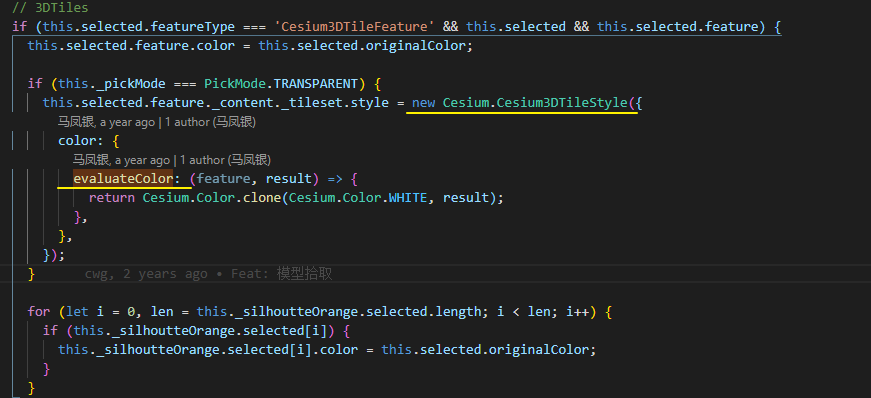

## 图层样式设置

`LayerManager.setMaterialOptions` 设置材质参数

`layer.type = layerTypesEnum.MODEL || layerTypesEnum.BIM || layerTypesEnum.IMAGERY`

```ts
 setMaterialOptions(id: string, options: MaterialsType, tileset?: Cesium.Cesium3DTileset) {
    const cmlayer = tileset || this.getCesiumLayerById(id);
    if (cmlayer) {
        // 颜色 ---- Cesium3DTileStyle 对象中的color
      const color = /^\#/.test(options.color) ? `color('${options.color}')` : options.color;
      cmlayer.style = new Cesium.Cesium3DTileStyle({
        color,
      });
        
      // 设置模型倾斜材质光照
      cmlayer.luminanceAtZenith = options.luminanceAtZenith;
      cmlayer.imageBasedLightingFactor = new Cesium.Cartesian2(
        options.imageBasedLighting,
        options.imageBasedLighting,
      );

      if (cmlayer.type === layerTypesEnum.MODEL && options?.flowTextureOptions?.enable) {
        const flowTextureOptions = options?.flowTextureOptions;
		
          // 流动纹理
        cmlayer.flowTexture = new Cesium.FlowTexture({
          enable: flowTextureOptions.enable ?? defaultFlowTextureOptions.enable,
          scaledDown: flowTextureOptions.scaledDown ?? defaultFlowTextureOptions.scaledDown,
          speed: flowTextureOptions.speed ?? defaultFlowTextureOptions.speed,
          forward: flowTextureOptions.forward ?? defaultFlowTextureOptions.forward,
          verticalOrigin:
            flowTextureOptions.verticalOrigin ?? defaultFlowTextureOptions.verticalOrigin,
          horizontalOrigin:
            flowTextureOptions.horizontalOrigin ?? defaultFlowTextureOptions.horizontalOrigin,
          repeat: new Cesium.Cartesian2(
            flowTextureOptions.repeatX ?? defaultFlowTextureOptions.repeatX,
            flowTextureOptions.repeatY ?? defaultFlowTextureOptions.repeatY,
          ),
          image: flowTextureOptions.image ?? defaultFlowTextureOptions.image,
        });
      }
    }
  }
```


### 空间查询搭配属性查询来验证


### 空间查询高亮设置高亮

与其他的高亮冲突, 原因是3DTileset只有一个style属性, 被各种高亮覆盖了

1. 图层样式设置
2. 属性查询高亮


smart3d.pick 没有直接清除掉原来的style



在demo中手动更改style后再拾取也不是重置了颜色

```js
tileset.style=new Cesium.Cesium3DTileStyle({color: "color('yellow')"})
```

尽在透明模式下有重新设置 style 对象


### color : [StyleExpression](https://cesium.com/learn/cesiumjs/ref-doc/StyleExpression.html)

style.color.evaluateColor


### pick 后处理效果

```js
// 添加后期处理效果
this._silhoutteOrange = Cesium.PostProcessStageLibrary.createSilhouetteStage();
```

通过将选中的feature加入到后处理器的队列中进行额外的复色?

```js
// 开启轮廓高亮
silhouetteOrange = PostProcessStageLibrary.createEdgeDetectionStage();
silhouetteOrange.uniforms.color = Color.ORANGE; // 轮廓线颜色
silhouetteOrange.uniforms.length = 0.01;
silhouetteOrange.selected = [];
postProcess = PostProcessStageLibrary.createSilhouetteStage([silhouetteOrange]);
viewer.scene.postProcessStages.add(postProcess);

// 定位 + 高亮某个 modelId 的部件
const primitives = viewer.scene.primitives as any;
const visibleTileset = primitives._primitives.find((v) => v.mid === item.mid);
if (visibleTileset) {
    // 通过 tileVisible + modelId 逐个去遍历获取对应的 Cesium3DTilesetFeature.
    visibleTileset.tileVisible.addEventListener((tile) => {
        const { content } = tile;
        const { featuresLength } = content;
        for (let i = 0; i < featuresLength; i++) {
            if (content.getFeature(i).getProperty('names') === item.modelId) {
                hightLightFeature = content.getFeature(i);
                break;
            }
        }
    });
}

viewer.camera.flyTo({
    destination: midPoint,
    orientation: HeadingPitchRoll.fromDegrees(0, -90, 0),
    duration: 0.5,
    complete: () => {
        if (hightLightFeature) {
            if (selected.feature) {
                clearLastFeature(selected.feature);
            }

            // 轮廓高亮遍历出的 Cesium3DTilesetFeature
            selected.feature = hightLightFeature;
            selected.originalColor = hightLightFeature.color;
            selected.feature.color = Color.ORANGE;
            // 添加到后处理效果中
            silhouetteOrange.selected = [selected.feature];
        }
        if (visibleTileset) visibleTileset.tileVisible._listeners.pop(); // 移除监听
    },
});
```


### 区别

pick 不直接改变feature/tileset的style对象


空间查询是通过 Cesium3dTileStyle 中的 conditions 进行条件筛选, 需要(额外)添加对应的属性
