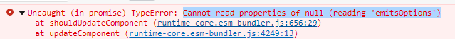

### Vue.defineAsyncComponent [#](https://v3.cn.vuejs.org/api/global-api.html#defineasynccomponent)

创建一个只有在需要时才会加载的异步组件

`defineAsyncComponent` 可以接受一个返回 `Promise` 的工厂函数。Promise 的 `resolve` 回调应该在服务端返回组件定义后被调用。你也可以调用 `reject(reason)` 来表示加载失败。

当使用[局部注册](https://v3.cn.vuejs.org/guide/component-registration.html#局部注册)时，你也可以直接提供一个返回 `Promise` 的函数

### Vue 报错?

Cannot read properties of null (reading 'emitsOptions')

###  **Suspence:异步加载组件。**

[#](https://zhuanlan.zhihu.com/p/409481330)

`Suspense` 是一个特殊的组件，它会有两个 `template slot` ，刚开始会渲染 `feedback` 内容，直到**达到某个条件以后**，才会渲染正式的内容，也就是default的内容。这样呢，进行异步内容的渲染就会变得特别简单

