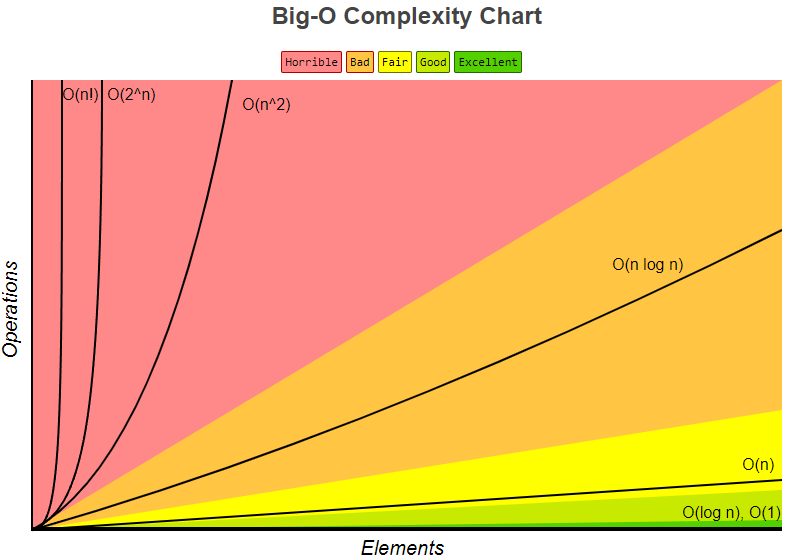
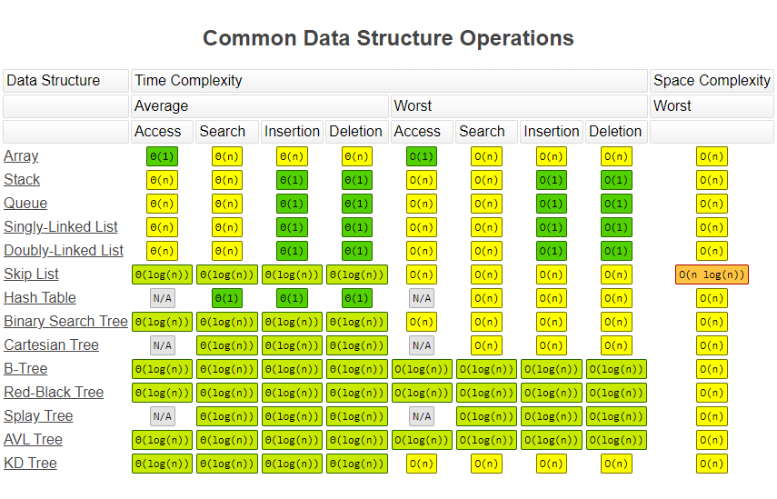
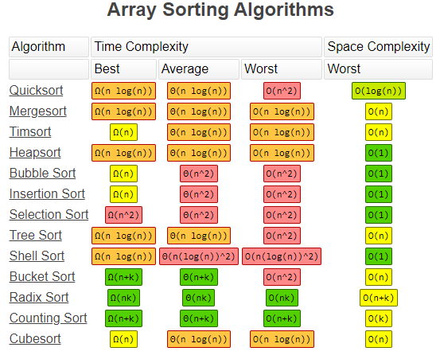

[TOC]

### mini-vue

[Vue3 源码解读](https://github.com/cuixiaorui/mini-vue)

把 Vue3 源码中最核心的逻辑剥离出来，只留下核心逻辑，以供大家学习。带有详细的中文注释，以及完善的输出，帮助用户理解运行时流程

[阮一峰推荐最佳学习 vue3 源码的利器 - mini-vue ](https://www.bilibili.com/video/BV1Zy4y1J73E)


### [GPS 原理解释](https://pages.longtian.info/gps/)（中文）


### [花10年写一本编程语言实现的书](https://catcoding.me/2022/01/12/a-book-on-programming-language.html)（中文）

Robert Nystrom 是一位拥有20年工作经验的谷歌软件工程师。他花了近10年时间，写了一本关于编程语言实现的书，2020年终于写完了。本文介绍这本书。

2009 年开始写一本**设计模式**方面的书，叫 [Game Programming Patterns](http://gameprogrammingpatterns.com/)，写到一半发现自己对编程语言实现很感兴趣。强忍着兴奋继续写第一本，直到 2014 年第一本书完成.。这本书收获很高的评价，建议想学习设计模式的同学看看这本书，电子版本的完全公开。

而后就开始了第二本关于编程语言实现的书，断断续续写了这么多年，直到 2020 年完成了：[Crafting Interpreters](http://craftinginterpreters.com/)，整个过程居然花费了接近 10 年时间。

在这篇 [Crafting “Crafting Interpreters” ](http://journal.stuffwithstuff.com/2020/04/05/crafting-crafting-interpreters/)中，作者详细记录了完成这本书的过程。反正我看完后很震惊，一本技术书籍可以按照这种制作工艺和水准，最后的成书是我见过的质量最高的技术书籍，而且成书和代码可以完全免费阅读！

其实写技术书是投入产出比很低的事情，只有纯粹的热情才能让一个人花这么多年去写这种书。

电子书链接:

1. [Game Programming Patterns](http://gameprogrammingpatterns.com/sample.pdf)
2. [Crafting Interpreters](http://craftinginterpreters.com/sample.pdf)


### [Big-O 复杂性速查表](https://www.bigocheatsheet.com/)

这个网站提供 Big-O 复杂性表示法的各种基本信息，比如复杂性排序、常见数据结构和算法的复杂性。








### 编程之美

编程之美.pdf https://www.aliyundrive.com/s/VfWGbqTa7Zx 提取码: j8w8


### 大厂高频面试题

leetcode题目太多了，目前总共有2491道题（还在不断增长中），不知道哪些是高频题，无从下手，除了买plus会员外，你还可以参考这个网站：

https://codetop.cc/home

该网站也是微软的一个同事开发的，收录各大厂高频面试题。


### smart3d-vue的导入组件

引入组件会被当作没使用的变量, 因为没有在ts部分使用    

```vue
<script lang="ts">
// eslint-disable-next-line @typescript-eslint/consistent-type-imports
import { SBuffer, SFlatting } from 'smart3d-vue'
</script>
    
<template>
	<SBuffer />
</template>


```

