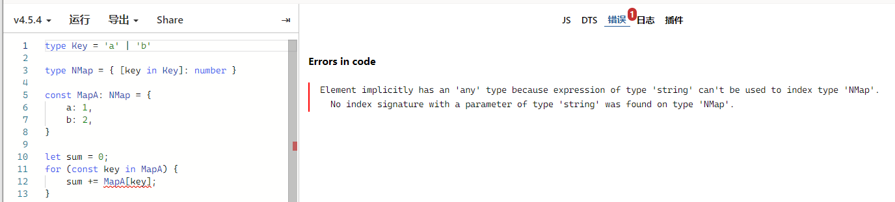
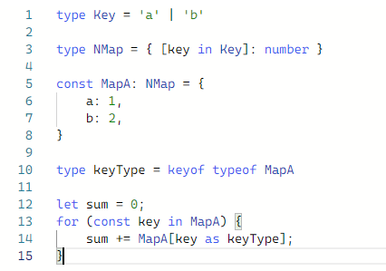
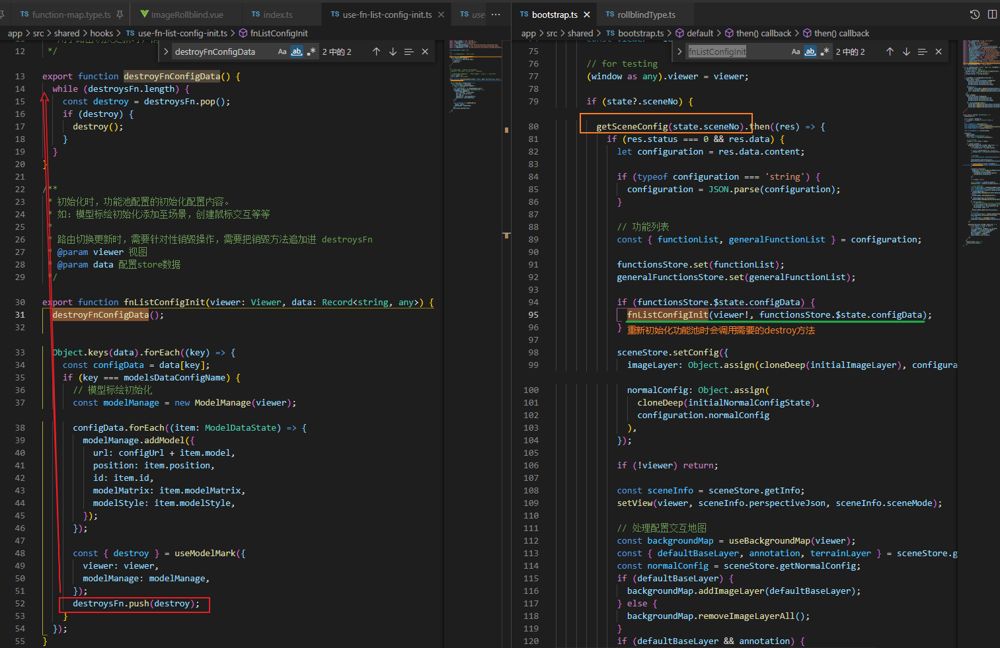
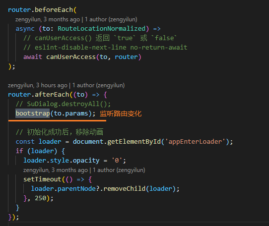
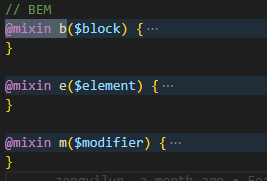
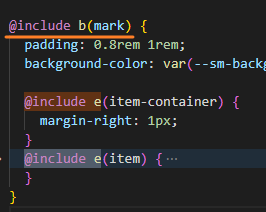
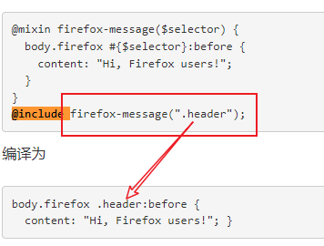

[TOC]

### git 更改文件名

大小写不敏感的时候修改会不触发git的

可以通过重复两次命名Abc->Abcd->abc来实现


### 大厂内网论坛

很多人以为大厂内网论坛是个信息交流分享的地方了。

其实是：

1. 体面的内部宣传（洗脑）地。

2. 假装是内部的封闭的，实则希望对外溢出良性形象内容。

3. 引诱员工说实话，以利于分析和管理风险的诱鸟器。

4. 过滤器，过滤喜欢钻空子和挑战规则（潜规则）的人。

后两点多数人不知道。要学会看明白（潜）规则。


### 在TypeScript箭头函数中指定返回类型


### ts动态取对象的值报错

```ts
function transformBaseMaps(): baseMap[] {
  const baseMapMode = {
    BAIDU: BaseMapMode.BAIDU,
    BAIDUIMAGE: BaseMapMode.BAIDUIMAGE,
    BAIDUVCA: BaseMapMode.BAIDUVCA,
  };
  const maps = imageLayers.map((layer: ImageLayerModel) => {
    const layerName = layer.name.toUpperCase();
    const map: baseMap = {
      baseMapMode: baseMapMode[layerName], // ERROR: Element implicitly has an 'any' type because expression of type 'any' can't be used to index type
      name: layer.text,
    };
    return map;
  });
  return maps.filter(Boolean);
}
```

大意是说: layerName可能不匹配baseMapMode中的属性键值...



tsplay [#](https://www.typescriptlang.org/zh/play?#code/C4TwDgpgBA0hJQLxQOQEMVQD6oEYoFgAoY0SKAOQFk0wkoBvKAbQGt4oBLAO1ngF0AXFG4BXALa4IAJygBfYsQDGAe24BnYFBpgAgsOq16DYlDNQ0wgIwAaU+dzCATHaIKSRADYQt6ifQAGAG5iADMVWQAKVQ0tdgQebVpdAEpGezM-cSgAamQdXTYBELcgA)



奇怪的hack


### UserRouter / UseRoute

```vue
<script setup>
import { watch } from 'vue'; 
import { useRoute } from 'vue-router';
const route = useRoute();
watch(() => route.params, console.log);
</script>
```


### [导航守卫](https://router.vuejs.org/zh/guide/advanced/navigation-guards.html)

当一个导航触发时，全局前置守卫按照创建顺序调用。

守卫是异步解析执行，此时导航在所有守卫 resolve 完之前一直处于等待中。


### url场景id改变 更新






### 字节跳动 吴伟猝死 

[字节跳动内网回应确认 28 岁员工不幸离世](https://www.zhihu.com/question/518120410)

想打破各位的一个幻想，不会因为猝死的案例越多，加班现象就越快得到解决。

意图用生命警醒资本，是一种自我感动。

他们只会越来越聪明，越来越懂如何规避风险。

一是避免猝死的负面影响波及公司利益，公关手段越发高明

资本是逐利的，指望不了自我醒悟。打工人是分散的，也指望不了众志成城，多的是内鬼。

并夕夕员工猝死，b站员工猝死，闹得沸沸扬扬，有什么实质性影响吗，没有。

所以，除非有外部强制性措施约束，这个现象还得持续下去


把最近几天的消息连着来看，真实伤害更大。

>  如何评价买房首付降至20%？
>
> 35岁失业没工作怎么办？
>
> 上海26岁设计师过劳猝死；
>
> 字节28岁工程师猝死，妻子怀孕两个月，还剩30年房贷月供2万1；
>
> 如何看待我国灵活就业人数达2亿人？
>
> 渐进式延迟法定退休年龄至65岁；

所以如果用一条线来描述部分普通人的一生：

读书卷→找工作卷→加班卷→凑齐首付→背上高额贷款→加班更卷→身体变差→年纪变大失业风险→延迟退休

每个步骤都是极限挑战，不能出一点岔子，不卷就会丢工作，工作出问题可能会断贷，身体出问题，随时可能猝死。

这个问题基本无解，房价不可能从3万5万变成3千5千；

资本更不可能良心发现；

人多岗位少，想留下的不可能不卷；

更不可能在指望着劳动者保护监管。

虽然不是专业人士，但我的建议是先保证精力充沛再考虑健身，如果本身身体负荷就很大，还是多休息吧，强行锻炼反而会加速死亡。

2.1 *30 *12=756万 这房贷想想都让人绝望，就算不出事，这样的日子也是永远望不到边啊，这还留下个怀孕的老婆。人生艰难，人死更艰难。


一，不要强行买房，按揭30年。

你现在身强体壮赚2万，不代表35岁还能继续，不代表45岁还能继续，不代表55岁还能继续。

二，不要强行加班，用命换钱

工作是为了更好的生活，而不是急切的用命换钱。没了命，除了家人朋友，没有人会可怜你，就算是也就一周后就忘了你

三，不要觉得自己身体好，就强行健身。

劳累一天，切记不要剧烈运动。运动必须在休息好的情况下，缓慢锻炼

四，降低欲望，人生是长跑。

就是被既得利益者看死咱们在乎的东西，才会被死命的收割

保护自己身体吧，你能强壮的过28岁时的你么

他只是想有一个家，错的是房价和资本家

30年高额房贷，风险非常大。经济不会一直好，工资也不会一直涨


### Sass @mixin 与 @include

```scss
@include b() {
    @include d() {
         // ...
    }
}
```





类似于定义和使用的意思...


@mixin 指令允许我们定义一个可以在整个样式表中重复使用的样式。

@include 指令可以将混入（mixin）引入到文档中。


定义一个混入

混入(mixin)通过 @mixin 指令来定义。 `@mixin name { property: value; property: value; ... }`

以下实例创建一个名为 "important-text" 的混入：

## Sass 代码：

```scss
@mixin important-text {
 color: red;
 font-size: 25px;
 font-weight: bold;
 border: 1px solid blue;
}
```


注意：Sass 的连接符号 - 与下划线符号 _ 是相同的，也就是 `@mixin important-text { }` 与 `@mixin important_text { }` 是一样的混入。

### 使用混入

@include 指令可用于包含一混入：

#### Sass @include 混入语法：

```
selector {
 @include mixin-name;
}
```

因此，包含 important-text 混入代码如下：

#### 实例

```
.danger {
 @include important-text;
 background-color: green;
}
```

将以上代码转换为 CSS 代码，如下所示：

#### Css 代码：

```
.danger {
 color: red;
 font-size: 25px;
 font-weight: bold;
 border: 1px solid blue;
 background-color: green;
}
```

混入中也可以包含混入，如下所示：

#### 实例

```
@mixin special-text {
 @include important-text;
 @include link;
 @include special-border;
}
```


## 向混入传递变量

混入可以接收参数。

我们可以向混入传递变量。

定义可以接收参数的混入：

## 实例

```SCSS
/* 混入接收两个参数 */
@mixin bordered($color, $width: 10px) { // $width 变量的默认值
 border: $width solid $color;
}

.myArticle {
 @include bordered(blue, 1px); // 调用混入，并传递两个参数*
}

.myNotes {
 @include bordered(red, 2px); // 调用混入，并传递两个参数*
}

// 输出
.myArticle {
  border: 1px solid blue;
}

.myNotes {
  border: 2px solid red;
}
```

### 可变参数

有时，不能确定一个混入（mixin）或者一个函数（function）使用多少个参数，这时我们就可以使用 ... 来设置可变参数。

例如，用于创建盒子阴影（box-shadow）的一个混入（mixin）可以采取任何数量的 box-shadow 作为参数。

## 实例

```scss
@mixin box-shadow($shadows...) {
   -moz-box-shadow: $shadows;
   -webkit-box-shadow: $shadows;
   box-shadow: $shadows;
}

.shadows {
 @include box-shadow(0px 4px 5px #666, 2px 6px 10px #999);
}
// 输出
.shadows {
  -moz-box-shadow: 0px 4px 5px #666, 2px 6px 10px #999;
  -webkit-box-shadow: 0px 4px 5px #666, 2px 6px 10px #999;
  box-shadow: 0px 4px 5px #666, 2px 6px 10px #999;
}
```


### include 传参怎么理解? [中文文档 _ scss_9.3](https://www.sass.hk/docs/)

```scss
@include b(mark) {
  padding: 0.8rem 1rem;
  background-color: var(--sm-background-color-base);

  @include e(item-container) {
    margin-right: 1px;
  }
  @include e(item) {
    overflow: hidden;
    }
}
```



写入到 @mixin 定义的参数当中
