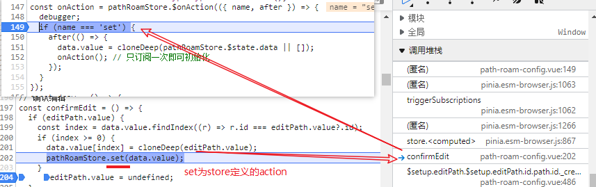
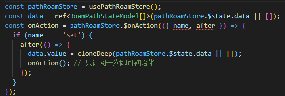

[TOC]

### 俄罗斯 乌克兰 局势 

**战争前兆主要有两个，知乎大v很多分析奇葩分析脱离实际。**

第一，乌克兰政府军和乌克兰东部顿巴斯地区民兵组织在19日一天之内违反停火协议的事件近2000起，双方几乎全面开打了，而且据俄罗斯方面声称，乌克兰政府军已经将战火燃烧到俄罗斯境内了；

第二，顿巴斯地区的居民已经开始大规模向俄罗斯境内撤离，总人数高达70万，首批2.5万居民已经乘坐大巴进入俄罗斯，而俄罗斯已经在罗斯托夫州8个地区以及1个市区的临时安置点，可容纳超70万人。俄紧急情况部、卫生部、公民平安保护监督局等机构代表也正前往罗斯托夫州，为接收乌东部难民提供保障。

​    都不承认乌克兰这个国家的合法性了，势必要瓦解这个政权的节奏，不打仗可能吗，有时候就不懂这些人的思路。

[普京获批在境外动用俄武装力量，这意味着什么？会对局势发展产生哪些影响？](https://www.zhihu.com/question/518181578)

反对分裂主权国家这个立场我觉得中国还是应该坚持。

但你说中国在这个问题上有多尴尬，哪就幼稚了。普京这个举动证明了主权国家的国土可以分裂，这个不假；但是准确说，他是证明了弱国的国土可以分裂。直接将国际社会带回到弱肉强食的殖民地时代。

要知道，当前的核心国际秩序，基于民族自决和国家主权独立的原则，是二战后在美国坚持下建立起来的。这是美国一贯的主张，第一次世界大战，就是因为那是美国实力还不够强，无法压住英法这种老牌殖民国家，才最终连国联都没参加，回到孤立主义的立场。

现在，毛子用自己承担全部苦难为代价，向世界证明，只要你豁得出去，美国和欧洲是不会为第三方国家流血的。

乌克兰，一个世界公认的主权独立国家，一个在布达佩斯条约里得到美英安全保障的国家，一个位于欧洲安全要冲的国家，被毛子这样撕裂，以美国为代表国际社会除了经济制裁根本不敢有任何反应。那么，一个本来美国自己都承认是中国不可分割部分的省，一个没有任何国际承认的政权，美国会为他流血么？就凭台湾能够代工生产半导体？

事实就是，国际社会秩序越靠讲道理，台湾分裂的危险越大，因为台湾的民意已经完全无法挽回。当回到洪荒时代，实力成为超越一切法则，台湾人对美国的底线已经一清二楚的情况下，台独的气焰肯定会大幅度收敛的。

### 股票涨停

股票涨停是指为了减少股市交易的投机行为，规定每个股票每个[交易日](https://baike.baidu.com/item/交易日/1174461)的[涨跌幅度](https://baike.baidu.com/item/涨跌幅度/11061781)，达到上涨上限幅度的就叫涨停。就中国股市来说，每个交易日涨跌限幅为10%，达到10%涨幅的就是[涨停](https://baike.baidu.com/item/涨停/586)，当天不能再涨了

从买卖双方来看，当买方力量大于卖方，也就是觉得股市未来值得投资的人大于看淡后市的人就会出现需求大于供给，多数人愿意出比[现价](https://baike.baidu.com/item/现价)更高的价格买股票，个股价格就会上升带动[股市指数](https://baike.baidu.com/item/股市指数)上升，出现牛市。反之当看淡后市的人大于看好后市的人，就有人低价抛售股票，[个股](https://baike.baidu.com/item/个股)价格下降带动股市指数下降。

一般买卖双方力量变化和**宏观经济走势**有关，[宏观经济](https://baike.baidu.com/item/宏观经济)趋缓，投资者预计对未来经济走势悲观就会抛售股票，反之则持有[股票](https://baike.baidu.com/item/股票/22647)。所以[股票市场](https://baike.baidu.com/item/股票市场)可以预先反映经济走势，是[宏观经济](https://baike.baidu.com/item/宏观经济)的晴雨表。

### 如何解决git冲突

对同一项目的**同一文件的同一区域**进行了不同修改会产生冲突

### pinia监听store

data => $state.data;  [api_$state](https://pinia.vuejs.org/api/interfaces/pinia._StoreWithState.html#state)

$onAction [api](https://pinia.vuejs.org/api/interfaces/pinia._StoreWithState.html#onaction)

$subscribe 

**参数?** 

嵌套 `onAction` ? 

