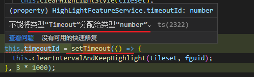

### 1、[怎样会无法招聘到优秀程序员？](https://www.getparthenon.com/blog/how-to-avoid-hiring-the-best-developers/)

今天的招聘市场上，每个人都想招到优秀程序员。但是，有一些因素，会让你错失他们，只招到没有其他地方可去的程序员。

(1) 缓慢的招聘流程

优秀工程师非常抢手，一出现在市场上就会被抢走。只要你把招聘流程放慢，每个阶段都要1到2周才给出回复，他们就会中途被其它公司雇佣。

（2）面试一些他们平时不做的事情

面试时，你问一些他们根本不拿手的、其它领域的问题，比如让前端程序员回答如何调试 MySQL 的性能。优秀程序员会对这种毫无意义的面试感到沮丧，从而自己放弃。

另一种情况是，你让他们把一个需要好多天工作的技术难题，带回家解答。优秀程序员根本不会有时间，用来解这种题目。技术难题耗费的时间越长、越复杂，优秀程序员越会直接拒绝这样做。

（3）只在本地面试。

你撒的网越小，发现宝物的机会也越小。如果限制只在一个小城市招聘，几乎就不会有机会遇到优秀程序员。尤其是还不提供远程工作。

另外，要求所有申请人自费到公司进行30分钟的面试，而你的公司又在很偏僻的地方，也很难招到优秀程序员。因为如果申请人愿意自费长途跋涉，这表明他们迫切需要一份工作。如果你不提供搬家费，但是申请人愿意从另一个城市搬到公司所在地，这也不是一个好的迹象。只有真正绝望的程序员才会自费搬家，为一家不知名的小公司工作。

（4）毫无激情的工作内容

优秀程序员对自己所做的事情，或者对于技术有很大的热情。他们通常把空闲时间都花在技术社区的活动，或者钻研 IT 技术和开源项目。如果你的工作把他们的时间占满，同时工作内容又无法让他们感到自豪或产生激情，优秀程序员就会产生反感。

（5）少付报酬

优秀程序员理应得到丰厚的报酬，要是你付给他们工资低于竞争对手，股权也很少，或者要在公司待很长时间才能得到股权，如果他们足够聪明，就会意识到为这点报酬，要待这么长时间是不值得的。

上面这些因素，保证让你雇佣不到优秀的程序员。但是，如果你把每一个因素都反过来做，那么很有可能雇佣到他们。

> - 快速招聘，迅速做出决定。
> - 重视程序员的专长。
> - 珍惜并尊重申请人的时间。
> - 提供远程工作和搬迁费用。
> - 不占用下班时间，为他们留出生活和业余爱好的空间。
> - 支付公平的薪水，并让他们有涨薪的期望。


### TS setTimeout/setInterval 返回的类型匹配问题



使用`ReturnType`可以简单方便地推断出来：

```TypeScript
const timer: ReturnType<typeof setTimeout> = setTimeout(() => {
    // do something...
}, 3000)
```
