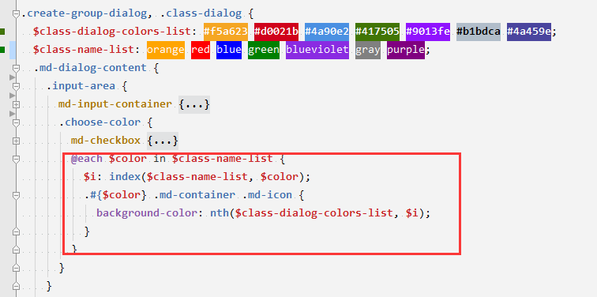

### 俄乌战争, 欧美只会制裁

拜登接受采访谈对俄两选项，称「制裁或者开启世界大战」，释放了哪些信号 [#](https://www.zhihu.com/question/518990000)

这个世界总有人要开打破旧秩序的第一枪，俄罗斯不打，那么美国会打，美国不打，中国也会打，区别只有打的时间和地点，乌克兰其实就是一个中美俄都默认的矛盾爆发地点，牺牲的是乌克兰的前途，打破的是二战后建立的以美国为首世界秩序，或者更直接的说，是美元霸权。

美元这个问题是一定要解决的，因为它已经从根本上烂掉了，这样的货币已经不适合作为世界货币流通了，这不是中国人的宣传政策，而是连美国都心知肚明的基本事实，但打破美元霸权，牵动的是资本力量的核心利益，资本力量是不可能允许自己的利益受到这样的影响的，所以为了打破资本的核心利益，我们需要做更多的准备，甚至是最坏的准备


### element-plus 封装组件的bem规范

```vue
// drawer.vue
<template><div
ref="drawerRef"
:class="[ns.b(), direction, visible && 'open', customClass]"
     >...</div></template>
<script>
export default defineComponent({
  name: 'ElDrawer',
    setup() {
        const drawerRef = ref<HTMLElement>()
    	const ns = useNamespace('drawer')
    	return {drawerRef, ns,}}
})
</script>
```

```scss
// drawer.scss
@use 'mixins/mixins' as *;
@use 'mixins/var' as *;
@use 'common/var' as *;

@include b(drawer) {
    &__header {...}
    &__title {...}
    @include e(footer) {
        
    }
}

```

```scss
/* minxins.scss */ 
// BEM
@mixin b($block) {
  $B: $namespace + '-' + $block !global;

  .#{$B} {
    @content;
  }
}

@mixin e($element) {
  $E: $element !global;
  $selector: &;
  $currentSelector: '';
  @each $unit in $element {
    $currentSelector: #{$currentSelector +
      '.' +
      $B +
      $element-separator +
      $unit +
      ','};
  }

  @if hitAllSpecialNestRule($selector) {
    @at-root {
      #{$selector} {
        #{$currentSelector} {
          @content;
        }
      }
    }
  } @else {
    @at-root {
      #{$currentSelector} {
        @content;
      }
    }
  }
}

@mixin m($modifier) {
  $selector: &;
  $currentSelector: '';
  @each $unit in $modifier {
    $currentSelector: #{$currentSelector +
      $selector +
      $modifier-separator +
      $unit +
      ','};
  }

  @at-root {
    #{$currentSelector} {
      @content;
    }
  }
}
```

https://github.com/element-plus/element-plus/blob/dev/packages/theme-chalk/src/mixins/mixins.scss


### 9.4.  @content: 向混合样式中导入内容

在引用混合样式的时候，可以先将一段代码导入到混合指令中，然后再输出混合样式，额外导入的部分将出现在 `@content` 标志的地方

```scss
@mixin apply-to-ie6-only {
  * html {
    @content;
  }
}
@include apply-to-ie6-only {
  #logo {
    background-image: url(/logo.gif);
  }
}
```

编译为

```css
* html #logo {
  background-image: url(/logo.gif);
}
```

**为便于书写，`@mixin` 可以用 `=` 表示，而 `@include` 可以用 `+` 表示**，所以上面的例子可以写成：

```sass
=apply-to-ie6-only
  * html
    @content

+apply-to-ie6-only
  #logo
    background-image: url(/logo.gif)
```

**注意：** 当 `@content` 在指令中出现过多次或者出现在循环中时，额外的代码将被导入到每一个地方。


## 8. 控制指令 (Control Directives)

SassScript 提供了一些基础的控制指令，比如在满足一定条件时引用样式，或者设定范围重复输出格式。控制指令是一种高级功能，日常编写过程中并不常用到，主要与混合指令 (mixin) 配合使用

### 8.1. if()

### 8.2. @if

当 `@if` 的表达式返回值不是 `false` 或者 `null` 时，条件成立，输出 `{}` 内的代码：

`@if` 声明后面可以跟多个 `@else if` 声明

### 8.3. @for

`@for` 指令可以在限制的范围内重复输出格式，每次按要求（变量的值）对输出结果做出变动。

这个指令包含两种格式：

- `@for $var from <start> through <end> `， through 范围 [start, end]
- `@for $var from <start> to <end> ` ， to 范围 [start, end)

through 比 to 多遍历到最后的边界范围

```scss
@for $i from 1 through 3 {
  .item-#{$i} { width: 2em * $i; }
}
```

编译为

```css
.item-1 {
  width: 2em; }
.item-2 {
  width: 4em; }
.item-3 {
  width: 6em; }
```

遍历字符串呢? 


### 8.4. @each  比@for有更好的灵活性

`@each` 指令的格式是 `$var in <list> `, `$var` 可以是任何变量名，比如 `$length` 或者 `$name`，而 `<list>` 是一连串的值，也就是值列表。

`@each` 将变量 `$var` 作用于值列表中的每一个项目，然后输出结果，例如：

```scss
@each $animal in puma, sea-slug, egret, salamander {
  .#{$animal}-icon {
    background-image: url('/images/#{$animal}.png');
  }
}
```

编译为

```css
.puma-icon {
  background-image: url('/images/puma.png'); }
.sea-slug-icon {
  background-image: url('/images/sea-slug.png'); }
.egret-icon {
  background-image: url('/images/egret.png'); }
.salamander-icon {
  background-image: url('/images/salamander.png'); }
```

#### 8.4.1 Multiple Assignment (多个赋值的情况)

```scss
@each $animal, $color, $cursor in (puma, black, default),
                                  (sea-slug, blue, pointer),
                                  (egret, white, move) {
  .#{$animal}-icon {
    background-image: url('/images/#{$animal}.png');
    border: 2px solid $color;
    cursor: $cursor;
  }
}
```

is compiled to:

```css
.puma-icon {
  background-image: url('/images/puma.png');
  border: 2px solid black;
  cursor: default; }
.sea-slug-icon {
  background-image: url('/images/sea-slug.png');
  border: 2px solid blue;
  cursor: pointer; }
.egret-icon {
  background-image: url('/images/egret.png');
  border: 2px solid white;
  cursor: move; }
```

使用案例



可能这个案例构造出上面 多个复制的情况会更简便

### 8.5. @while
