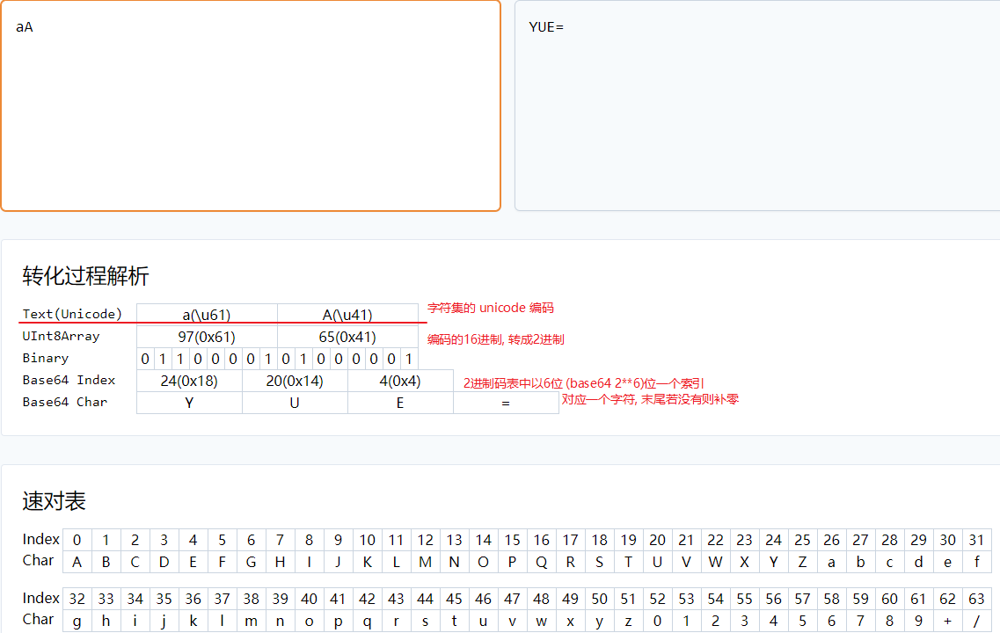
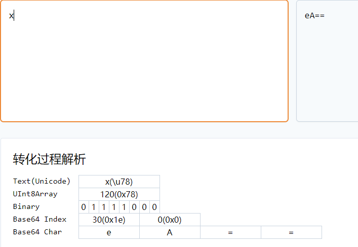

### 通过经纬度获取地形高度

```ts
// Query the terrain height of two Cartographic positions
const terrainProvider = Cesium.createWorldTerrain();
const positions = [
    Cesium.Cartographic.fromDegrees(86.925145, 27.988257),
    Cesium.Cartographic.fromDegrees(87.0, 28.0)
];
const promise = Cesium.sampleTerrain(terrainProvider, 11, positions);
Cesium.when(promise, function(updatedPositions) {
    // positions[0].height and positions[1].height have been updated.
    // updatedPositions is just a reference to positions.
});
```

[Global - Cesium Documentation](https://cesium.com/learn/cesiumjs/ref-doc/global.html?classFilter=sampleTerrain#sampleTerrain)

### setup provide


### Base64 Encoding/Decoding 及编码过程实时解析

[Base64 Encoding/Decoding · 开发者工具箱 (devtool.tech)](https://devtool.tech/base64)

https://juejin.cn/post/6989391487200919566

https://juejin.cn/post/6844903698045370376



**补"="的规律, 补成长度为4n**



### 优点

1. 可以将二进制数据（比如图片）转化为可打印字符，方便传输数据
2. 对数据进行简单的加密，肉眼是安全的
3. 如果是在html或者css处理图片，可以减少http请求

### 缺点

1. 内容编码后体积变大， 至少1/3
    因为是**三字节变成四个字节**，当只有一个字节的时候，也至少会变成三个字节。
2. 编码和解码需要额外工作量


### Unicode ASCII码 UTF-8

ASCII 主要用于显示**现代英文**，到目前为止只定义了 **128** 个字符，包含控制字符和可显示字符。

记住这个重要的知识：

- Unicode: **字符集**
- UTF-8: **编码规则**


Unicode 为世界上所有字符都分配了一个唯一的编号(**码点**)，这个编号范围从 0x000000 到 0x10FFFF (十六进制)，有 100 多万，每个字符都有一个唯一的 Unicode 编号，这个编号一般写成 16 进制，在前面加上 U+。例如：`掘`的 Unicode 是U+6398。

最前面的**65536**个字符位，它的码点范围是从0一直到**2\*\*16-1**。所有最常见的字符都放在这里。

- U+010000一直到U+10FFFF

[String.prototype.charCodeAt](https://link.juejin.cn/?target=https%3A%2F%2Fdeveloper.mozilla.org%2Fen-US%2Fdocs%2FWeb%2FJavaScript%2FReference%2FGlobal_Objects%2FString%2FcharCodeAt) 可以获取字符的码点，**获取范围为`0` ~ `65535`。** 

UTF-8 是互联网使用最多的一种 Unicode 的实现方式。还有 UTF-16（字符用两个字节或四个字节表示）和 UTF-32（字符用四个字节表示）等实现方式。


### viewer.clock.currentTime 跟运动相关

