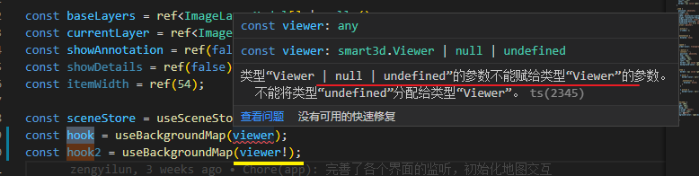
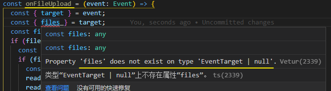

### ts 语法: 变量后面的!



查了一下ts的文档说明，原来感叹号**是非`null`和非`undefined`的类型断言**，所以上面的写法就是对`propA`这个属性进行非空断言。文档的相关说明在[这里](https://link.zhihu.com/?target=https%3A//github.com/Microsoft/TypeScript/wiki/What's-new-in-TypeScript%23non-null-assertion-operator)。

官方文档上的一个例子很好的说明了这个问题

```text
interface Entity {
  name: string
}

// Compiled with --strictNullChecks
function validateEntity(e?: Entity) {
  // Throw exception if e is null or invalid entity
}

function processEntity(e?: Entity) {
  validateEntity(e);
  let s = e!.name;  // Assert that e is non-null and access name
}
```


### 文件上传ts类型声明报错



需要将 target 指定为 `input`

```ts
const { target } = event;
const { files } = target as HTMLInputElement;
const file = files![0] // files也需要非空断言
```

event.target是一个HTMLElement，它是所有HTML元素的父级，但不能保证具有属性value。 TypeScript检测到此错误并引发错误。将event.target强制转换为适当的HTML元素，以确保它是具有value属性的HTMLInputElement：

