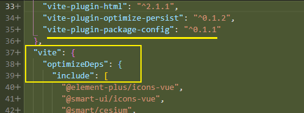
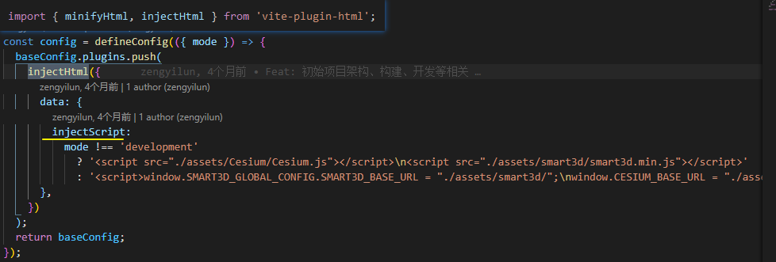
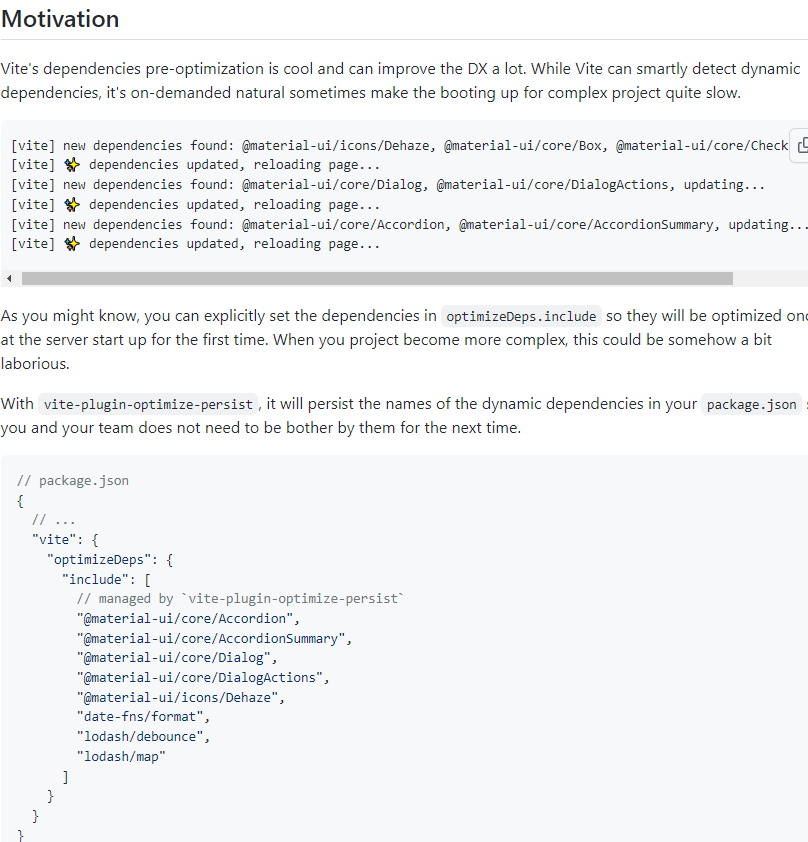
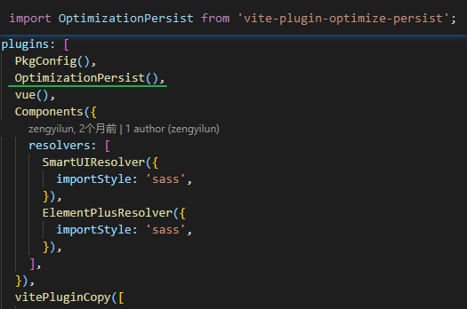
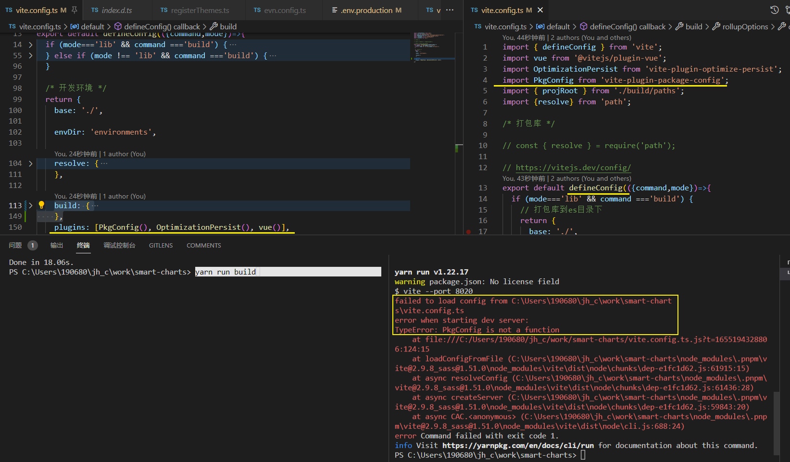
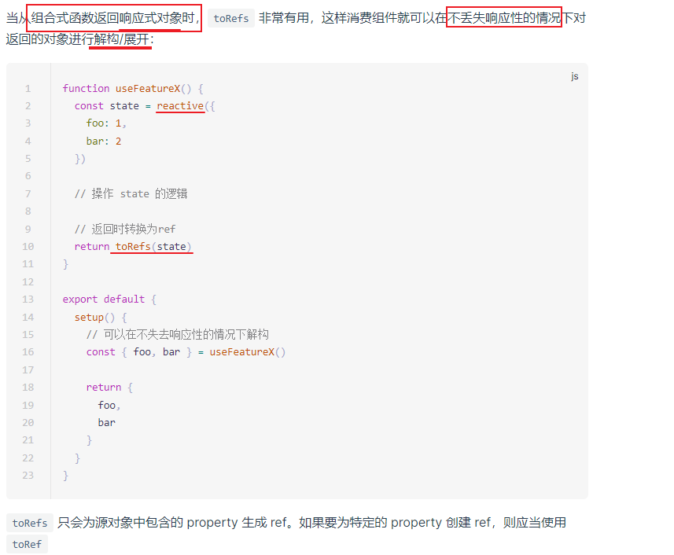
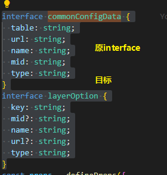
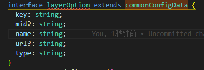

[TOC]

### vite.config.js 如何配置


## 缓存[#](https://cn.vitejs.dev/guide/dep-pre-bundling.html#caching)

### 文件系统缓存[#](https://cn.vitejs.dev/guide/dep-pre-bundling.html#file-system-cache)

Vite 会将预构建的依赖缓存到 `node_modules/.vite`。它根据几个源来决定是否需要重新运行**预构建**步骤:

- `package.json` 中的 `dependencies` 列表
- 包管理器的 lockfile，例如 `package-lock.json`, `yarn.lock`，或者 `pnpm-lock.yaml`
- 可能在 `vite.config.js` 相关字段中配置过的

只有在上述其中一项发生更改时，才需要**重新运行预构建**。

如果出于某些原因，你想要强制 Vite 重新构建依赖，你可以用 `--force` 命令行选项启动开发服务器，或者手动删除 `node_modules/.vite` 目录。

### 浏览器缓存[#](https://cn.vitejs.dev/guide/dep-pre-bundling.html#browser-cache)

解析后的依赖请求会以 HTTP 头 `max-age=31536000,immutable` **强缓存**，以提高在开发时的页面重载性能。一旦被缓存，这些请求将永远不会再到达开发服务器。如果安装了不同的版本（这反映在包管理器的 lockfile 中），则附加的版本 query 会自动使它们失效。如果你想通过本地编辑来调试依赖项，你可以:

1. 通过浏览器调试工具的 Network 选项卡暂时禁用缓存；
2. 重启 Vite dev server，并**添加 `--force` 命令以重新构建依赖**；
3. 重新载入页面。


### vite 读取package中的配置



1. vite-plugin-html

   https://github.com/vbenjs/vite-plugin-html/blob/main/README.zh_CN.md

   

2. vite-plugin-optimize-persist

   

   Vite 的依赖预优化很酷，可以大大提升 DX。虽然 Vite 可以智能地检测动态依赖关系，但它的按需自然有时会使复杂项目的启动变得非常缓慢。

   可以显式把依赖项设置在`optimizeDeps.include`中，以便在服务器第一次启动时对其进行优化。当您的项目变得更加复杂时，这可能会有点费力。

   **通过package中的预设的字段来对vite打包进行优化**

   

   ```
   npm i -D vite-plugin-optimize-persist vite-plugin-package-config
   ```

   Add plugin to your `vite.config.ts`:

   ```
   // vite.config.ts
   import OptimizationPersist from 'vite-plugin-optimize-persist'
   import PkgConfig from 'vite-plugin-package-config'
   
   export default {
     plugins: [
       PkgConfig(),
       OptimizationPersist()
     ]
   }
   ```

`vite-plugin-optimize-persist` `vite-plugin-package-config`两个**插件配套**使用

开发时有用吧 **这个在打包的时候会不会打进去呢?**


启动server时 有时报错?

`PkgConfig is not a function`




#### DEPRECATED

You no longer need this plugin since Vite 2.9.1

集成到vite中的么?


# Vue vben admin

Vue Vben Admin 是一个免费开源的中后台模版。使用了最新的`vue3`,`vite2`,`TypeScript`等主流技术开发，开箱即用的中后台前端解决方案，也可用于学习参考。

https://github.com/vbenjs/vue-vben-admin/blob/main/README.zh-CN.md


### toRefs




### 如何将interface里的必选属性转为可选



直接使用extends继承会报错

如果 `SquareConfig`带有上面定义的类型的`color`和`width`属性，并且*还会*带有**任意数量的其它属性**，那么我们可以这样定义它：

```ts
interface SquareConfig {
    color?: string;
    width?: number;
    [propName: string]: any;
}
```
