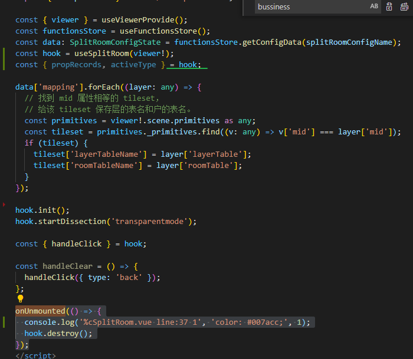
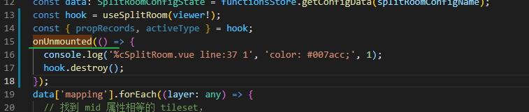
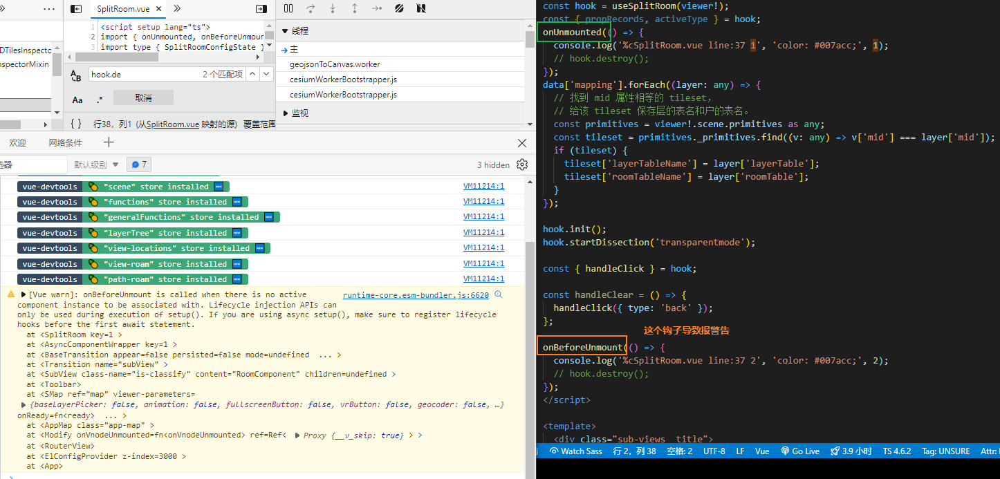
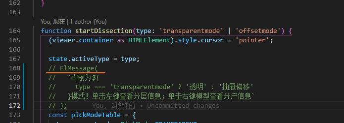
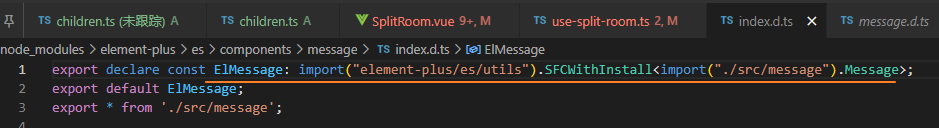
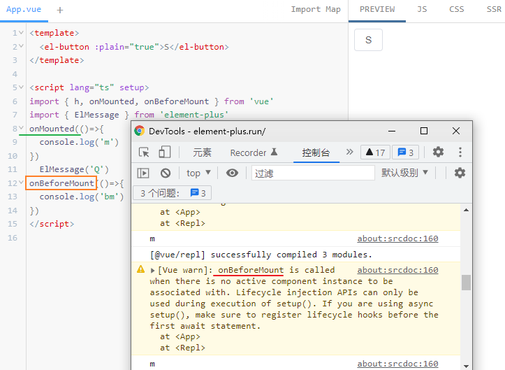
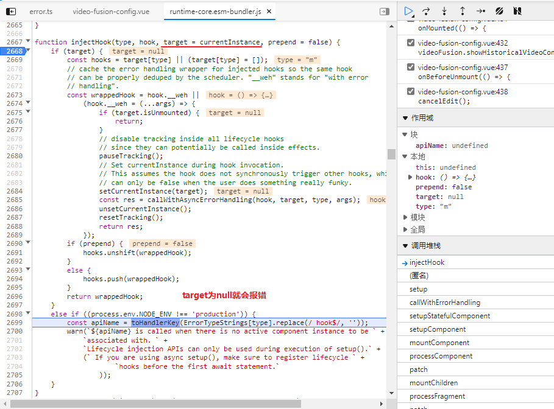

TS+eslint报黄: Expected 'this' to be used by class method 'warnNoDataMessage'.

注意在ESLint的术语中：

- `class method` 类型方法：指实例方法（英语中也称`instance method`），不是静态方法。
- `static function` 静态函数：指静态方法。

所以这个错误是指：在实例方法中没有使用`this`，可以考虑使用`this`或者改为静态方法。

错误的代码：

```javascript
class A {
    foo() {
        console.log("Hello World");     /*error Expected 'this' to be used by class method 'foo'.*/
    }
}
```

正确的代码：

```javascript
class A {
    foo() {
        this.bar = "Hello World"; // OK, 使用this
    }
}

class A {
    constructor() {
        // OK. 构造函数也可以不使用this
    }
}

class A {
    static foo() {
        // OK. 静态方法不需要使用this
    }
}
```


### vite.config.ts

build 如何配置? [#构建选项](https://cn.vitejs.dev/config/#build-target)


### iScene 写入自定义属性到primitive等

```ts
// LayerManager.ts
/**
   * 统一设置自定义值，比如mid，id
   * @param data cesium 数据图层类
   * @param layer 自定义图层类
   */
private setCustomValue(data: any, layer: Layer) {
    data.mid = layer.mid;
    data.id = layer.id;
    data.type = layer.type;
    data.name = layer.name;
}
```

```ts
private _add3DTiles(
    layer: Layer,
    options: TilesetStylesType & MaterialsType & PointCloudColorsType,
  ): Cesium3DTileset {
    const matrix = layer.modelMatrix;
    const tileset = this._primitives.add(
      new Cesium3DTileset({
        modelMatrix: matrix,
        url: getResoureWithUserId(layer.url),
        show: layer.show,
        dynamicScreenSpaceError: options.dynamicScreenSpaceError,
        maximumMemoryUsage: options.maximumMemoryUsage,
        maximumScreenSpaceError: options.maximumScreenSpaceError,
        progressiveResolutionHeightFraction: 0.5,
        cullRequestsWhileMoving: options.cullRequestsWhileMoving,
        cullRequestsWhileMovingMultiplier: options.cullRequestsWhileMovingMultiplier,
        preferLeaves: options.preferLeaves,
        preloadFlightDestinations: options.preloadFlightDestinations,
        skipLevelOfDetail: options.skipLevelOfDetail,
        requestPriority: options.requestPriority,
        backFaceCulling: options.backFaceCulling ?? defaultTielsetStyles.backFaceCulling,
      }),
    );
    tileset.readyPromise.then(() => {
      if (layer.isZoom) {
        this._viewer.flyTo(tileset);
      }
    });
    // 写入自定义属性到primitive
    this.setCustomValue(tileset, layer);
    if (layer?.type === layerTypesEnum.POINTCLOUD) {
      this.setPointCloudStyle(layer.id, options, tileset);
    } else if (
      layer.type &&
      (layer.type === layerTypesEnum.MODEL ||
        layer.type === layerTypesEnum.BIM ||
        layer.type === layerTypesEnum.IMAGERY)
    ) {
      this.setMaterialOptions(layer.id, options, tileset);
    }
    return tileset;
  }
```


### onUnmounted 钩子报错

onUnmounted is called when there is no active component instance to be associated with. **Lifecycle injection APIs can only be used during execution of setup()**.

生命周期注入接口只能在setup执行期间被使用...



退出时不会进入钩子



要把这个生命周期钩子前置? 这里不都是同步执行的吗?.. 不过前置后的确可以正确触发这个钩子

https://github.com/vuejs/vue-class-component/issues/502



注释掉钩子之间的代码的话, 是都不会报错的, 可能是中间的逻辑引起的?


是不是两个钩子之间有存在异步的操作??

经过排查警告是两个钩子之间的代码产生的.



是这个ElMessage执行导致的..

单独把这个方法放到vue组件中执行也会产生同样的结果...



是不是因为是动态import导致出现的异步操作引起

注意一下 ElMessage在setup作用域中执行会导致其后面注册的钩子函数报错.



## 生命周期钩子

可以通过直接导入 `onX` 函数来注册生命周期钩子：

```js
import { onMounted, onUpdated, onUnmounted } from 'vue'

const MyComponent = {
  setup() {
    onMounted(() => {
      console.log('mounted!')
    })
    onUpdated(() => {
      console.log('updated!')
    })
    onUnmounted(() => {
      console.log('unmounted!')
    })
  }
}
```

这些生命周期钩子注册函数只能在 [`setup()`](https://v3.cn.vuejs.org/api/composition-api.html#setup) 期间**同步使用**，因为它们依赖于内部的全局状态来定位当前活动的实例 (此时正在调用其 `setup()` 的组件实例)。**在没有当前活动实例的情况下，调用它们将会出错。**

组件实例的上下文也是在生命周期钩子的同步执行期间设置的，因此，在生命周期钩子内同步创建的侦听器和计算属性也会在组件卸载时自动删除。


### 比较常见输出上面警告的使用案例

```ts
async setup() {
	await fetch()
    onMounted(()=>{ 
        //... lifecycle
    })
    return {
        ...
    }
}
// should be useful
async setup() {
    onMounted(()=>{ 
        //... lifecycle
    })
    await fetch()
    return {
        ...
    }
}
```

**也就是说 如果你使用了 async setup()，那么在如果想要使用 onMounted 生命周期的话，需要确保在第一个 await 语句之前注册 生命周期钩子**



