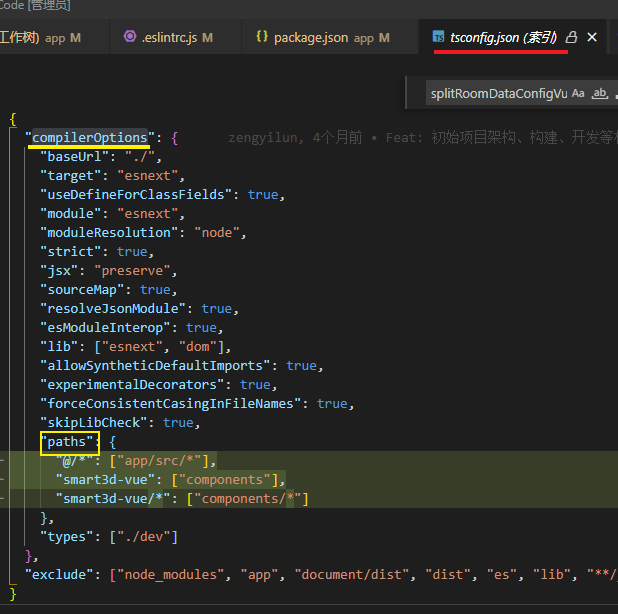
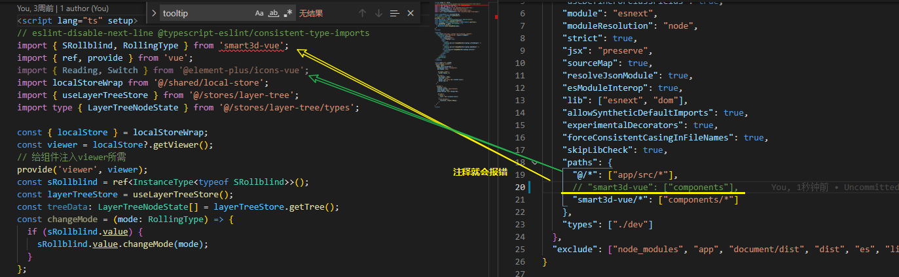
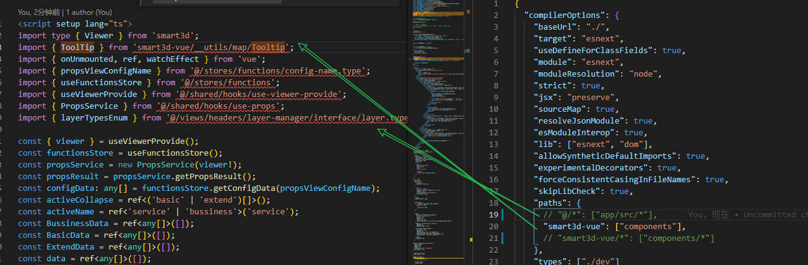
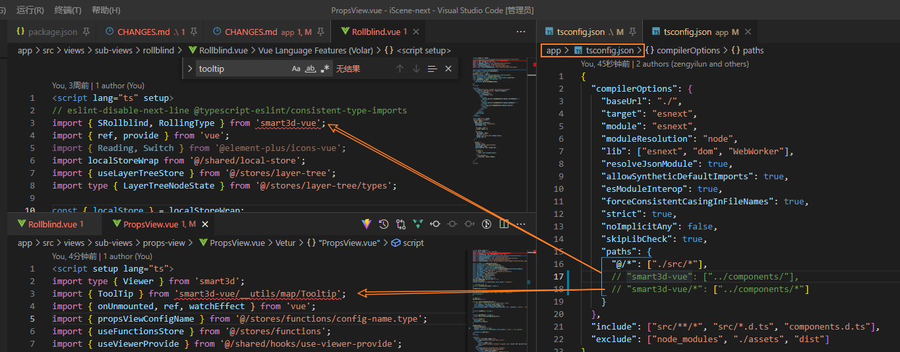
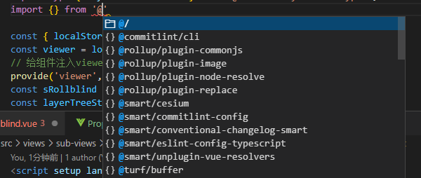
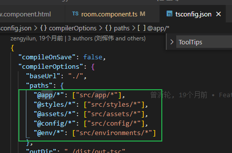
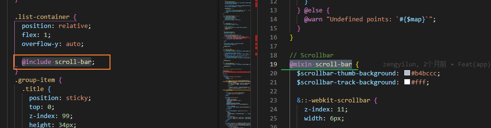
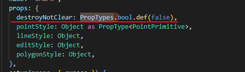

### github issue labels


[bug](https://github.com/reegodev/vue-screen/labels/bug) Something isn't working

[dependencies](https://github.com/reegodev/vue-screen/labels/dependencies) Pull requests that update a dependency file

[duplicate](https://github.com/reegodev/vue-screen/labels/duplicate) This issue or pull request already exists

[enhancement](https://github.com/reegodev/vue-screen/labels/enhancement) New feature or request

[good first issue](https://github.com/reegodev/vue-screen/labels/good first issue) Good for newcomers

[hacktoberfest](https://github.com/reegodev/vue-screen/labels/hacktoberfest)

[help wanted](https://github.com/reegodev/vue-screen/labels/help wanted) Extra attention is needed

[invalid](https://github.com/reegodev/vue-screen/labels/invalid) This doesn't seem right

[Missing repro](https://github.com/reegodev/vue-screen/labels/Missing repro)

[question](https://github.com/reegodev/vue-screen/labels/question) Further information is requested

[wontfix](https://github.com/reegodev/vue-screen/labels/wontfix) This will not be worked on


### Vue 函数式组件


### esm 中的 import()  [$](https://es6.ruanyifeng.com/#docs/module#import)

### 简介

前面介绍过，`import`命令会被 JavaScript 引擎静态分析，先于模块内的其他语句执行。所以，下面的代码会报错。

```javascript
// 报错
if (x === 2) {
  import MyModual from './myModual';
}
```

引擎处理`import`语句是在编译时，这时不会去分析或执行`if`语句，所以`import`语句放在`if`代码块之中毫无意义，因此会报句法错误，而不是执行时错误。

**`import`和`export`命令只能在模块的顶层，不能在代码块之中**

如果`import`命令要取代 Node 的`require`方法，这就形成了一个障碍。因为`require`是运行时加载模块，`import`命令无法取代`require`的动态加载功能。


[ES2020提案](https://github.com/tc39/proposal-dynamic-import) 引入`import()`函数，支持动态加载模块。

`import`函数的参数`specifier`，指定所要加载的模块的位置。

`import`命令能够接受什么参数，`import()`函数就能接受什么参数，两者区别主要是后者为动态加载。

`import()`返回一个 Promise 对象。`import()`加载模块成功以后，这个模块会作为一个对象，当作`then`方法的参数。

```javascript
const main = document.querySelector('main');

import(`./section-modules/${someVariable}.js`)
  .then(module => {
    module.loadPageInto(main);
  })
  .catch(err => {
    main.textContent = err.message;
  });
```

`import()`函数可以用在任何地方，不仅仅是模块，非模块的脚本也可以使用。它是运行时执行，也就是说，什么时候运行到这一句，就会加载指定的模块。

另外，`import()`函数与所加载的模块没有静态连接关系，这点也是与`import`语句不相同。

`import()`类似于 Node 的`require`方法，区别主要是前者是异步加载，后者是同步加载。

### 适用场合

下面是`import()`的一些适用场合。

（1）按需加载。

（2）条件加载

`import()`可以放在`if`代码块，根据不同的情况，加载不同的模块。

（3）动态的模块路径

`import()`允许模块路径动态生成。


如果想同时加载多个模块，可以采用Promise.all包裹转成一个Promise。

```javascript
Promise.all([
  import('./module1.js'),
  import('./module2.js'),
  import('./module3.js'),
])
.then(([module1, module2, module3]) => {
   ···
});
```

`import()`也可以用在 async 函数之中。

```javascript
async function main() {
  const myModule = await import('./myModule.js');
  const {export1, export2} = await import('./myModule.js');
  const [module1, module2, module3] =
    await Promise.all([
      import('./module1.js'),
      import('./module2.js'),
      import('./module3.js'),
    ]);
}
main();
```


### eslint 不认 vite 配置的别名



主要是修改根路径下的tsconfig.json文件





但是 `app/tsconfig` 也有配置别名, 这里也要配置... 不知道怎么具体是应用关系, 而且这个不配会影响到 `lint` 命令



配置后还可以在import时识别`别名`




`iscene-tsconfig.json`



[路径映射](https://www.tslang.cn/docs/handbook/module-resolution.html#path-mapping)

[如何让eslint、ts识别配置的路径别名，并且不报错？ - 掘金 (juejin.cn)](https://juejin.cn/post/7021084391065518087)

### 滚动条样式 mixin



使用时需要先提前引导定义mixin的文件`@use '@/styles/mixins/mixins' as *;`


### .gitattributes

```
* text=auto eol=lf
*.ts linguist-detectable=false
*.css linguist-detectable=false
*.scss linguist-detectable=false
*.js linguist-detectable=true
*.vue linguist-detectable=true
```


### PropTypes?

```ts
import type { CSSProperties } from 'vue';
import type { VueTypeValidableDef, VueTypesInterface } from 'vue-types';
import { createTypes } from 'vue-types';
import type { VueNode } from './type';

const PropTypes = createTypes({
  func: undefined,
  bool: undefined,
  string: undefined,
  number: undefined,
  array: undefined,
  object: undefined,
  integer: undefined,
});

PropTypes.extend([
  {
    name: 'looseBool',
    getter: true,
    type: Boolean,
    default: undefined,
  },
  {
    name: 'style',
    getter: true,
    type: [String, Object],
    default: undefined,
  },
  {
    name: 'VNodeChild',
    getter: true,
    type: undefined,
  },
]);

export function withUndefined<T extends { default?: any }>(type: T): T {
  // eslint-disable-next-line no-param-reassign
  type.default = undefined;
  return type;
}
export default PropTypes as VueTypesInterface & {
  readonly looseBool: VueTypeValidableDef<boolean>;
  readonly style: VueTypeValidableDef<CSSProperties>;
  readonly VNodeChild: VueTypeValidableDef<VueNode>;
};

```

组件定义prop



