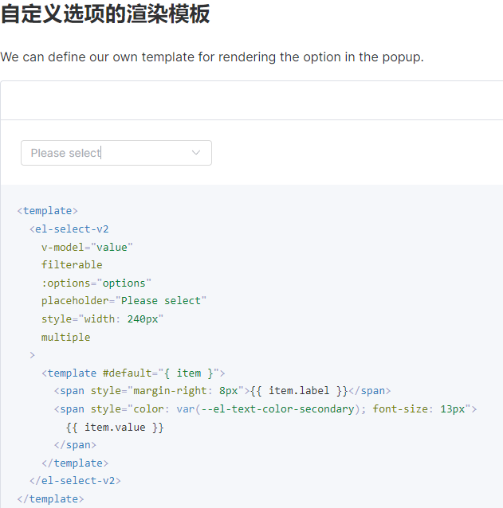
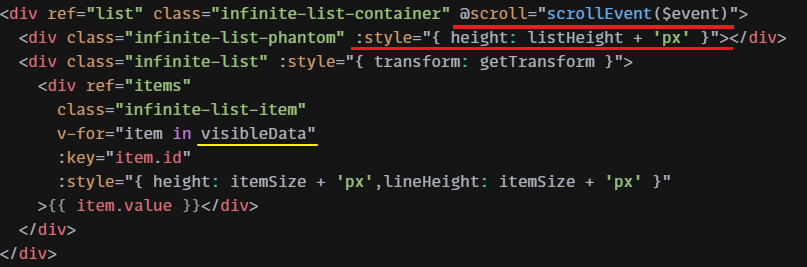

[TOC]


### Vue组件传参


### 高手过招


- 对哪些构建工具比较熟悉，bundler还是bundless的，简单介绍几个工具之间对应解决的场景，以及为什么。再细分问webpack是怎么处理es6和commonjs之间的模块差异的，异步chunk的原理。rollup有了解它实现treeshaking的原理吗，vite可以讲下热更新的链路吗

**孤独的野驴**：当然是bundler的了，webpack runrime使用自定义的require方法，进行模块加载，对es module使用esModule=true标记进行标识，对应的加载时候判断esModule属性对模块导出添加.default。async module使用jsonp包装同样使用自定义require evel之后进行加载。tree shake还是基于esmodule的可进行静态依赖分析实现的，或者使用ast层面引用计数方式去除引用次数为0的模块。vite通过socket重新让浏览器发出bundler请求，请求进入内部的dev server后进行vue代码块编译，返回前端tender函数执行

- 用户反馈页面打开表格中的某个下拉框，非常卡顿，需要优化。可以讲讲你的排查思路吗

- 有使用过微前端的相关技术吗，它解决了你的什么问题，你的方案选型的思路是怎么样的，这个方案的缺点xx怎么看待，有了解过它的沙箱机制是怎么实现的吗，还有没有其他方法可以实现这种机制


- 为什么前端也需要开一个server
  开server的目的是为了实时渲染代码。当代码有变动时，server会感受到，并且更新改动的代码。通过websocket传给浏览器，从而实现浏览器显示的画面随着代码的更新自动变化


### 使用虚拟滚动优化 大量Option

https://element-plus.gitee.io/zh-CN/component/select-v2.html#selectv2-%E5%B1%9E%E6%80%A7

在某些使用情况下，单个选择器可能最终加载数万行数据。 将这么多的数据渲染至 DOM 中可能会给浏览器带来负担，从而造成性能问题。 为了更好的用户和开发者体验，我们决定添加此组件。


使用的案例:


使用value-key + 作用域插槽:




#### 实现的原理?

确实能够优化上万条的数据

**[高性能渲染十万条数据(虚拟列表)](https://juejin.cn/post/6844903982742110216)**

demo: https://codesandbox.io/s/virtuallist-1-rp8pi?file=/src/components/VirtualList.vue





startOffset is what??  **取mod, 保证是size的倍数, 完整显示单条**

设置个debugger; 看看 

### Array.from({ length: count }) 

`Array.from`方法用于将两类对象转为真正的数组：类似数组的对象（array-like object）和可遍历（iterable）的对象（包括 ES6 新增的数据结构 Set 和 Map）。

`{length: number}` 即为类数组对象 本质特征只有一点，即必须有`length`属性。

```javascript
Array.from({ length: 3 });
// [ undefined, undefined, undefined ]
```

`Array.from`还可以接受**第二个参数**，作用类似于数组的`map`方法，用来对每个元素进行处理，将处理后的值放入返回的数组。

```javascript
Array.from(arrayLike, x => x * x);
// 等同于
Array.from(arrayLike).map(x => x * x);

Array.from([1, 2, 3], (x) => x * x)
// [1, 4, 9]
```


### 1

烂尾楼产生原因--财政完全依赖卖地，狂撸工资税，不收资产税，竭泽而渔

烂尾楼是因为政府要发展，没钱，也不愿意让富人交税。想提前预支无产阶级余生的收入，就划片野地找几个开发商抬价，抬完价找银行给开发商放贷，然后允许开发商通过预售来极限榨取工薪族余生剩余价值。不用担心无产阶级买二手房，市中心房子全部都屯在富人手里，0持有成本，可以出租稳定获利，期房定价刚好是无产阶级承受极限。富人二手房定价相对期房上浮20%，刚好超过了无产阶级能力极限。

开发商大量贷款和拍卖抬价产生了很高的资金利息成本，这些资金成本需要房子不断涨价，销售回款稳定才能维持。从13年到19年房子的涨幅和经济发展是可以维持地产公司的融资成本的。20年疫情开始后房价太高，经济不景气，无产阶级无力接盘了，然后地产公司贷的几千亿资金利息不会停，房价不涨，卖不出去就意味着每天都在亏钱。所以资本扩张太严重或者实力差的就烂尾了

\---
烂尾楼解决方案:调整税收制度，降低工资税，增加资产税，用阶梯房产税代替卖地财政[从游牧进化为畜牧]，实现可持续发展


立即取消居民住宅用地竞价拍卖制，收编所有无良资本主义房企成立国家住房，主营住房，装修，物业业务，对标国家电网。

0.开发国家住房app,买房卖房，拍卖，房产税，装修，物业，一个app全搞定。住房售卖价格根据市场供需关系每周五变更，只要哄抢就涨，连续4周滞销就降，避免价格不符合供需关系引发哄抢或者滞销。以上年平均售价作为征税基准，贷款未还完禁止再买房。

1.用房产税代替卖地收入，家庭前二套1%，三套3%，4套5%，5套10%，6套15%，阶梯递增，上不封顶。套数顺序按从贵到便宜排列，以结婚证算一个家庭，离婚的人征税套数按+1算。

2.超过180平的住房，面积除于120算套数，小产权在被拆除之前*0.6的系数交税。

3.家庭综合收入低于最低工资*2，且只有一套房的，的首套房税率减免80%，[未还贷款可以再买一套相同房产的，且只有一套房的接盘侠们公式放宽到:家庭收入-每月还贷金额<最低工资*2]申请时需提供近5年银行流水，消费记录，旅行记录，发现诈骗国家的拘役30天，上征信。

4.欠税一年以上拍卖房子[唯一住房除外，只上征信]，拍卖所得扣去滞纳金罚金，拍卖佣金，欠款后剩余的钱给房主，拍卖所得低于上面费用的一笔勾销，如果降到均价25%还卖不出去，政府收购房产，用于商业运作补贴财政。

5.代持没收房产，代持双方拘役6个月，上征信，根据实际出资人，银行流水，持有人，入住人，邻里证言居委会证言判定代持，举报成功奖励罚金10%。买房时签署代持后果告知书。

6.假离婚罚款家庭资产*0.2，夫妻双方拘役三个月，上征信。根据房产套数，离婚时间，婚姻破裂证据，邻里证言，居委会证言，银行流水，来判断是否假离婚，举报成功奖励罚金10%。离婚时需签署假离婚后果告知书。

7.税制改革，个税起征点为家庭月收入达到当地每平米房价*2，社保取消公司统筹部分，重点征收房产税，资产税，遗产税，移民税


市场经济的唯一致命缺陷是富人可以通过投机生活必需品人为控制供需关系，暴力剥削穷人，房产税可完美解决这一致命缺陷。


生活必需品竞价拍卖制无限放大了既有资产的话语权重，降低了知识技能的话语权重。还会劣币驱逐良币，淘汰掉踏踏实实盖房子的地产公司。迫使地产公司为了拿地剑走偏锋玩金融，疯狂极限加杠杆，加到房价不涨就会倒闭那种，同时把房价抬到畸形危险的高度，降低人民幸福度，降低内需，阻碍制造业升级，降低实体产业投入，扩大贫富差距，造成巨大资源浪费和经济危机。成立国家住房可以完美解决这个问题。


阶梯房产税+欠税拍卖制可以引导当代地主主动或被动抛售多余房产，让供需关系回到不受投机干涉的水平，缩小贫富差距扩大内需。富人由于人数量少钱多，他们的钱大部分都用于奢侈品，移民，出国旅游，留学，国外豪宅，转移资产[王健林，潘石屹，海底捞老板，宋丹丹继女，某 ]，对社会内需的回报率很低，0.001%左右，穷人的钱都用于国内消费，可以提供很多制造业服务行业岗位，对社会内需的回报率可以达到95%，贫差大的结果就是社会财富持续流失，内需严重不足，制造业无法升级。


目前状况已经到了不改革就耽搁发育的地步了，就像一个年轻人身上的肿瘤一样，吸收了本该属于其他部位的营养，埋下健康的隐患。


如果成功按照上述方案改革后，中国将会贫富差距缩小，人民幸福度提高，资本流入实体产业，内需扩大，制造业升级，经济科技飞速发展，我国将快速跻身发达国家行业，超越美国，成为新的世界霸主。
