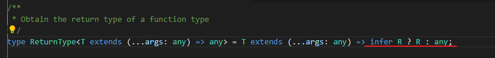

### [Finger Pool](https://github.com/victorqribeiro/fingerPool)

开源的 2D 网页桌球游戏，撞击效果做得很好


### [我打算重写 TypeScript 编译器](https://zackoverflow.dev/writing/tyty)（英文）

TypeScript 编译器 tsc 是用 JavaScript 写的，非常慢。作者打算用 Rust 写一个非官方的编译器。


### [Deno 示例集](https://examples.deno.land/)

[Deno 示例集](https://examples.deno.land/)


### esbuild 为什么这么快

[esbuild - FAQ](https://esbuild.github.io/faq/)

esbuild 是新一代的 JavaScript 打包工具，以速度快著称，耗时只有 Webpack 的2%～3%。本文是该软件的作者谈它为什么这么快。


### returnType




### 泛型约束


### Blob

[Blob](https://mp.weixin.qq.com/s?__biz=MzI2MjcxNTQ0Nw==&mid=2247484522&idx=1&sn=7028aa65a4dec0f2d0cb847838703bc3&chksm=ea47a532dd302c242b0672d83169d489eb1dd58a7ef41d9cc47008e5a07b8527a35018029311&scene=21#wechat_redirect)

[mdn](https://developer.mozilla.org/zh-CN/docs/Web/API/Blob/stream)

#### Blob 使用场景: 分片上传

File 对象是特殊类型的 Blob，且可以用在任意的 Blob 类型的上下文中。所以针对大文件传输的场景，我们可以使用 slice 方法对大文件进行切割，然后分片进行上传，具体示例如下：

```js
const file = new File(["a".repeat(1000000)], "test.txt");

const chunkSize = 40000;
const url = "https://httpbin.org/post";

async function chunkedUpload() {
  for (let start = 0; start < file.size; start += chunkSize) {
      const chunk = file.slice(start, start + chunkSize + 1);
      const fd = new FormData();
      fd.append("data", chunk);

      await fetch(url, { method: "post", body: fd }).then((res) =>
        res.text()
      );
  }
}
```

#### Blob 用作 URL

Blob 可以很容易的作为 `<a>`、`` 或其他标签的 URL
