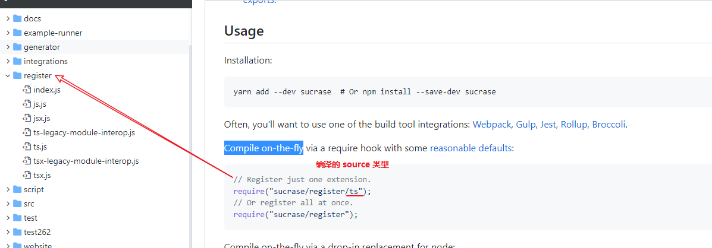
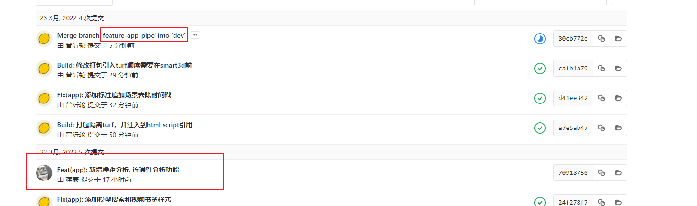
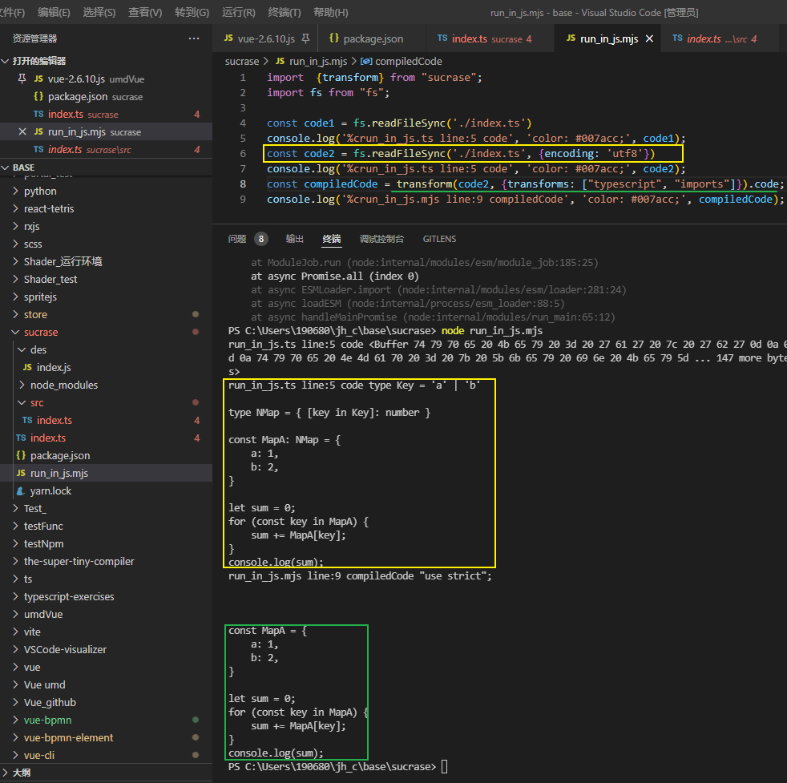
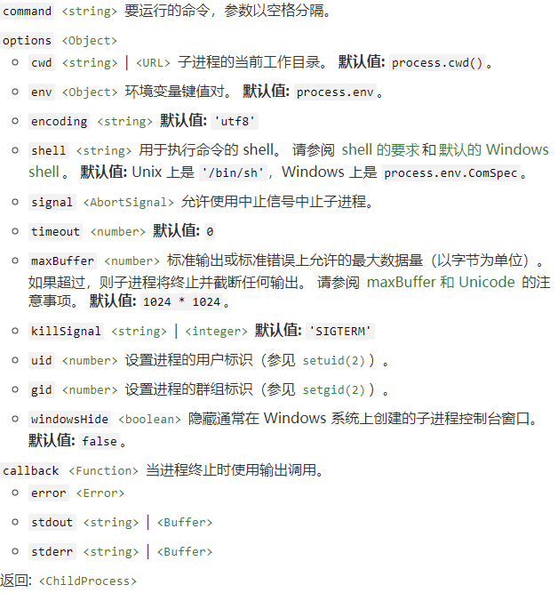
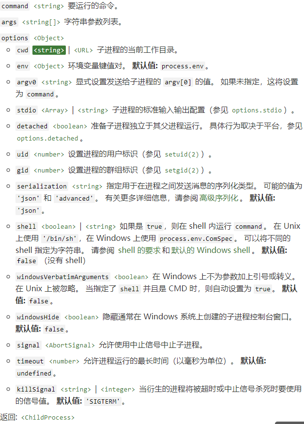

### iScene-next 分别打包执行的操作

```json
// package.json
"build-lib": "gulp --require sucrase/register/ts -f build/gulpfile.ts",


"build-app": "yarn workspace iscene run build",
--"build": "build": "rimraf -rf dist && vite build",
```

- build-lib

  以components为核心内容输出一个lib文件提供给外部使用

  **gulp-cli**

  Gulp 由许多小模块组成，这些模块被拉到一起以实现内聚性工作。通过在小模块中使用 [semver](https://semver.org/)，我们可以在不发布 gulp 新版本的情况下发布 bug 修复和特性。通常，当您没有看到主存储库上的进展时，工作是在其中一个模块中完成的。

  如果遇到问题，请使用 `npm update` 命令更新当前模块。如果问题仍然存在，则在单个项目存储库上打开一个 issue。
  
  - [undertaker](https://github.com/gulpjs/undertaker) - the task registration system
  - [vinyl](https://github.com/gulpjs/vinyl) - the virtual file objects
  - [vinyl-fs](https://github.com/gulpjs/vinyl-fs) - a vinyl adapter to your local file system
  - [glob-watcher](https://github.com/gulpjs/glob-watcher) - the file watcher
  - [bach](https://github.com/gulpjs/bach) - task orchestration using `series()` and `parallel()`
  - [last-run](https://github.com/gulpjs/last-run) - tracks the last run time of a task
- [vinyl-sourcemap](https://github.com/gulpjs/vinyl-sourcemap) - built-in sourcemap support
  - [gulp-cli](https://github.com/gulpjs/gulp-cli) - the command line interface for interacting with gulp

  ## gulp-cli Flags

  gulp has very few flags to know about. All other flags are for tasks to use if needed.

  **Some flags only work with gulp 4 and will be ignored when invoked against gulp 3.**
  
  | Flag                       | Short Flag | Description                                                  |
  | -------------------------- | ---------- | ------------------------------------------------------------ |
  | --help                     | -h         | Show this help.                                              |
  | --version                  | -v         | Print the global and local gulp versions.                    |
  | --require [path]           |            | **Will require a module before running the gulpfile. This is useful for transpilers but also has other applications.** |
  | --gulpfile [path]          | -f         | **Manually set path of gulpfile. Useful if you have multiple gulpfiles. This will set the CWD to the gulpfile directory as well.** |
  | --cwd [path]               |            | Manually set the CWD. The search for the gulpfile, as well as the relativity of all requires (including the `--require` flag) will be from here. |
  | --verify [path (optional)] |            | Will verify plugins referenced in project's package.json against the plugins blacklist. |
  | --tasks                    | -T         | Print the task dependency tree for the loaded gulpfile.      |
  | --tasks-simple             |            | Print a plaintext list of tasks for the loaded gulpfile.     |
  | --tasks-json [path]        |            | Print the task dependency tree, in JSON format, for the loaded gulpfile. The [path] argument is optional, and if given writes the JSON to the path. |
  | --tasks-depth [number]     |            | Specify the depth of the task dependency tree to print. This flag can be used with --tasks or --tasks-json. (This flag was named --depth before but is deprecated.) |
  | --compact-tasks            |            | Reduce the output of task dependency tree by printing only top tasks and their child tasks. This flag can be used with --tasks or --tasks-json. |
  | --sort-tasks               |            | Will sort top tasks of task dependency tree. This flag can be used with --tasks. |
  | --color                    |            | Will force gulp and gulp plugins to display colors, even when no color support is detected. |
  | --no-color                 |            | Will force gulp and gulp plugins to not display colors, even when color support is detected. |
  | --silent                   | -S         | Suppress all gulp logging.                                   |
  | --continue                 |            | Continue execution of tasks upon failure.                    |
| --series                   |            | Run tasks given on the CLI in series (the default is parallel). |
  | --log-level                | -L         | Set the loglevel. -L for least verbose and -LLLL for most verbose. -LLL is default. |

  
  
  **总结**: 指明gulpfile的路径, 同时会要借助sucrase这个编译工具进行编译ts

```ts
import { series, parallel, task } from 'gulp';
import { withTaskName } from './utils/gulp';
import { run } from './utils/process';
import { buildFullBundle } from './gulp/build-full';
import { buildModules } from './gulp/build-modules';
import { generateTypesDefinitions } from './gulp/types-definitions';
import buildStyle from './gulp/build-style';

const runTask = (name: string) => withTaskName(name, () => run(`yarn run build-lib ${name}`));

task('buildModules', buildModules);
task('buildModulesStyle', buildStyle);
task('buildFullBundle', buildFullBundle);
task('generateTypesDefinitions', generateTypesDefinitions);

export default series(
  withTaskName('clean', () => run('yarn run clean')),

  parallel(
    runTask('buildModules'),
    runTask('buildModulesStyle'),
    runTask('buildFullBundle'),
    runTask('generateTypesDefinitions')
  )
);

```


输出了es&lib两个目录


- **vite build**

  build 会通过依赖图把所有的模块打包输出


#### build-lib各个子任务

```ts
// build-modules.ts
import { rollup } from 'rollup';
import type { OutputOptions } from 'rollup';
import vue from 'rollup-plugin-vue';
import { nodeResolve } from '@rollup/plugin-node-resolve';
import commonjs from '@rollup/plugin-commonjs';
import esbuild from 'rollup-plugin-esbuild';
import filesize from 'rollup-plugin-filesize';
import image from '@rollup/plugin-image';
import glob from 'fast-glob';
import { compRoot } from '../paths';
import { generateExternal, writeBundles } from '../utils/rollup';
import { reporter } from '../plugins/size-reporter';
import { buildConfigEntries } from './build-info';
import { excludeFiles } from '../utils/pkg';

export const buildModules = async () => {
  const input = excludeFiles(
    await glob('**/*.{js,ts,vue}', {
      cwd: compRoot,
      absolute: true,
      onlyFiles: true,
      ignore: ['**/style/index.ts'],
    })
  );
  const bundle = await rollup({
    input: input,
    external: await generateExternal({ full: false }),
    plugins: [
      vue({ target: 'browser' }),
      nodeResolve({
        extensions: ['.mjs', '.js', '.json', '.ts'],
      }),
      commonjs(),
      image(),
      esbuild({
        sourceMap: true,
        target: 'es2018',
      }),
      filesize({ reporter }),
    ],
    treeshake: false,
  });
  await writeBundles(
    bundle,
    buildConfigEntries.map(([module, config]): OutputOptions => {
      return {
        format: config.format,
        dir: config.output.path,
        exports: module === 'cjs' ? 'named' : undefined,
        preserveModules: true,
        preserveModulesRoot: compRoot,
        sourcemap: true,
        entryFileNames: `[name].${config.ext}`,
      };
    })
  );
};

```


### git merge 可合并到之前的节点




昨天提的MR [feat(app)],  今天在dev上提交之后合并MR,  feat(app) 的节点在今天提交节点之前?

commit 的hash值也没有变更?


怎么理解往分支前面


### 在node环境中使用esm && readFileSync读取文件内容



- js文件使用 `.mjs` 后缀在执行.

- readFileSync要添加编码格式`utf8`

  如果指定了 `encoding` 选项，则此函数返回字符串。 否则它返回Buffer。


### Babel是如何工作的：

1. 将输入源代码 Tokenize  为  token stream。
2. 将 token stream 解析为 AST。
3. **遍历 AST 以计算每个变量的作用域信息**。
4. 在单个遍历中应用所有转换插件，从而生成新的 AST。
5. 打印生成的 AST。


### child_process.exec & child_process.spawn

#### `exec(command[, options][, callback])`:衍生 shell




**衍生 shell，然后在该 shell 中执行 `command`，**缓冲任何生成的输出。 

传给执行函数的 `command` 字符串由 shell 直接处理，特殊字符（因 [shell](http://url.nodejs.cn/eUHhwc) 而异）需要进行相应处理：

```js
const { exec } = require('child_process');

exec('"/path/to/test file/test.sh" arg1 arg2');
// 使用双引号，这样路径中的空格就不会被解释为多个参数的分隔符。

exec('echo "The \\$HOME variable is $HOME"');
// $HOME 变量在第一个实例中被转义，但在第二个实例中没有。
```

**切勿将未经处理的用户输入传给此函数。 任何包含 shell 元字符的输入都可用于触发任意命令执行。**

如果提供了 `callback` 函数，则使用参数 `(error, stdout, stderr)` 调用它。 成功后，`error` 将是 `null`。 出错时，`error` 将是 [`Error`](http://nodejs.cn/api/errors.html#class-error) 的实例。 `error.code` 属性将是进程的退出码。 按照惯例，除 `0` 之外的任何退出码都表示错误。 `error.signal` 将是终止进程的信号。

传给回调的 `stdout` 和 `stderr` 参数将包含子进程的标准输出和标准错误的输出。 默认情况下，Node.js 会将输出解码为 UTF-8 并将字符串传给回调。 `encoding` 选项可用于指定用于解码标准输出和标准错误的输出的字符编码。 如果 `encoding` 是 `'buffer'` 或无法识别的字符编码，则 `Buffer` 对象将被传给回调。

```js
const { exec } = require('child_process');
exec('cat *.js missing_file | wc -l', (error, stdout, stderr) => {
  if (error) {
    console.error(`exec error: ${error}`);
    return;
  }
  console.log(`stdout: ${stdout}`);
  console.error(`stderr: ${stderr}`);
});
```

如果 `timeout` 大于 `0`，则如果子进程运行时间超过 `timeout` 毫秒，父进程将发送由 `killSignal` 属性（默认为 `'SIGTERM'`）标识的信号。

与 [`exec(3)`](http://url.nodejs.cn/rVeqwf) POSIX 系统调用不同，`child_process.exec()` 不替换现有进程，而是使用 shell 来执行命令。

如果此方法作为其 [`util.promisify()`](http://nodejs.cn/api/util.html#utilpromisifyoriginal) 版本被调用，则其将为具有 `stdout` 和 `stderr` 属性的 `Object` 返回 `Promise`。 返回的 `ChildProcess` 实例作为 `child` 属性附加到 `Promise`。 如果出现错误（包括任何导致退出码不是 0 的错误），则将返回被拒绝的 promise，其具有与回调中给定相同的 `error` 对象，但有两个额外的属性 `stdout` 和 `stderr`。

```js
const util = require('util');
const exec = util.promisify(require('child_process').exec);

async function lsExample() {
  const { stdout, stderr } = await exec('ls');
  console.log('stdout:', stdout);
  console.error('stderr:', stderr);
}
lsExample();
```

如果启用了 `signal` 选项，则在相应的 `AbortController` 上调用 `.abort()` 与在子进程上调用 `.kill()` 类似，只是传给回调的错误将是 `AbortError`：

```js
const { exec } = require('child_process');
const controller = new AbortController();
const { signal } = controller;
const child = exec('grep ssh', { signal }, (error) => {
  console.log(error); // 一个 AbortError
});
controller.abort();
```

#### `spawn(command[, args][, options])` : 衍生新进程



`child_process.spawn()` 方法**使用给定的 `command` 和 `args` 中的命令行参数衍生新进程。** 如果省略，`args` 默认为空数组。

**如果启用了 `shell` 选项，则请勿将未经处理的用户输入传递给此函数。 任何包含 shell 元字符的输入都可用于触发任意命令执行。**

第三个参数可用于指定其他选项，具有以下默认值：

```js
const defaults = {
  cwd: undefined,
  env: process.env
};
```

使用 `cwd` 指定从中衍生进程的工作目录。 如果没有给定，则默认是继承当前工作目录。 如果给定，但路径不存在，则子进程会触发 `ENOENT` 错误并立即退出。 当命令不存在时，也会触发 `ENOENT`。

使用 `env` 指定对新进程可见的环境变量，默认为 [`process.env`](http://nodejs.cn/api/process.html#processenv)。

`env` 中的 `undefined` 值将被忽略。

运行 `ls -lh /usr`、捕获 `stdout`、`stderr` 和退出码的示例：

```js
const { spawn } = require('child_process');
const ls = spawn('ls', ['-lh', '/usr']);

ls.stdout.on('data', (data) => {
  console.log(`stdout: ${data}`);
});

ls.stderr.on('data', (data) => {
  console.error(`stderr: ${data}`);
});

ls.on('close', (code) => {
  console.log(`child process exited with code ${code}`);
});
```

示例：一种非常精细的运行 `ps ax | grep ssh` 的方式

```js
const { spawn } = require('child_process');
const ps = spawn('ps', ['ax']);
const grep = spawn('grep', ['ssh']);

ps.stdout.on('data', (data) => {
  grep.stdin.write(data);
});

ps.stderr.on('data', (data) => {
  console.error(`ps stderr: ${data}`);
});

ps.on('close', (code) => {
  if (code !== 0) {
    console.log(`ps process exited with code ${code}`);
  }
  grep.stdin.end();
});

grep.stdout.on('data', (data) => {
  console.log(data.toString());
});

grep.stderr.on('data', (data) => {
  console.error(`grep stderr: ${data}`);
});

grep.on('close', (code) => {
  if (code !== 0) {
    console.log(`grep process exited with code ${code}`);
  }
});
```

检查失败 `spawn` 的示例：

```js
const { spawn } = require('child_process');
const subprocess = spawn('bad_command');

subprocess.on('error', (err) => {
  console.error('Failed to start subprocess.');
});
```

某些平台（macOS、Linux）将使用 `argv[0]` 的值作为进程标题，而其他平台（Windows、SunOS）将使用 `command`。

Node.js 当前在启动时用 `process.execPath` 覆盖 `argv[0]`，因此 Node.js 子进程中的 `process.argv[0]` 将不匹配从父进程传给 `spawn` 的 `argv0` 参数，而是使用 `process.argv0` 属性检索它。

如果启用了 `signal` 选项，则在相应的 `AbortController` 上调用 `.abort()` 与在子进程上调用 `.kill()` 类似，只是传给回调的错误将是 `AbortError`：

```js
const { spawn } = require('child_process');
const controller = new AbortController();
const { signal } = controller;
const grep = spawn('grep', ['ssh'], { signal });
grep.on('error', (err) => {
  // 如果控制器中止，则这将在 err 为 AbortError 的情况下被调用
});
controller.abort(); // 停止子进程
```


### [Node process 进程](http://nodejs.cn/api/process.html)


### Node.tls 安全传输层 [#](http://nodejs.cn/api/tls.html#tlsssl-concepts)
