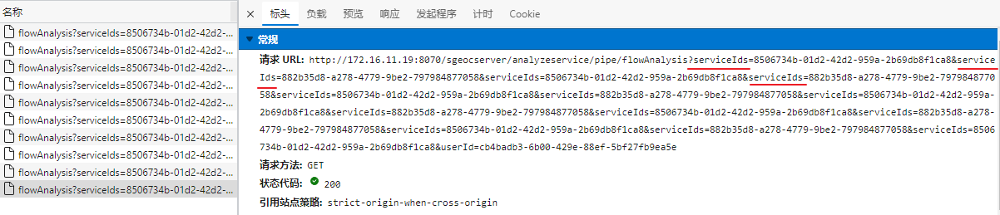

[TOC]


### three.js 多相机

http://www.webgl3d.cn/threejs/examples/webgl_camera_array.html


### Cesium 多视角

2/3维联动 ~ `import 'Linkage23D' from 'smart3d'`


Cesium是多个`Viewer`

示例: [Multiple Synced Views - Cesium Sandcastle](https://sandcastle.cesium.com/?src=Multiple Synced Views.html)


### axios get 请求query中怎么带有一对[]

```js
export function flowAnalysis(serviceIds: string[]) {
  return request.get('/analyzeservice/pipe/flowAnalysis', {
    params: {
      serviceIds,
    },
  });
}
```


?? 

不过功能正常的请求url如下:




同名的请求参数 key ?

正常情况下


那上面的请求参数要更改为..?


更改为 `string,string` 的参数即可正常请求

总结问题: **axios.get 数组类型的query 参数异常**


`axios/package.json/yarn start`

坑爹呢? 要用 `qs` 模块转换一下 

[axios传递数组参数爬坑总结 - 简书 (jianshu.com)](https://www.jianshu.com/p/68d81da4e1ad)

axios的get方法中使用params时对于js数组类型的参数的默认操作比较诡异，会使得参数名后带上'[]'字符串

究其原因是axios对params的序列化采用的是[qs库](https://link.segmentfault.com/?enc=4GW%2By6hS8rjOqsz3GqtdBg%3D%3D.U%2B0UG%2FtyoDIzRW2g7YGa0zZsE6U4bYYSzuX8y%2FOuzRfcgJQR1SMsJsGp4wC23DXw)

因此可以使用qs自带的 arrayFormat 参数配置解决这个问题，大致配置如下：


### axios封装

```ts
import type { AxiosRequestConfig, AxiosResponse } from 'axios';
import axios from 'axios';
import qs from 'qs';
import { useStore } from '@/stores';
import { getUserIdCookie } from '../utils/cookie';
import type { SmartResponse } from './config';
import { configUrl } from './config';
import './interceptors/user-interceptor';

const defaultConfig: AxiosRequestConfig<any> = {
  timeout: 30000,
  withCredentials: true, // 请求携带 cookie 
  params: {},
};

/**
 * 请求集合地
 *
 * 处理各式请求方式，添加请求头等相关信息
 */
export const request = {
  /**
   * 非平台环境配置接口地址get请求
   */
  getOwnUrl: (url: string, options: AxiosRequestConfig<any> = defaultConfig) =>
    new Promise((resolve, reject) => {
      axios
        .get(url, {
          ...options,
        })
        .then((response: AxiosResponse) => {
          resolve(response.data);
        })
        .catch((response: AxiosResponse) => {
          reject(response);
        });
    }),

  /**
   * 封装的get请求，默认开启携带cookie请求
   */
  get: (url: string, options: AxiosRequestConfig<any> = {}) => {
    const { params = defaultConfig.params, ...arg } = options;
    const store = useStore();

    return new Promise<SmartResponse>((resolve, reject) => {
      axios
        .get(configUrl + url, {
          withCredentials: defaultConfig.withCredentials,
          timeout: defaultConfig.timeout,
          ...arg,
          params: {
            userId: getUserIdCookie(),
            systemId: store.$state.platformInfo.systemId,
            ...params,
          },
        })
        .then((response: AxiosResponse) => {
          resolve(response.data);
        })
        .catch((reason: unknown) => {
          reject(reason);
        });
    });
  },

  /**
   * 传统表单提交请求，`application/x-www-form-urlencoded`类型提交
   */
  post: (url: string, data: any) =>
    new Promise<SmartResponse>((resolve, reject) => {
      const store = useStore();
      // 全面接口添加systemId字段
      if (!data.hasOwnProperty('systemId')) {
        data.systemId = store.$state.platformInfo.systemId;
      }
      axios
        .post(configUrl + url, qs.stringify(data), {
          headers: {
            'Content-type': 'application/x-www-form-urlencoded',
          },
          params: {
            userId: getUserIdCookie(),
          },
          withCredentials: defaultConfig.withCredentials,
          timeout: defaultConfig.timeout,
        })
        .then((res: AxiosResponse) => {
          resolve(res.data);
        })
        .catch((res: AxiosResponse) => {
          reject(res);
        });
    }),

  /**
   * 使用`multipart/form-data`类型上传提交，一般文件上传使用
   */
  postFormData: (url: string, formData: FormData) =>
    new Promise<SmartResponse>((resolve, reject) => {
      const store = useStore();
      // 全面接口添加systemId字段
      if (formData.has && formData.has('systemId')) {
        // ie FormData没有has方法
        formData.append('systemId', store.$state.platformInfo.systemId);
      }

      axios
        .post(configUrl + url, formData, {
          headers: {
            'Content-type': 'multipart/form-data',
          },
          params: {
            userId: getUserIdCookie(),
          },
          withCredentials: defaultConfig.withCredentials,
          timeout: defaultConfig.timeout,
        })
        .then((res: AxiosResponse) => {
          resolve(res.data);
        })
        .catch((reason: any) => {
          reject(reason);
        });
    }),

  /**
   * 使用`application/json`类型上传提交
   */
  postJson: (url: string, data: any) =>
    new Promise<SmartResponse>((resolve, reject) => {
      const store = useStore();
      // 全面接口添加systemId字段
      // eslint-disable-next-line no-param-reassign
      if (!data.hasOwnProperty('systemId')) {
        data.systemId = store.$state.platformInfo.systemId;
      }

      axios
        .post(configUrl + url, data, {
          headers: {
            'Content-type': 'application/json',
          },
          params: {
            userId: getUserIdCookie(),
          },
          withCredentials: defaultConfig.withCredentials,
          timeout: defaultConfig.timeout,
        })
        .then((res: AxiosResponse) => {
          resolve(res.data);
        })
        .catch((reason: any) => {
          reject(reason);
        });
    }),
};
```


### 拓展Cesium的特性

[Cesium实现流动线/动态纹理](https://blog.csdn.net/weixin_42066016/article/details/105426932?msclkid=79f3782bb25311ec86c402de2bd9888c)

#### 流动纹理 [#PolyLineTrailLinkMaterialProperty](./Cesium-ExtraFeature/PolyLineTrailLinkMaterialProperty.js)

```js

// const img = require('@assets/img/pipeflow.png');
// const img = require('@assets/source/img/flowdirection/arrow.png');
import img from '@assets/source/img/flowdirection/arrow.png';

/**
 * 自定义流动纹理线
 * @param {*} color 颜色
 * @param {*} duration  持续时间 毫秒
 */
function PolylineTrailLinkMaterialProperty(color, duration) {
  this._definitionChanged = new Cesium.Event();
  this._color = undefined;
  this._colorSubscription = undefined;
  this.color = color;
  this.duration = duration;
  this._time = new Date().getTime();
}

PolylineTrailLinkMaterialProperty.prototype.getType = function (time) {
  return 'PolylineTrailLink';
};
PolylineTrailLinkMaterialProperty.prototype.getValue = function (time, result) {
  if (!Cesium.defined(result)) {
    result = {};
  }
  result.color = Cesium.Property.getValueOrClonedDefault(
    this._color,
    time,
    Cesium.Color.WHITE,
    result.color,
  );
  result.image = Cesium.Material.PolylineTrailLinkImage;
  // result.image = this.image;
  result.time = ((new Date().getTime() - this._time) % this.duration) / this.duration;
  return result;
};
PolylineTrailLinkMaterialProperty.prototype.equals = function (other) {
  return (
    this === other ||
    (other instanceof PolylineTrailLinkMaterialProperty && this._color.equals(other._color))
  );
};

Cesium.PolylineTrailLinkMaterialProperty = PolylineTrailLinkMaterialProperty;
Cesium.Material.PolylineTrailLinkType = 'PolylineTrailLink';
Cesium.Material.PolylineTrailLinkImage = img;
Cesium.Material.PolylineTrailLinkSource =
  'czm_material czm_getMaterial(czm_materialInput materialInput)\n\
                                                  {\n\
                                                       czm_material material = czm_getDefaultMaterial(materialInput);\n\
                                                       vec2 st = materialInput.st;\n\
                                                       vec4 colorImage = texture2D(image, vec2(fract(st.s*3.0-time)*8.0-0.2, st.t));\n\
                                                       material.alpha = colorImage.a * color.a;\n\
                                                       material.diffuse = (colorImage.rgb+color.rgb)/2.0;\n\
                                                       return material;\n\
                                                   }';

// 将自定义的类 原型链 加到cesium上
Object.defineProperties(PolylineTrailLinkMaterialProperty.prototype, {
  isConstant: {
    get: function () {
      return false;
    },
  },
  definitionChanged: {
    get: function () {
      return this._definitionChanged;
    },
  },
  color: Cesium.createPropertyDescriptor('color'),
});

Cesium.Material._materialCache.addMaterial(Cesium.Material.PolylineTrailLinkType, {
  fabric: {
    type: Cesium.Material.PolylineTrailLinkType,
    uniforms: {
      color: new Cesium.Color(1, 1, 1, 1),
      image: Cesium.Material.PolylineTrailLinkImage,
      // repeat: new Cesium.Cartesian2(1000, 10),
      // repeat: {x:10,y:1},
      time: 0,
    },
    source: Cesium.Material.PolylineTrailLinkSource,
  },
  translucent: function (material) {
    return true;
  },
});

export default PolylineTrailLinkMaterialProperty;

```

使用流动纹理的方式:

```ts
mids = configData.map((item) => item.mid);

// 请求
flowAnalysis(mids).then((response) => {
    if (response.status === 0) {
        const pipesArr = response.data;
        if (pipesArr.length > 0) {
            pipeFlowLayer = viewer.entities.add(new Entity({ id: 'pipe-flow-direct' }));
            const matt = new PolylineTrailLinkMaterialProperty(new Color(1, 1, 1, 1), 6000);
            pipesArr.forEach((pipe) => {
                viewer.entities.add({
                    parent: pipeFlowLayer,
                    id: pipe.id,
                    polyline: {
                        positions: Cartesian3.fromDegreesArray(pipe.coordinate),
                        width: 10,
                        material: matt,
                        show: true,
                        clampToGround: true,
                        classificationType: ClassificationType.CESIUM_3D_TILE,
                    },
                });
            });
            pipeFlowLayer.entityCollection.show = false;
        }
    }
});
}

function changeShowFlowDirect(on: boolean) {
    if (pipeFlowLayer && pipeFlowLayer.entityCollection) {
        pipeFlowLayer.entityCollection.show = on;
    }
}
```


在迭代中使用的属性是 `id` , 在请求的结果中使用的`modelId` 真的存在关联吗??

根本就没有意义的请求, 重要的是坐标点集


#### 核心shader


### vue3 setup 生命周期

setup函数的特性

- setup函数是 Composition API（组合API）的入口
- **在beforeCreate之前调用**
- 在setup中没有this
- 返回对象中的属性刻在模板中使用
- setup函数是**处于生命周期函数 beforeCreate 和 Created 两个钩子函数之间**的函数 也就说在 setup函数中是无法 使用 data 和 methods 中的数据和方法的
- 在setup函数中定义的变量和方法最后都是需要 return 出去的 不然无法再模板中使用


#### setup定义变量及方法ref和reactive

`ref`接受一个内部值并返回一个响应式且可变的 `ref` 对象。

`ref` 对象具有指向内部值的单个 `property.value`

`reactive`是返回对象的响应式副本

1. 简单数据类型（String、Number等）推荐使用ref
   引入： import { ref } from 'vue' 使用：let count = ref(1); 

   后面想改变或获取值，通过count.value进行

2. 复杂数据类型（Array、Object）推荐使用reactive
   引入： import { reactive } from 'vue' 使用： let arr = reactive({ age：18 })

   传入一个对象，vue会封装成Proxy对象，使用里面的方法实现响应式数据

注意：如果不需要做响应式的数据，比如从接口获取的数据，直接声明变量存放即可，不需要调用ref或者reactive
