[TOC]

### 测量计算 [#](./computed.js.md)

#### 计算两点空间距离

```js
/**
 * 计算两点空间距离
 * @private
 *
 * @param {Cartesian3} stPoint 起点
 * @param {Cartesian3} edPoint 终点
 * @returns {Number} 返回结果距离
 */
export function computedDistance(stPoint, edPoint) {debugger;
  // return Cesium.Cartesian3.distance(stPoint, edPoint);
  const point1cartographic = Cesium.Cartographic.fromCartesian(stPoint);
  const point2cartographic = Cesium.Cartographic.fromCartesian(edPoint);
  // 根据经纬度计算出距离
  const geodesic = new Cesium.EllipsoidGeodesic();
  geodesic.setEndPoints(point1cartographic, point2cartographic);
  let s = geodesic.surfaceDistance;
  s = Math.sqrt(Math.pow(s, 2) + Math.pow(point2cartographic.height - point1cartographic.height, 2));
  return s;
}
```

之前用的是 `Cartesian3.distance` 计算两点之间的距离，但这是不合适的，原因是 `Cartesian3.distance` 计算的是两点之间的直线距离，**忽略了地球曲率**，不太合理，应该改为量算测地距离(GeodesicDistance)。

```js
/**
 * 返回两点之间的测地距离。
 * @param {Cartesian3} pointOne 第一个坐标点
 * @param {Cartesian3} pointTwo 第二个坐标点
 * @returns {Number} 返回两点之间的测地距离。
 */
getGeodesicDistance (pointOne, pointTwo) {
  const { Ellipsoid, EllipsoidGeodesic } = Cesium
  const pickedPointCartographic = Ellipsoid.WGS84.cartesianToCartographic(
    pointOne
  )
  const lastPointCartographic = Ellipsoid.WGS84.cartesianToCartographic(
    pointTwo
  )
  const geodesic = new EllipsoidGeodesic(
    pickedPointCartographic,
    lastPointCartographic
  )
  return geodesic.surfaceDistance // 还是取这个椭球地的表面距离
}
```


##### EllipsoidGeodesic  / 椭球体测地

	- setEndPoints
	- surfaceDistance

空间距离: **在一个椭球体上设置起止点**, 高度不同, 以勾股定理取斜边作为距离

##### 椭球体 Ellipsoid

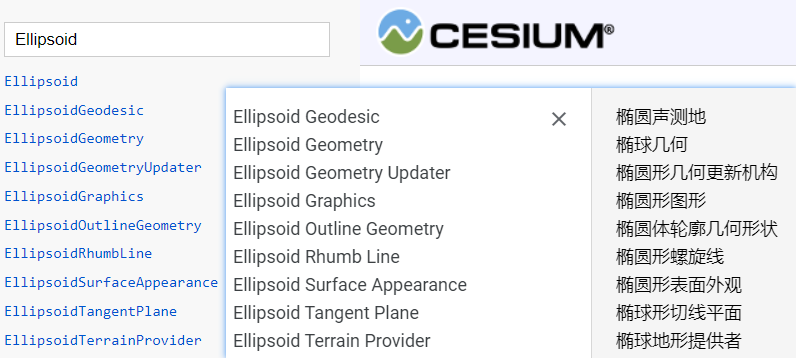


#### 计算多面体面积

```js
const scratchCartesian31 = new Cesium.Cartesian3();
const scratchCartesian32 = new Cesium.Cartesian3();
function triangleArea(p0, p1, p2) {
  const v0 = Cesium.Cartesian3.subtract(p0, p1, scratchCartesian31);
  const v1 = Cesium.Cartesian3.subtract(p2, p1, scratchCartesian32);

  const crossResult = Cesium.Cartesian3.cross(v0, v1, v0);
  return 0.5 * Cesium.Cartesian3.magnitude(crossResult);
}

function trianglesArea(positions, indices) {
  const length = indices.length;
  let area = 0;

  for (let i = 0; i < length; i += 3) {
    const i0 = indices[i];
    const i1 = indices[i + 1];
    const i2 = indices[i + 2];

    area += triangleArea(positions[i0], positions[i1], positions[i2]);
  }

  return area;
}

// see PolygonGeometry.createGeometry
export function computePolygonTriangulationArea(positions, ellipsoid) {
  const polygonHierarchy = new Cesium.PolygonHierarchy(positions);

  const tangentPlane = Cesium.EllipsoidTangentPlane.fromPoints(positions, ellipsoid);

  const perPositionHeight = true;
  const results = Cesium.PolygonGeometryLibrary.polygonsFromHierarchy(
    polygonHierarchy,
    tangentPlane.projectPointsOntoPlane.bind(tangentPlane),
    !perPositionHeight,
    ellipsoid
  );

  const hierarchy = results.hierarchy;
  const polygons = results.polygons;

  if (hierarchy.length === 0) {
    return 0;
  }

  let area = 0;
  for (const polygon of polygons) {
    let indices = Cesium.PolygonPipeline.triangulate(polygon.positions2D, polygon.holes);

    /* If polygon is completely unrenderable, just use the first three vertices */
    if (indices.length < 3) {
      indices = [0, 1, 2];
    }

    area += trianglesArea(polygon.positions, indices);
  }

  return area;
}

```

#40 行

#49 行

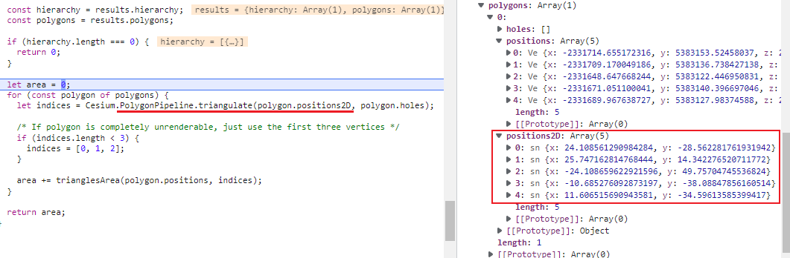

##### PolygonHierarchy [#](https://cesium.com/learn/cesiumjs/ref-doc/PolygonHierarchy.html?classFilter=PolygonHierarchy) --- 通过点定义一个平面(holes)

##### EllipsoidTangentPlane

 - fromPoints

   Creates a new instance from the provided ellipsoid and the center point of the provided Cartesians. (从提供的椭圆体和所提供的笛卡尔人的中心点创建一个新实例。)

	- projectPointsOntoPlane

##### PolygonGeometryLibrary -- 工具库 [cesium/PolygonGeometryLibrary.js](https://github.com/CesiumGS/cesium/blob/dc725e67fc8c2adf8033e93ce5513711ed43c2ac/Source/Core/PolygonGeometryLibrary.js)

- polygonsFromHierarchy
- 

##### PolygonPipeline -- 工具 [cesium/PolygonPipeline.js](https://github.com/CesiumGS/cesium/blob/6bbf84b7d0bc734ff3c7678830fb19899675950d/Source/Core/PolygonPipeline.js)

- triangulate, 将一个平面切割成三角形, (耳切法 earcut 三方库),  平面内部有 holdes 则需要另外计算

  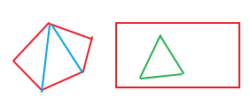

- triangulate 返回切割后三角形的索引列表, 每三个作为一个三角形

- 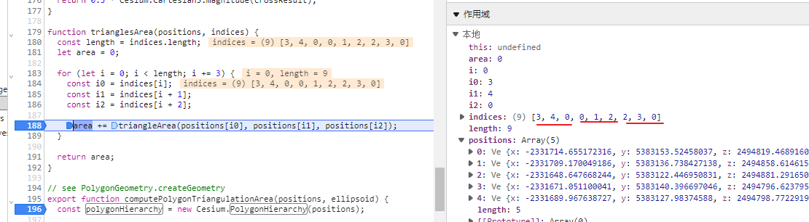

##### Cartesian3

- subtract
- cross
- magnitude

计算3个点的面积的思路是, 

1. p0 - p1 => p1到p0的连线所成向量 
2. p2 - p1 => p1到p2的连线所成向量
3. 在二维平面中,  二维向量叉积的几何意义就是**向量 a、b 组成的平行四边形的面积**。**向量叉乘运算的结果是一个向量**
4. 求叉乘结果并取该结果向量长度的一般作为所成三角形的面积.

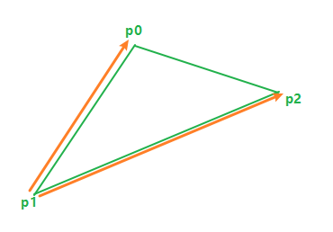

### 高度测量

跟测距是一样的, 不过实现上是取了另一个点用来测量水平/垂直的距离, 直角三角形

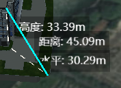

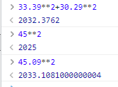

### 角度测量

角度测量是画三个点,  求中间(第二个)的点跟外部所成的两个连线的夹角

实现的方式是: 

```js
const a = computedDistance(positions[0], positions[1]);
const b = computedDistance(positions[1], positions[2]);
const c = computedDistance(positions[0], positions[2]);
const angle = (Math.acos((a * a + b * b - c * c) / (2 * a * b)) * 180) / Math.PI;
```

在任何一个三角形中,任意一边的平方等于另外两边的平方和减去这两边的2倍乘以它们夹角的余弦几何语言：在△ABC中,a²=b²+c²-2bc×cosA此定理可以变形为：**cosA=（b²+c²-a²）÷2bc**。


[Cesium - 距离、面积、高度量算 | zouyaoji's Blog](https://zouyaoji.top/2019/01-cesium-measure-tool/#面积量算)

smart3d 的测量有参考上面的内容

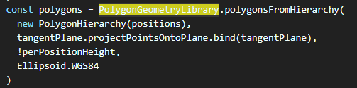

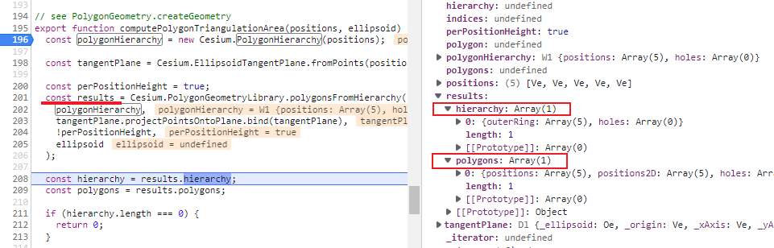


### Cesium 如何做动画?

[Cesium的Property机制总结 ](https://www.cnblogs.com/cesium1/p/10062955.html)

#### 动画1: SampleProperty

我们最早在上述示例中使用的就是它，用来通过给定**多个不同时间点的Sample**，然后在每两个时间点之间进行**线性插值**的一种Property。代码写法如下：

```javascript
var property = new Cesium.SampledProperty(Cesium.Cartesian3);

property.addSample(Cesium.JulianDate.fromIso8601('2019-01-01T00:00:00.00Z'), 
                   new Cesium.Cartesian3(400000.0, 300000.0, 200000.0));

property.addSample(Cesium.JulianDate.fromIso8601('2019-01-03T00:00:00.00Z'), 
                   new Cesium.Cartesian3(400000.0, 300000.0, 700000.0));

blueBox.box.dimensions = property;
```

效果如下所示：

 

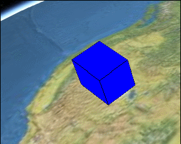

盒子逐渐变长

#### 动画2: TimeIntervalCollectionProperty

该Property用来指定**各个具体的时间段的属性值**，每个时间段内的属性值是恒定的，并不会发生变化，除非已经进入到下一个时间段。拿创建的盒子示例来说，表现出来的特点就是盒子尺寸的变化时**跳跃式**的。效果如下：

 

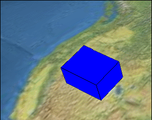


代码如下：

```javascript
var property = new Cesium.TimeIntervalCollectionProperty(Cesium.Cartesian3);

property.intervals.addInterval(Cesium.TimeInterval.fromIso8601({
    iso8601 : '2019-01-01T00:00:00.00Z/2019-01-01T12:00:00.00Z',
    isStartIncluded : true,
    isStopIncluded : false,
    data : new Cesium.Cartesian3(400000.0, 300000.0, 200000.0)
}));
property.intervals.addInterval(Cesium.TimeInterval.fromIso8601({
    iso8601 : '2019-01-01T12:00:01.00Z/2019-01-02T00:00:00.00Z',
    isStartIncluded : true,
    isStopIncluded : false,
    data : new Cesium.Cartesian3(400000.0, 300000.0, 400000.0)
}));
property.intervals.addInterval(Cesium.TimeInterval.fromIso8601({
    iso8601 : '2019-01-02T00:00:01.00Z/2019-01-02T12:00:00.00Z',
    isStartIncluded : true,
    isStopIncluded : false,
    data : new Cesium.Cartesian3(400000.0, 300000.0, 500000.0)
}));
property.intervals.addInterval(Cesium.TimeInterval.fromIso8601({
    iso8601 : '2019-01-02T12:00:01.00Z/2019-01-03T00:00:00.00Z',
    isStartIncluded : true,
    isStopIncluded : true,
    data : new Cesium.Cartesian3(400000.0, 300000.0, 700000.0)
}));

blueBox.box.dimensions = property;
```

#### 动画3: ConstantProperty

通过对TimeIntervalCollectionProperty和SampleProperty的描述，读者应该基本了解Property的特点。我们回过头来说下**ConstantProperty，其实这才是最常用的Property**。

示例代码如下：

```cpp
blueBox.box.dimensions = new Cesium.Cartesian3(400000.0, 300000.0, 200000.0);
```

以上代码貌似没有使用ConstantProperty，实际上他是等同于：

```cpp
blueBox.box.dimensions = new ConstantProperty(new Cesium.Cartesian3(400000.0, 300000.0, 200000.0));
```

也就是Entity的box.dimensions类型并不是Cartesian3，而是一个Property。

虽然我们赋值了一个Cartesian3，但是Cesium内部会隐晦地转化成了一个ConstantProperty。

> 注意只会隐晦地转化成ConstantProperty，而不是SampleProperty，更不是TimeIntervalCollectionProperty。

**虽然叫ConstantProperty，但是，这里Constant的意思并不是说这个Property不可改变**，而是**说它不会随时间发生变化**。

举个例子，我们可以**通过 property.getValue(viewer.clock.currentTime) 方法来获取某个时间点**property的属性值。如果property是SampleProperty或者TimeIntervalCollectionProperty的话，不同的时间点，可能getValue出不同的数值。但是如果这个property是**ConstantProperty，那么无论什么时间（getValue的第一个参数不起作用），最后返回的数值都是一样的。**

但是**不会随时间变化，并不代表不可改变**。

ConstantProperty还有一个**setValue的方法，开发者可以通过调用它**，来在适当的时候改变property的值。

比如，我可以通过点击按钮来修改ConstantProperty，代码如下：

```css
blueBox.box.dimensions.setValue(new Cesium.Cartesian3(400000.0, 300000.0, 700000.0));
```

需要注意的是，虽然最终效果一样，但是以下两种写法的意义是不一样的。

```
blueBox.box.dimensions = new Cesium.Cartesian3(400000.0, 300000.0, 200000.0);
blueBox.box.dimensions.setValue(new Cesium.Cartesian3(400000.0, 300000.0, 700000.0));
```

前者会创建一个新的ConstantProperty，后者则会修改原有的ConstantProperty的值。


#### 动画4: CompositeProperty

CompositeProperty的意思是组合的Property，可以把多种不同类型的ConstantProperty、SampleProperty、TimeIntervalCollectionProperty等Property组合在一起来操作。

比如前一个时间段需要线性运动，后一段时间再跳跃式运动。则可以使用类似下面这段代码来实现。

```javascript
// 1 sampledProperty
var sampledProperty = new Cesium.SampledProperty(Cesium.Cartesian3);
sampledProperty.addSample(Cesium.JulianDate.fromIso8601('2019-01-01T00:00:00.00Z'), 
                          new Cesium.Cartesian3(400000.0, 300000.0, 200000.0));

sampledProperty.addSample(Cesium.JulianDate.fromIso8601('2019-01-02T00:00:00.00Z'), 
                          new Cesium.Cartesian3(400000.0, 300000.0, 400000.0));

// 2 ticProperty
var ticProperty = new Cesium.TimeIntervalCollectionProperty();
ticProperty.intervals.addInterval(Cesium.TimeInterval.fromIso8601({
    iso8601 : '2019-01-02T00:00:00.00Z/2019-01-02T06:00:00.00Z',
    isStartIncluded : true,
    isStopIncluded : false,
    data : new Cesium.Cartesian3(400000.0, 300000.0, 400000.0)
}));
ticProperty.intervals.addInterval(Cesium.TimeInterval.fromIso8601({
    iso8601 : '2019-01-02T06:00:00.00Z/2019-01-02T12:00:00.00Z',
    isStartIncluded : true,
    isStopIncluded : false,
    data : new Cesium.Cartesian3(400000.0, 300000.0, 500000.0)
}));
ticProperty.intervals.addInterval(Cesium.TimeInterval.fromIso8601({
    iso8601 : '2019-01-02T12:00:00.00Z/2019-01-02T18:00:00.00Z',
    isStartIncluded : true,
    isStopIncluded : false,
    data : new Cesium.Cartesian3(400000.0, 300000.0, 600000.0)
}));
ticProperty.intervals.addInterval(Cesium.TimeInterval.fromIso8601({
    iso8601 : '2019-01-02T18:00:00.00Z/2019-01-03T23:00:00.00Z',
    isStartIncluded : true,
    isStopIncluded : true,
    data : new Cesium.Cartesian3(400000.0, 300000.0, 700000.0)
}));

// 3 compositeProperty
var compositeProperty = new Cesium.CompositeProperty();
compositeProperty.intervals.addInterval(Cesium.TimeInterval.fromIso8601({
    iso8601 : '2019-01-01T00:00:00.00Z/2019-01-02T00:00:00.00Z',
    data : sampledProperty
}));
compositeProperty.intervals.addInterval(Cesium.TimeInterval.fromIso8601({
    iso8601 : '2019-01-02T00:00:00.00Z/2019-01-03T00:00:00.00Z',
    isStartIncluded : false,
    isStopIncluded : false,
    data : ticProperty
}));

// 4 设置position
blueBox.box.dimensions = compositeProperty;
```

最终实现的效果如下：

 

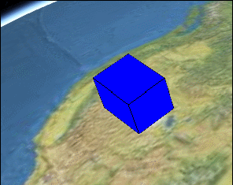


#### PositionProperty

以上示例可以看到，我们一直在用SampledProperty、ConstantProperty等来修改Entity的box.dimensions属性。基本上可以得出结论：大部分Property都是可以赋值给Entity的box.dimensions的。

PositionProperty和Property一样，是一个虚类，并不能直接实例化，他扩展了Property的接口，增加了referenceFrame，同时只能用来表示position。


#### 方法5: SampledPositionProperty

SampledPositionProperty的用法，不多解释，直接看代码吧：

```javascript
var property = new Cesium.SampledPositionProperty();

property.addSample(Cesium.JulianDate.fromIso8601('2019-01-01T00:00:00.00Z'), 
                   Cesium.Cartesian3.fromDegrees(-114.0, 40.0, 300000.0));

property.addSample(Cesium.JulianDate.fromIso8601('2019-01-03T00:00:00.00Z'), 
                   Cesium.Cartesian3.fromDegrees(-114.0, 45.0, 300000.0));

blueBox.position = property;
```

效果如下：

 

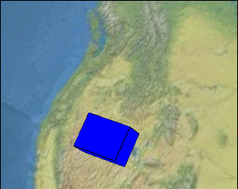

SampledPositionProperty

SampleProperty和SampledPositionProperty有一个特有的方法：setInterpolationOptions，用来修改不同的插值方式。以下是以Cesium的Interpolation示例中的截图来说明他们的不同之处。


#### **飞行管理 如何实现? **


### 如何使数据兼容Cesium


### 坐标系 坐标系转换

```js
/**
 * 坐标系类型
 * @enum {Number}
 * @ignore
 */
const CoordinateType = {
  /**
   * wgs国际坐标系
   */
  WGS84: 'wsg84',
  /**
   * 火星坐标系(国测坐标系)
   */
  GCJ02: 'gcj02',
  /**
   * 百度坐标系
   */
  BD09: 'bd09',
};
```


### 顶点拾取?
