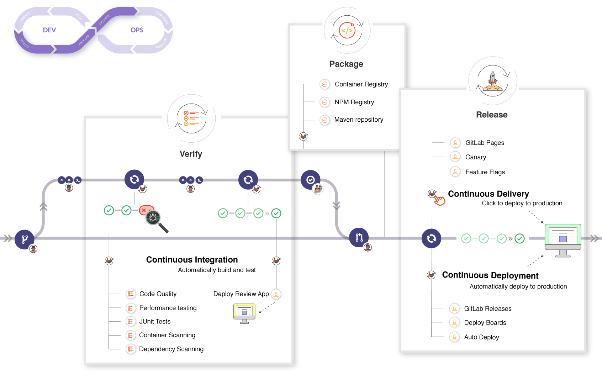

[TOC]

# [GitLab CI/CD | GitLab](https://docs.gitlab.com/ee/ci/)

GitLab CI/CD is a tool for software development using the continuous methodologies:

- [Continuous Integration (CI)](https://docs.gitlab.com/ee/ci/introduction/index.html#continuous-integration)
- [Continuous Delivery (CD)](https://docs.gitlab.com/ee/ci/introduction/index.html#continuous-delivery)
- [Continuous Deployment (CD)](https://docs.gitlab.com/ee/ci/introduction/index.html#continuous-deployment)

(持续集成 持续交付 持续部署)

通过持续的软件开发方法，您可以持续构建、测试和部署迭代代码更改。此迭代过程有助于减少基于错误或失败的先前版本开发新代码的机会。使用这种方法，从新代码的开发到部署，您努力减少人为干预甚至根本没有干预。

## Concepts

GitLab CI/CD uses a number of concepts to describe and run your build and deploy.

<table>
<thead>
<tr>
<th style="text-align:left">Concept
</th><th style="text-align:left">Description
</th></tr></thead><tbody>
<tr>
<td style="text-align:left"><a href="pipelines/index.html">Pipelines</a>
</td><td style="text-align:left">Structure your CI/CD process through pipelines.
</td></tr><tr>
<td style="text-align:left"><a href="variables/index.html">CI/CD variables</a>
</td><td style="text-align:left">Reuse values based on a variable/value key pair.
</td></tr><tr>
<td style="text-align:left"><a href="environments/index.html">Environments</a>
</td><td style="text-align:left">Deploy your application to different environments (for example, staging, production).
</td></tr><tr>
<td style="text-align:left"><a href="pipelines/job_artifacts.html">Job artifacts</a>
</td><td style="text-align:left">Output, use, and reuse job artifacts.
</td></tr><tr>
<td style="text-align:left"><a href="caching/index.html">Cache dependencies</a>
</td><td style="text-align:left">Cache your dependencies for a faster execution.
</td></tr><tr>
<td style="text-align:left"><a href="https://docs.gitlab.com/runner/">GitLab Runner</a>
</td><td style="text-align:left">Configure your own runners to execute your scripts.
</td></tr><tr>
<td style="text-align:left"><a href="pipelines/pipeline_efficiency.html">Pipeline efficiency</a>
</td><td style="text-align:left">Configure your pipelines to run quickly and efficiently.
</td></tr><tr>
<td style="text-align:left"><a href="test_cases/index.html">Test cases</a>
</td><td style="text-align:left">Create testing scenarios.
</td></tr></tbody></table>

- 管道 CI/CI变量 环境 作业工件 缓存依赖项 gitlab-runner 管道效率 测试用例

## Configuration

GitLab CI/CD supports numerous configuration options:

<table>
<thead>
<tr>
<th style="text-align:left">Configuration
</th><th style="text-align:left">Description
</th></tr></thead><tbody>
<tr>
<td style="text-align:left"><a href="pipelines/schedules.html">Schedule pipelines</a>
</td><td style="text-align:left">Schedule pipelines to run as often as you need.
</td></tr><tr>
<td style="text-align:left"><a href="pipelines/settings.html#specify-a-custom-cicd-configuration-file">Custom path for <code class="highlighter-rouge">.gitlab-ci.yml</code></a>
</td><td style="text-align:left">Define a custom path for the CI/CD configuration file.
</td></tr><tr>
<td style="text-align:left"><a href="git_submodules.html">Git submodules for CI/CD</a>
</td><td style="text-align:left">Configure jobs for using Git submodules.
</td></tr><tr>
<td style="text-align:left"><a href="ssh_keys/index.html">SSH keys for CI/CD</a>
</td><td style="text-align:left">Using SSH keys in your CI pipelines.
</td></tr><tr>
<td style="text-align:left"><a href="triggers/index.html">Pipeline triggers</a>
</td><td style="text-align:left">Trigger pipelines through the API.
</td></tr><tr>
<td style="text-align:left"><a href="pipelines/merge_request_pipelines.html">Merge request pipelines</a>
</td><td style="text-align:left">Design a pipeline structure for running a pipeline in merge requests.
</td></tr><tr>
<td style="text-align:left"><a href="../user/infrastructure/clusters/index.html">Integrate with Kubernetes clusters</a>
</td><td style="text-align:left">Connect your project to Google Kubernetes Engine (GKE) or an existing Kubernetes cluster.
</td></tr><tr>
<td style="text-align:left"><a href="large_repositories/index.html">Optimize GitLab and GitLab Runner for large repositories</a>
</td><td style="text-align:left">Recommended strategies for handling large repositories.
</td></tr><tr>
<td style="text-align:left"><a href="yaml/index.html"><code class="highlighter-rouge">.gitlab-ci.yml</code> full reference</a>
</td><td style="text-align:left">All the attributes you can use with GitLab CI/CD.
</td></tr></tbody></table>

## Features

GitLab CI/CD features, grouped by DevOps stage, include:

<table>
<thead>
<tr>
<th style="text-align:left">Feature
</th><th style="text-align:left">Description
</th></tr></thead><tbody>
<tr>
<td style="text-align:left"><strong>Configure</strong>
</td><td style="text-align:left">&nbsp;
</td></tr><tr>
<td style="text-align:left"><a href="../topics/autodevops/index.html">Auto DevOps</a>
</td><td style="text-align:left">Set up your app’s entire lifecycle.
</td></tr><tr>
<td style="text-align:left"><a href="chatops/index.html">ChatOps</a>
</td><td style="text-align:left">Trigger CI jobs from chat, with results sent back to the channel.
</td></tr><tr>
<td style="text-align:left"><a href="cloud_services/index.html">Connect to cloud services</a>
</td><td style="text-align:left">Connect to cloud providers using OpenID Connect (OIDC) to retrieve temporary credentials to access services or secrets.
</td></tr><tr>
<td style="text-align:left"><strong>Verify</strong>
</td><td style="text-align:left">&nbsp;
</td></tr><tr>
<td style="text-align:left"><a href="../user/project/merge_requests/browser_performance_testing.html">Browser Performance Testing</a>
</td><td style="text-align:left">Quickly determine the browser performance impact of pending code changes.
</td></tr><tr>
<td style="text-align:left"><a href="../user/project/merge_requests/load_performance_testing.html">Load Performance Testing</a>
</td><td style="text-align:left">Quickly determine the server performance impact of pending code changes.
</td></tr><tr>
<td style="text-align:left"><a href="services/index.html">CI services</a>
</td><td style="text-align:left">Link Docker containers with your base image.
</td></tr><tr>
<td style="text-align:left"><a href="ci_cd_for_external_repos/index.html">GitLab CI/CD for external repositories</a>
</td><td style="text-align:left">Get the benefits of GitLab CI/CD combined with repositories in GitHub and Bitbucket Cloud.
</td></tr><tr>
<td style="text-align:left"><a href="interactive_web_terminal/index.html">Interactive Web Terminals</a>
</td><td style="text-align:left">Open an interactive web terminal to debug the running jobs.
</td></tr><tr>
<td style="text-align:left"><a href="review_apps/index.html">Review Apps</a>
</td><td style="text-align:left">Configure GitLab CI/CD to preview code changes.
</td></tr><tr>
<td style="text-align:left"><a href="unit_test_reports.html">Unit test reports</a>
</td><td style="text-align:left">Identify test failures directly on merge requests.
</td></tr><tr>
<td style="text-align:left"><a href="docker/using_docker_images.html">Using Docker images</a>
</td><td style="text-align:left">Use GitLab and GitLab Runner with Docker to build and test applications.
</td></tr><tr>
<td style="text-align:left"><strong>Release</strong>
</td><td style="text-align:left">&nbsp;
</td></tr><tr>
<td style="text-align:left"><a href="../topics/autodevops/stages.html#auto-deploy">Auto Deploy</a>
</td><td style="text-align:left">Deploy your application to a production environment in a Kubernetes cluster.
</td></tr><tr>
<td style="text-align:left"><a href="docker/using_docker_build.html">Building Docker images</a>
</td><td style="text-align:left">Maintain Docker-based projects using GitLab CI/CD.
</td></tr><tr>
<td style="text-align:left"><a href="../user/project/canary_deployments.html">Canary Deployments</a>
</td><td style="text-align:left">Ship features to only a portion of your pods and let a percentage of your user base to visit the temporarily deployed feature.
</td></tr><tr>
<td style="text-align:left"><a href="../user/project/deploy_boards.html">Deploy boards</a>
</td><td style="text-align:left">Check the current health and status of each CI/CD environment running on Kubernetes.
</td></tr><tr>
<td style="text-align:left"><a href="../operations/feature_flags.html">Feature Flags</a>
</td><td style="text-align:left">Deploy your features behind Feature Flags.
</td></tr><tr>
<td style="text-align:left"><a href="../user/project/pages/index.html">GitLab Pages</a>
</td><td style="text-align:left">Deploy static websites.
</td></tr><tr>
<td style="text-align:left"><a href="../user/project/releases/index.html">GitLab Releases</a>
</td><td style="text-align:left">Add release notes to Git tags.
</td></tr><tr>
<td style="text-align:left"><a href="cloud_deployment/index.html">Cloud deployment</a>
</td><td style="text-align:left">Deploy your application to a main cloud provider.
</td></tr><tr>
<td style="text-align:left"><strong>Secure</strong>
</td><td style="text-align:left">&nbsp;
</td></tr><tr>
<td style="text-align:left"><a href="../user/project/merge_requests/code_quality.html">Code Quality</a>
</td><td style="text-align:left">Analyze your source code quality.
</td></tr><tr>
<td style="text-align:left"><a href="../user/application_security/container_scanning/index.html">Container Scanning</a>
</td><td style="text-align:left">Check your Docker containers for known vulnerabilities.
</td></tr><tr>
<td style="text-align:left"><a href="../user/application_security/dependency_scanning/index.html">Dependency Scanning</a>
</td><td style="text-align:left">Analyze your dependencies for known vulnerabilities.
</td></tr><tr>
<td style="text-align:left"><a href="../user/compliance/license_compliance/index.html">License Compliance</a>
</td><td style="text-align:left">Search your project dependencies for their licenses.
</td></tr><tr>
<td style="text-align:left"><a href="../user/application_security/index.html">Security Test reports</a>
</td><td style="text-align:left">Check for app vulnerabilities.
</td></tr></tbody></table>

# CI/CD 概念[所有层](https://about.gitlab.com/pricing/?glm_source=docs.gitlab.com&glm_content=badges-docs)

通过持续的软件开发方法，您可以持续构建、测试和部署迭代代码更改。此迭代过程有助于减少基于错误或失败的先前版本开发新代码的机会。使用这种方法，从新代码的开发到部署，您努力减少人为干预甚至根本没有干预。

## 持续集成

考虑一个应用程序，其代码存储在 GitLab 的 Git 存储库中。开发人员每天推送代码更改，每天推送多次。对于每次推送到存储库，您都可以创建一组脚本来**自动构建和测试应用程序**。这些脚本有助于**降低**在应用程序中引入**错误**的可能性。

这种做法称为[持续集成](https://en.wikipedia.org/wiki/Continuous_integration)。提交到应用程序（甚至开发分支）的**每个更改都是自动且连续地构建和测试的**。这些测试可确保更改通过**为应用程序建立的所有测试、准则和代码符合性标准**。

[GitLab 本身就是](https://gitlab.com/gitlab-org/gitlab)使用持续集成作为软件开发方法的项目的一个例子。对于对项目的每次推送，都会针对代码运行一组检查。

## 持续交付

[持续交付](https://continuousdelivery.com/)是超越持续集成的一步。每次将代码更改推送到代码库时，不仅会生成和测试应用程序，还会持续部署应用程序。但是，对于持续交付，您可以手动触发部署。

持续交付会自动检查代码，但需要人工干预才能手动和战略性地触发更改的部署。

## 持续部署

[持续部署](https://www.airpair.com/continuous-deployment/posts/continuous-deployment-for-practical-people)是超越持续集成的另一个步骤，类似于持续交付。不同之处在于，您不是手动部署应用程序，而是将其设置为**自动部署**。不需要人为干预

### GitLab CI/CD 工作流程

GitLab CI/CD 适合常见的开发工作流程。

您可以先讨论问题中的代码实现，然后在本地处理建议的更改。然后，您可以将提交推送到 GitLab 中托管的远程存储库中的功能分支。**推送将触发项目的 CI/CD 管道**。然后，GitLab CI/CD：

- **运行自动脚本**（按顺序或并行）以：
  - 生成并测试应用程序。
  - 预览“审阅”应用中的更改，与 在 `localhost`上看到的相同。

实现按预期工作后：

- 让您的代码经过审核和批准。
- 将功能分支合并到默认分支中。
  - GitLab CI/CD 会自动将您的更改部署到生产环境。

工作流显示了 GitLab 过程中的主要步骤。您不需要任何外部工具来交付软件，并且可以在 GitLab UI 中可视化所有步骤。

### 更深入地了解 CI/CD 工作流

如果您更深入地了解工作流程，可以看到 GitLab 在 DevOps 生命周期的每个阶段可用的功能。

[深入了解 GitLab CI/CD](https://youtu.be/l5705U8s_nQ?t=369)。