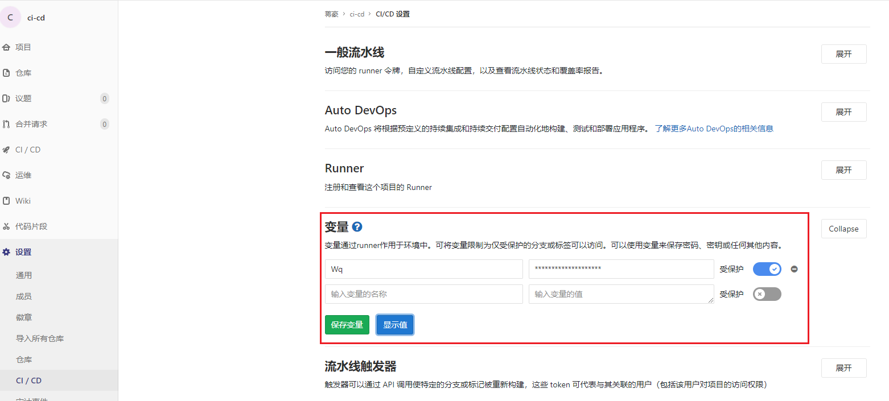

[TOC]

# GitLab CI/CD 变量[所有层](https://about.gitlab.com/pricing/?glm_source=docs.gitlab.com&glm_content=badges-docs)

CI/CD 变量是一种环境变量。您可以使用它们来：

- 控制作业和[管道的行为](https://docs.gitlab.com/ee/ci/pipelines/index.html)。
- 存储要重用的值。
- 避免对文件`.gitlab-ci.yml`中的值进行硬编码。

您可以使用[预定义的 CI/CD 变量](https://docs.gitlab.com/ee/ci/variables/#predefined-cicd-variables)或定义自定义：

- [`.gitlab-ci.yml` 文件中的变量](https://docs.gitlab.com/ee/ci/variables/#create-a-custom-cicd-variable-in-the-gitlab-ciyml-file)。
- [项目 CI/CD 变量](https://docs.gitlab.com/ee/ci/variables/#add-a-cicd-variable-to-a-project)。
- [对 CI/CD 变量进行分组](https://docs.gitlab.com/ee/ci/variables/#add-a-cicd-variable-to-a-group)。
- [实例 CI/CD 变量](https://docs.gitlab.com/ee/ci/variables/#add-a-cicd-variable-to-an-instance)。

在 GitLab UI 中设置的变量**不会**传递到[服务容器](https://docs.gitlab.com/ee/ci/docker/using_docker_images.html)。要设置它们，请将它们分配给 UI 中的变量，然后在您的`.gitlab-ci.yml` ：

```yaml
variables:
  SA_PASSWORD: $SA_PASSWORD
```


## 预定义的 CI/CD 变量

GitLab CI/CD 具有一[组默认的预定义 CI/CD 变量](https://docs.gitlab.com/ee/ci/variables/predefined_variables.html)，您可以在管道配置和作业脚本中使用。


## 自定义 CI/CD 变量

You can create custom CI/CD variables:

- For a project:
  - [In the project’s `.gitlab-ci.yml` file](https://docs.gitlab.com/ee/ci/variables/#create-a-custom-cicd-variable-in-the-gitlab-ciyml-file).
  - [In the project’s settings](https://docs.gitlab.com/ee/ci/variables/#add-a-cicd-variable-to-a-project).
  - [With the API](https://docs.gitlab.com/ee/api/project_level_variables.html).
- For all projects in a group [in the group’s setting](https://docs.gitlab.com/ee/ci/variables/#add-a-cicd-variable-to-a-group).
- For all projects in a GitLab instance [in the instance’s settings](https://docs.gitlab.com/ee/ci/variables/#add-a-cicd-variable-to-an-instance).

您可以[手动覆盖特定管道的变量值](https://docs.gitlab.com/ee/ci/jobs/index.html#specifying-variables-when-running-manual-jobs)，也可以[在手动管道中预填充](https://docs.gitlab.com/ee/ci/pipelines/index.html#prefill-variables-in-manual-pipelines)变量值。

有两种类型的变量：[`文件`或`变量`](https://docs.gitlab.com/ee/ci/variables/#cicd-variable-types)。

变量名称受[运行程序用于执行脚本的 shell](https://docs.gitlab.com/runner/shells/index.html) 的限制。每个 shell 都有自己的一组保留变量名称。

确保为每个变量都定义了[要在其中使用它的作用域](https://docs.gitlab.com/ee/ci/variables/where_variables_can_be_used.html)。

默认情况下，FORK 项目中的管道无法访问父项目中的 CI/CD 变量。

如果在[父项目中为来自分叉的合并请求运行合并请求管道](https://docs.gitlab.com/ee/ci/pipelines/merge_request_pipelines.html#run-pipelines-in-the-parent-project)，则所有变量都将可用于管道

### 在文件中创建自定义 CI/CD 变量`.gitlab-ci.yml`

若要在 [`.gitlab-ci.yml`](https://docs.gitlab.com/ee/ci/yaml/index.html#variables) 文件中创建自定义变量，请使用关键字`variables`定义变量和值。

您可以在**作业中**或**在`.gitlab-ci.yml`文件的顶层**使用关键字`variables`。

如果变量位于顶层，则它是全局可用的，并且所有作业都可以使用它。

如果在作业中定义了它，则只有该作业可以使用它。

```YAML
variables: #TOP
  TEST_VAR: "All jobs can use this variable's value"

job1:
  variables: #UNDER JOB
    TEST_VAR_JOB: "Only job1 can use this variable's value"
  script:
    - echo "$TEST_VAR" and "$TEST_VAR_JOB" #acces by $
```

保存在`.gitlab-ci.yml`文件中的变量应仅存储非敏感项目配置，如 `RAILS_ENV`或 `DATABASE_URL`变量。这些变量在存储库中可见。在项目设置中存储包含机密、密钥等的敏感变量。

保存在`.gitlab-ci.yml`文件中的变量在[服务容器](https://docs.gitlab.com/ee/ci/docker/using_docker_images.html)中也可用。

如果**不希望全局定义的变量在作业中可用**，请设置`variables`为`{}` ： 额外设置:

```yaml
job1:
  variables: {}
  script:
    - echo This job does not need any variables
```

使用[`值`和`描述`](https://docs.gitlab.com/ee/ci/yaml/index.html#variablesdescription)关键字定义为[手动触发的管道](https://docs.gitlab.com/ee/ci/pipelines/index.html#run-a-pipeline-manually)[预填充的变量](https://docs.gitlab.com/ee/ci/pipelines/index.html#prefill-variables-in-manual-pipelines)。


### 在其他变量中使用变量

您可以在其他变量中使用变量：

```yaml
job:
  variables:
    FLAGS: '-al'
    LS_CMD: 'ls "$FLAGS"'
  script:
    - 'eval "$LS_CMD"'  # Executes 'ls -al'
```

#### 在变量中使用字符`$`

如果不希望将字符`$`解释为变量的开头，请改用`$$`：

```yaml
job:
  variables:
    FLAGS: '-al'
    LS_CMD: 'ls "$FLAGS" $$TMP_DIR'
  script:
    - 'eval "$LS_CMD"'  # Executes 'ls -al $TMP_DIR'
```

### 将 CI/CD 变量添加到项目中

可以将 CI/CD 变量添加到**项目的设置**中。

**只有具有维护者角色的项目成员才能添加或更新项目 CI/CD 变量。**

若要将 CI/CD 变量保密，请将其放在**项目设置**中，而不是放在`.gitlab-ci.yml`文件中。

在项目设置中添加或更新变量：

1. 转到项目的**“设置”> CI/CD**“，然后展开**”变量**“部分。
2. 选择**“添加变量**”按钮并填写详细信息：

- **Key**: Must be one line, with no spaces, using only letters, numbers, or `_`.
- **Value**: No limitations.
- **Type**: [`File` or `Variable`](https://docs.gitlab.com/ee/ci/variables/#cicd-variable-types).
- **Environment scope**: Optional. `All`, or specific [environments](https://docs.gitlab.com/ee/ci/environments/index.html).
- **Protect variable** Optional. If selected, the variable is only available in pipelines that run on protected branches or tags.
- **Mask variable** Optional. If selected, the variable’s **Value** is masked in job logs. The variable fails to save if the value does not meet the [masking requirements](https://docs.gitlab.com/ee/ci/variables/#mask-a-cicd-variable).



After you create a variable, you can use it in the `.gitlab-ci.yml` file:

```yaml
test_variable:
  stage: test
  script:
    - echo "$CI_JOB_STAGE"  # calls a predefined variable
    - echo "$TEST"          # calls a custom variable of type `env_var`
    - echo "$GREETING"      # calls a custom variable of type `file` that contains the path to the temp file
    - cat "$GREETING"       # the temp file itself contains the variable value
```


### 将 CI/CD 变量添加到组

### 将 CI/CD 变量添加到实例

### CI/CD 变量类型

### 屏蔽 CI/CD 变量

### 保护 CI/CD 变量

### CI/CD 变量安全性

### 由 GitLab 验证的自定义变量


## 在作业脚本中使用 CI/CD 变量

### Bash环境

### powershell

### Windows Batch

### 列出所有环境变量

您可以使用 Bash 或 PowerShell 中的命令列出可用于脚本的所有环境变量。这会公开**所有**可用变量的值，这可能会带来[安全风险](https://docs.gitlab.com/ee/ci/variables/#cicd-variable-security)。[屏蔽的变量](https://docs.gitlab.com/ee/ci/variables/#mask-a-cicd-variable)显示为 `[masked]`。

- `export` in Bash
- `dir env:` in PowerShell.

```yaml
job_name:
  script:
    - export
    # - 'dir env:'  # Use this for PowerShell
```


### More todo...