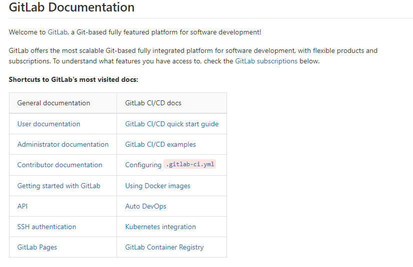

[TOC]

# [帮助 · GitLab](http://172.16.11.133/help)

**Shortcuts to GitLab's most visited docs:**

<table dir="auto">
<thead>
<tr>
<th align="left">General documentation</th>
<th align="left">GitLab CI/CD docs</th>
</tr>
</thead>
<tbody>
<tr>
<td align="left"><a href="/help/user/index.md">User documentation</a></td>
<td align="left"><a href="/help/ci/quick_start/README.md">GitLab CI/CD quick start guide</a></td>
</tr>
<tr>
<td align="left"><a href="/help/administration/index.md">Administrator documentation</a></td>
<td align="left"><a href="/help/ci/examples/README.md">GitLab CI/CD examples</a></td>
</tr>
<tr>
<td align="left"><a href="/help/#contributor-documentation">Contributor documentation</a></td>
<td align="left"><a href="/help/ci/yaml/README.md">Configuring <code>.gitlab-ci.yml</code></a></td>
</tr>
<tr>
<td align="left"><a href="/help/#getting-started-with-gitlab">Getting started with GitLab</a></td>
<td align="left"><a href="/help/ci/docker/using_docker_images.md">Using Docker images</a></td>
</tr>
<tr>
<td align="left"><a href="/help/api/README.md">API</a></td>
<td align="left"><a href="/help/topics/autodevops/index.md">Auto DevOps</a></td>
</tr>
<tr>
<td align="left"><a href="/help/ssh/README.md">SSH authentication</a></td>
<td align="left"><a href="/help/user/project/clusters/index.md">Kubernetes integration</a></td>
</tr>
<tr>
<td align="left"><a href="/help/user/project/pages/index.md">GitLab Pages</a></td>
<td align="left"><a href="/help/user/project/container_registry.md">GitLab Container Registry</a></td>
</tr>
</tbody>
</table>