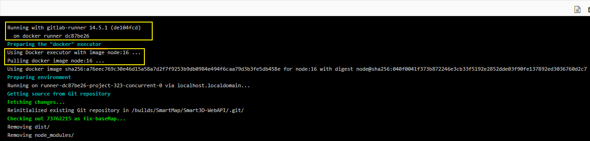
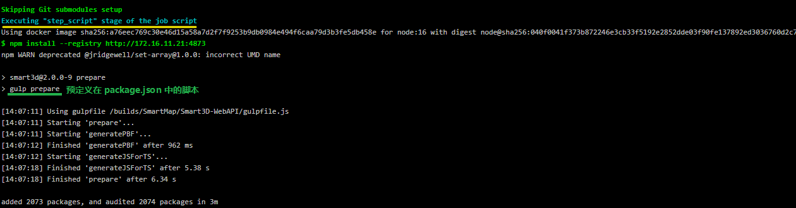
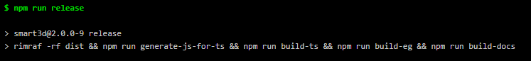

# [build (#8722) · Jobs · SmartMap / Smart3D-WebAPI · GitLab](http://172.16.11.133/SmartMap/Smart3D-WebAPI/-/jobs/8722)







```json
{
"scripts": {
    "start": "npm run dev",
    "dev": "webpack-dev-server --config config/webpack.dev.conf.js --info=false",
    "build": "rimraf -rf ./dist/smart3d && cross-env NODE_ENV=production webpack --config config/webpack.umd.conf.js --display-entrypoints false --hide-modules && npm run build-min",
    "build-min": "cross-env NODE_ENV=production CODE_ENV=production webpack --config config/webpack.umd.conf.js --display-entrypoints false --hide-modules",
    "build-src": "rimraf -rf ./.src && cross-env NODE_ENV=production webpack --config config/webpack.umd.conf.js --env.src --display-entrypoints false --hide-modules",
    "build-ts": "gulp build-ts",
    "build-eg": "npm run lint-eg && npm run build && gulp buildEg && cp-cli favicon.ico dist/examples/favicon.ico",
    "build-docs": "rimraf -rf dist/document && jsdoc -c docs/jsdoc/conf.json && cp-cli docs/images dist/document/images && cp-cli favicon.ico dist/document/favicon.ico",
    "generate-js-for-ts": "gulp generateJSForTS",
    "minifyRelease": "rimraf -rf dist && npm run generate-js-for-ts && npm run build-ts && npm run build && npm run build-min",
    "release": "rimraf -rf dist && npm run generate-js-for-ts && npm run build-ts && npm run build-eg && npm run build-docs",
    "pub": "npm run release && gulp makeZipFile && node config/pub-release.js",
    "lint": "eslint ./src --fix",
    "lint-eg": "eslint -c examples/.eslintrc.js --ext .html,.js --fix ./examples",
    "prettier": "prettier -c --write **/*.js **/*.html",
    "test": "gulp test",
    "coverage": "gulp coverage",
    "makeZip": "npm run release && gulp makeZipFile",
    "version": "conventional-changelog -n ./node_modules/@smart/conventional-changelog-smart/index.js -i CHANGELOG.md -s -r 0 && git add CHANGELOG.md",
    "prepare": "gulp prepare"
  },
}
```

