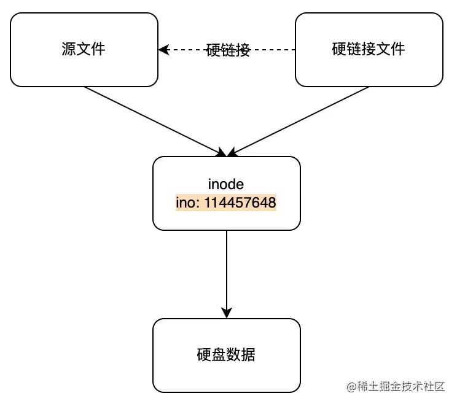
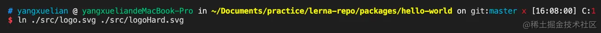

[TOC]

### ts 不支持 js内部的构造函数的类型监测


### pnpm

官网: [Fast, disk space efficient package manager | pnpm](https://pnpm.io/)

[Pnpm: 最先进的包管理工具 - 知乎 (zhihu.com)](https://zhuanlan.zhihu.com/p/404784010)

[以 pnpm 为例谈谈如何调试大型项目 (qq.com)](https://mp.weixin.qq.com/s/S2Ao5eq6aRLn4oTp_GUQbQ)


神三元: 关于现代包管理器的深度思考 https://juejin.cn/post/6932046455733485575


当使用 npm 或 Yarn 时，如果你有100个项目使用了某个依赖（dependency），就会有100份该依赖的副本保存在硬盘上 (现状)。  

而在使用 pnpm 时，依赖会被存储在内容可寻址的存储中，所以：

1. 如果你用到了某依赖项的不同版本，那么只会将有差异的文件添加到仓库。 例如，如果某个包有100个文件，而它的新版本只改变了其中1个文件。那么 `pnpm update` 时只会向存储中心额外添加1个新文件，而不会因为仅仅一个文件的改变复制整新版本包的内容。
2. **所有文件都会存储在硬盘上的某一位置**。 当软件包被被安装时，包里的文件会**硬链接**到这一位置，而不会占用额外的磁盘空间。 这允许你跨项目地共享同一版本的依赖。

因此，您在磁盘上节省了大量空间，这与项目和依赖项的数量成正比，并且安装速度要快得多

##### 创建非扁平化 (树状) 的 node_modules 文件夹: 


 **高效利用磁盘空间**

pnpm 内部使用`基于内容寻址`的文件系统来存储磁盘上所有的文件，这个文件系统出色的地方在于:

- **不会重复安装同一个包。**用 npm/yarn 的时候，如果 100 个项目都依赖 lodash，那么 lodash 很可能就被安装了 100 次，磁盘中就有 100 个地方写入了这部分代码。但在使用 pnpm 只会安装一次，磁盘中只有一个地方写入，后面再次使用都会直接使用 `hardlink`(硬链接，不清楚的同学详见[这篇文章](https://link.juejin.cn?target=https%3A%2F%2Fwww.cnblogs.com%2Fitech%2Farchive%2F2009%2F04%2F10%2F1433052.html))。
- 即使**一个包的不同版本**，pnpm 也会极大程度地**复用**之前版本的代码。举个例子，比如 lodash 有 100 个文件，更新版本之后多了一个文件，那么磁盘当中并不会重新写入 101 个文件，而是保留原来的 100 个文件的 `hardlink`，仅仅写入那`一个新增的文件`。


使用 npm 或 Yarn Classic 安装依赖项时，所有包都被提升到模块目录的根目录。 因此，项目可以访问到未被添加进当前项目的依赖。

默认情况下，pnpm 使用软链的方式将项目的直接依赖添加进模块文件夹的根目录。 如果你想了解 pnpm 关于 `node_modules` 结构设计的更多细节，以及为什么它在 Node.js 生态成为了后起之秀，请参考：

- [扁平的 node_modules 不是唯一的方法](./pnpm/#1 扁平的 node_modules 不是唯一的方法.md)
- [基于符号链接的 node_modules 结构](./pnpm/#2 基于符号链接的 node_modules 结构.md)

> TIP:  如果您的工具不适用于符号链接，您仍然可以使用 pnpm 并将 [node-linker](https://pnpm.io/zh/npmrc#node-linker) 设置设置为 `hoisted`。 这将指示 pnpm 创建一个类似于 npm 和 Yarn Classic 创建的 node_modules 目录。


#### npm/yarn 幽灵依赖 (Phantom dependencies) 

[`npm install` should deduplicate its tree as part of the install process · Issue #6912 · npm/npm (github.com)](https://github.com/npm/npm/issues/6912)

之前在使用 npm/yarn 的时候，由于 node_module 的扁平结构，如果 A 依赖 B， B 依赖 C，那么 A 当中是可以直接使用 C 的，但问题是 A 当中并没有声明 C 这个依赖。因此会出现这种非法访问的情况。

引发这个现象的原因一般是因为 node_modules 结构所导致的。例如使用 npm或yarn 对项目安装依赖，依赖里面有个依赖叫做 `foo`，`foo` 这个依赖同时依赖了 `bar`，yarn 会对安装的 node_modules 做一个扁平化结构的处理，会把依赖在 node_modules 下打平，这样相当于 `foo` 和 `bar` 出现在同一层级下面。那么根据 nodejs 的寻径原理，用户能 require 到 `foo`，同样也能 require 到 `bar`。

nodejs的寻址方式：([查看更多](https://link.juejin.cn?target=https%3A%2F%2Fnodejs.org%2Fapi%2Fmodules.html%23loading-from-the-global-folders))

1. 对于核心模块（core module） => 绝对路径 寻址
2. node标准库 => 相对路径寻址
3. 第三方库（通过npm安装）到node_modules下的库：

​     3.1   先在当前路径下，寻找 node_modules/xxx
​     3.2    递归从下往上到上级路径，寻找 ../node_modules/xxx
​     3.3    循环第二步
​     3.4    在全局环境路径下寻找 .node_modules/xxx


#### NPM VS PNPM

[pnpm vs npm | pnpm](https://pnpm.io/zh/pnpm-vs-npm)


## monorepo

[Monorepo 是什么，为什么大家都在用？ - 知乎 (zhihu.com)](https://zhuanlan.zhihu.com/p/77577415)

神三元: 现代前端工程为什么越来越离不开 Monorepo? https://juejin.cn/post/6944877410827370504

[10分钟带你从0到1搭建monorepo 工程化项目 (qq.com)](https://mp.weixin.qq.com/s/dUbUJ9755m9NW-Qo5neESA)

随着前端工程的日益复杂，越来越多的项目开始使用 monorepo。之前对于多个项目的管理，我们一般都是使用多个 git 仓库，但 **monorepo 的宗旨就是用一个 git 仓库来管理多个子项目**，所有的子项目都存放在根目录的`packages`目录下，那么一个子项目就代表一个`package`。如果你之前没接触过 monorepo 的概念，建议仔细看看[这篇文章](https://link.juejin.cn?target=https%3A%2F%2Fwww.perforce.com%2Fblog%2Fvcs%2Fwhat-monorepo)以及开源的 monorepo 管理工具[lerna](https://link.juejin.cn?target=https%3A%2F%2Fgithub.com%2Flerna%2Flerna%23readme)，项目目录结构可以参考一下 [babel 仓库](https://link.juejin.cn?target=https%3A%2F%2Fgithub.com%2Fbabel%2Fbabel)。

pnpm 与 npm/yarn 另外一个很大的不同就是支持了 monorepo，体现在各个子命令的功能上，比如在根目录下 `pnpm add A -r`, 那么所有的 package 中都会被添加 A 这个依赖，当然也支持 `--filter`字段来对 package 进行过滤。

Monorepo 其实不是一个新的概念，在软件工程领域，它已经有着十多年的历史了。概念上很好理解，就是把**多个项目**放在**一个仓库**里面，相对立的是传统的 MultiRepo 模式，即每个项目对应一个单独的仓库来分散管理。


总而言之，Monorepo 的开发模式就是将各自独立的项目，变成一个统一的工程整体，解决 MultiRepo 下出现的各种痛点，提升研发效率和工程质量。

## MultiRepo 之痛

要想知道 Monorepo 的优势，首先得弄清楚之前的开发方式有什么痛点。

之前传统的方式`MultiRepo`当中，每个项目都对应单独的一个代码仓库。我之前也是用这种方式开发的，是真真切切地感受到了这种方式带来的诸多弊端。现在就和大家一一分享一下。

### 1.代码复用

在维护多个项目的时候，有一些逻辑很有可能会被多次用到，比如一些基础的组件、工具函数，或者一些配置，你可能会想: 要不把代码直接 copy 过来，多省事儿！但有个问题是，如果这些代码出现 bug、或者需要做一些调整的时候，就得修改多份，维护成本越来越高。

那如何来解决这个问题呢？比较好的方式是将公共的逻辑代码抽取出来，作为一个 npm 包进行发布，一旦需要改动，只需要改动一份代码，然后 publish 就行了。

但这真的就完美解决了么？我举个例子，比如你引入了 `1.1.0` 版本的 A 包，某个工具函数出现问题了，你需要做这些事情：

- 1. 去修改一个工具函数的代码
- 1. 发布`1.1.1`版本的新包
- 1. 项目中安装新版本的 A。

可能只是改了一行代码，需要走这么多流程。然而开发阶段是很难保证不出 bug 的，如果有个按钮需要改个样式，又需要把上面的流程重新走一遍......停下来想想，这些重复的步骤真的是必须的吗？我们只是想复用一下代码，为什么每次修改代码都这么复杂？

上述的问题其实是 `MultiRepo`普遍存在的问题，因为不同的仓库工作区的割裂，导致复用代码的成本很高，开发调试的流程繁琐，甚至在基础库频繁改动的情况下让人感到很抓狂，体验很差。

### 2.版本管理

在 MultiRepo 的开发方式下，依赖包的版本管理有时候是一个特别玄学的问题。比如说刚开始一个工具包版本是 v1.0.0，有诸多项目都依赖于这个工具包，但在某个时刻，这个工具包发了一个 `break change` 版本，和原来版本的 API 完全不兼容。而事实上有些项目并没有升级这个依赖，导致一些莫名的报错。

当项目多了之后，很容易出现这种依赖更新不及时的情况。这又是一个痛点。

### 3.项目基建

由于在 MultiRepo 当中，各个项目的工作流是割裂的，因此每个项目需要单独配置开发环境、配置 CI 流程、配置部署发布流程等等，甚至每个项目都有自己单独的一套脚手架工具。

其实，很容易发现这些项目里的很多基建的逻辑都是重复的，如果是 10 个项目，就需要维护 10 份基建的流程，逻辑重复不说，各个项目间存在构建、部署和发布的规范不能统一的情况，这样维护起来就更加麻烦了。

## Monorepo 的收益

说清楚 `MultiRepo` 的痛点之后，相信你也大概能理解为什么要诞生`Monorepo`这个技术了。现在就来细致地分析一下`Monorepo`到底给现代的前端工程带来了哪些收益。

首先是**工作流的一致性**，由于所有的项目放在一个仓库当中，复用起来非常方便，如果有依赖的代码变动，那么用到这个依赖的项目当中会立马感知到。并且所有的项目都是使用最新的代码，不会产生其它项目版本更新不及时的情况。

其次是**项目基建成本的降低**，所有项目复用一套标准的工具和规范，无需切换开发环境，如果有新的项目接入，也可以直接复用已有的基建流程，比如 CI 流程、构建和发布流程。这样只需要很少的人来维护所有项目的基建，维护成本也大大减低。

再者，**团队协作也更加容易**，一方面大家都在一个仓库开发，能够方便地共享和复用代码，方便检索项目源码，另一方面，git commit 的历史记录也支持以功能为单位进行提交，之前对于某个功能的提交，需要改好几个仓库，提交多个 commit，现在只需要提交一次，简化了 commit 记录，方便协作。

## Monorepo 的落地

如果你还从来没接触过 Monorepo 的开发，到这可能你会疑惑了: 刚刚说了这么多 Monorepo 的好处，可是我还是不知道怎么用啊！是直接把所有的代码全部搬到一个仓库就可以了吗?

当然不是，在实际场景来落地 Monorepo，需要一套完整的工程体系来进行支撑，因为基于 Monorepo 的项目管理，绝不是仅仅代码放到一起就可以的，**还需要考虑项目间依赖分析、依赖安装、构建流程、测试流程、CI 及发布流程等诸多工程环节**，同时还要考虑项目规模到达一定程度后的性能问题，比如项目`构建/测试`时间过长需要进行**增量构建/测试**、**按需执行 CI**等等，在实现全面工程化能力的同时，也需要兼顾到性能问题。

因此，要想从零开始定制一套完善的 Monorepo 的工程化工具，是一件难度很高的事情。不过**社区已经提供了一些比较成熟的方案**，我们可以拿来进行定制，或者对于一些上层的方案直接拿来使用。

其中**比较底层的方案比如 [`lerna`](https://link.juejin.cn?target=https%3A%2F%2Flerna.js.org%2F)**，封装了 Monorepo 中的依赖安装、脚本批量执行等等基本的功能，但没有一套构建、测试、部署的工具链，整体 Monorepo 功能比较弱，但要用到业务项目当中，往往需要基于它进行顶层能力的封装，提供全面工程能力的支撑。

当然也有一些集成的 Monorepo 方案，比如[`nx`](https://link.juejin.cn?target=https%3A%2F%2Fnx.dev%2Flatest%2Freact%2Fgetting-started%2Fgetting-started)(官网写的真心不错，还有不少视频教程)、[`rushstack`](https://link.juejin.cn?target=https%3A%2F%2Frushstack.io%2F)，提供从初始化、开发、构建、测试到部署的全流程能力，有一套比较完整的 Monorepo 基础设施，适合直接拿来进行业务项目的开发。不过由于这些顶层方案内部各种流程和工具链都已经非常完善了，如果要基于这些方案来定制，适配和维护的成本过高，基本是不可行的。

**Question**: 采用 Monorepo 解决了之前的痛点之后，产生了哪些新的问题呢？这些问题可以解决吗？欢迎大家在留言区一起讨论。

有点像微前端


### **lerna**

Lerna 是一个管理工具，用于管理包含多个软件包（package）的 JavaScript 项目。它自身功能非常强大，特别是版本变更、项目发布等功能，可以满足各种复杂场景的诉求，除了`workspace`经常被人吐槽（可以使用`yarn workspace`），是业界当中使用规模最多的repo管理工具。


### 硬连接/软链接

#### hard link / symlink or junction

#### [Linux软链接和硬链接](https://www.cnblogs.com/itech/archive/2009/04/10/1433052.html)

#### [软链接&硬链接在前端中的应用](https://juejin.cn/post/7047429181021356062#heading-4)

## 前置知识

先了解一个操作系统中重要的概念 `inode`（index nodes）。

### inode

> inode 是一种文件数据结构，用于存储有关除名称和数据之外的任何 Linux 文件的信息。

> inode更详细介绍可参考：[www.ruanyifeng.com/blog/2011/1…](https://link.juejin.cn?target=https%3A%2F%2Fwww.ruanyifeng.com%2Fblog%2F2011%2F12%2Finode.html)

- 扇区（sector）
  - 硬盘的最小存储单位叫「扇区」（sector，每个扇区存储512bit）
  - 操作系统一次读一个扇区效率太低，所以会一次读多个扇区

- 块（block）
  - 多个扇区组成一个块，最常见的大小为4kb（即由8个扇区组成）
  - 块是文件存取的最小单元，文件数据都存储在块中

- 索引节点（inode）
  - 存储文件元信息，比如文件的创建者、文件的创建日期、文件大小等
  - Unix/Linux系统内部不使用文件名，而使用inode号码来识别文件。对于系统来说，文件名只是inode号码便于识别的别称或者绰号。
  - 打开文件时，系统首先找到文件的inode号码，然后通过inode号码获取inode信息。然后根据inode中的文件数据所在block读取数据。


#### node方法获取文件信息

```js
const fs = require('fs')

const fileInfo = fs.statSync('./src/logo.svg')
console.log('文件信息：', fileInfo)
```

输出信息：

```js
文件信息： Stats {
  dev: 16777220,
  mode: 33188,
  nlink: 1,
  uid: 501,
  gid: 20,
  rdev: 0,
  blksize: 4096,
  ino: 114457648, // inode的唯一标识码
  size: 2632,
  blocks: 8,
  atimeMs: 1639292681311.895,
  mtimeMs: 1638968536815.0586,
  ctimeMs: 1638968536815.1282,
  birthtimeMs: 1638968536814.7827,
  atime: 2021-12-12T07:04:41.312Z,
  mtime: 2021-12-08T13:02:16.815Z,
  ctime: 2021-12-08T13:02:16.815Z,
  birthtime: 2021-12-08T13:02:16.815Z
}
```

#### linux命令获取inode

通过`ls -i`列出目录中文件以及所有inode标识码：


## 软链接（符号链接）与硬链接

**不论是硬链接或软链接都不会将原本的源文件复制一份，只会占用非常少量的磁盘空间。**

### 硬链接

- 多个文件可以指向源文件同一inode。

- 删除其中一个文件不影响对另一个文件的访问，文件内容的修改会同步到所有文件。

- 只能给文件创建硬链接，不能给目录创建。

- 适用场景：用于镜像数据文件，防止误删。

- 源文件和硬链接的关系：

#### 创建硬链接

通过linux命令创建一个硬链接`logoHard.svg`指向源文件`logo.svg`。



> logo.svg是已经存在的，logoHard.svg命令运行后会自动创建。

#### 查看硬链接信息

- 查看源文件和硬链接文件的inode信息：

```js
const fs = require('fs')

const fileInfo = fs.statSync('./src/logo.svg')
console.log('logo文件信息：', fileInfo)

const fileInfoHardLink = fs.statSync('./src/logoHard.svg')
console.log('logo硬链接文件信息：', fileInfoHardLink)
```

- 输出信息：
- - **两个文件的ino信息相同，其他信息也完全相同。**
  - 其中nlink表示链接数，每多一个文件指向改inode，**nlink就会+1**。当值减到 0，系统就自动回收 `inode` 及其对应的 `block` 区域。

```js
$ node link.js
logo文件信息： Stats {
  dev: 16777220,
  mode: 33188,
  nlink: 2,
  uid: 501,
  gid: 20,
  rdev: 0,
  blksize: 4096,
  ino: 114457648,
  size: 2632,
  blocks: 8,
  atimeMs: 1639295580440.4216,
  mtimeMs: 1638968536815.0586,
  ctimeMs: 1639295575616.7522,
  birthtimeMs: 1638968536814.7827,
  atime: 2021-12-12T07:53:00.440Z,
  mtime: 2021-12-08T13:02:16.815Z,
  ctime: 2021-12-12T07:52:55.617Z,
  birthtime: 2021-12-08T13:02:16.815Z
}
logo硬链接文件信息： Stats {
  dev: 16777220,
  mode: 33188,
  nlink: 2,
  uid: 501,
  gid: 20,
  rdev: 0,
  blksize: 4096,
  ino: 114457648,
  size: 2632,
  blocks: 8,
  atimeMs: 1639295580440.4216,
  mtimeMs: 1638968536815.0586,
  ctimeMs: 1639295575616.7522,
  birthtimeMs: 1638968536814.7827,
  atime: 2021-12-12T07:53:00.440Z,
  mtime: 2021-12-08T13:02:16.815Z,
  ctime: 2021-12-12T07:52:55.617Z,
  birthtime: 2021-12-08T13:02:16.815Z
}
```

### 软链接

- 也叫符号链接。

- 软链接是一个**链接文件**，指向源文件的地址。类似索引或者指针。

- 修改源文件内容，软链接内容也会改变。**当删除源文件时，访问软链接会报错**`No such file or directory`。

- 源文件与软链接的关系：


#### 创建软链接

##### linux命令创建

通过linux命令创建一个软链接`logoSoft.svg`指向`logo.svg`


##### node方法创建

通过node提供的`fs.symlinkSync(target, path[, type])`方法创建，其中target表示源文件，path表示软链接。

```js
const fs = require('fs');
fs.symlinkSync('./src/logo.svg', './logoSoftV2.svg')
```

#### 查看软链接信息

##### linux命令查看

通过`ls -il`命令可查看软链接的指向信息 & inode信息。


##### node方法查看

通过node提供的`fs.lstatSync(path[, options])`方法查看。其中path表示软链接的路径。

```js
const fs = require('fs');

const fileInfo = fs.statSync('./src/logo.svg')
console.log('logo源文件信息：', fileInfo)

const logoSoftInfo = fs.lstatSync('./src/logoSoft.svg');
console.log('logo软链接文件信息:', logoSoftInfo)
```

输出信息：

- 软链接和源文件是不同的inode，其他信息也不同

- **软链接文件只是存储了一个链接信息，所以文件size很小**

```js
$ node readSoftLink.js
logo源文件信息： Stats {
  dev: 16777220,
  mode: 33188,
  nlink: 3,
  uid: 501,
  gid: 20,
  rdev: 0,
  blksize: 4096,
  ino: 114457648,
  size: 2632,
  blocks: 8,
  atimeMs: 1639299883906.419,
  mtimeMs: 1639296458198,
  ctimeMs: 1639296496378.1218,
  birthtimeMs: 1638968536814.7827,
  atime: 2021-12-12T09:04:43.906Z,
  mtime: 2021-12-12T08:07:38.198Z,
  ctime: 2021-12-12T08:08:16.378Z,
  birthtime: 2021-12-08T13:02:16.815Z
}
logo软链接文件信息: Stats {
  dev: 16777220,
  mode: 41453,
  nlink: 1,
  uid: 501,
  gid: 20,
  rdev: 0,
  blksize: 4096,
  ino: 114734506,
  size: 14,
  blocks: 0,
  atimeMs: 1639296562078.7632,
  mtimeMs: 1639296562078.7632,
  ctimeMs: 1639296562078.7632,
  birthtimeMs: 1639296562078.7632,
  atime: 2021-12-12T08:09:22.079Z,
  mtime: 2021-12-12T08:09:22.079Z,
  ctime: 2021-12-12T08:09:22.079Z,
  birthtime: 2021-12-12T08:09:22.079Z
}
```

### 软链接与硬链接的区别

软链接和硬链接通过不同的方式来减少磁盘空间，那他们之间有啥区别，在具体的使用场景下我们应该怎么选择使用哪一种链接方式呢：

|                                      | 软链接                                                       | 硬链接                                            |
| ------------------------------------ | ------------------------------------------------------------ | ------------------------------------------------- |
| inode                                | 软链接与源文件拥有不同的inode，是两个不同的文件              | 硬链接和源文件拥有同一个inode，它们其实互为硬链接 |
| 文件属性                             | 链接文件                                                     | 与源文件类型相同                                  |
| 跨文件系统建立                       | 支持                                                         | 不支持                                            |
| 链接数目 （也就是文件信息中的nlink） | nlink不会随着软链接数目增加                                  | 每增加一个两链接nlink也会加1                      |
| 删除源文件                           | 软链接无法正常访问                                           | 硬链接文件可正常访问                              |
| 应用                                 | 1.  pnpm中解决幻影依赖的场景<br>2.  **快捷方式**（windows中创建桌面快捷方式） | **文件备份防误删**                                |


## 软链接 & 硬链接在前端中的应用

### yarn link

官方文档：[yarnpkg.top/Clilink.htm…](https://link.juejin.cn?target=http%3A%2F%2Fyarnpkg.top%2FClilink.html)

> 在开发阶段的项目包，可以被其他项目所依赖。因为还在开发阶段，项目包并没有被发布，通常用`yarn link`这种方式在其他项目中来测试新功能或者debug。

#### 使用方式

**场景举例**：当我们在业务**仓库A**（如：ep_student_client）中开发需求时，仓库A依赖了我们业务自定义的sdk。这个**sdk是在仓库B**（如：packasges仓库中开发的@byted-ep/slardar）中开发的。

**开发调试存在的问题**：在开发调试时，我们如果不借助yarn link，只能通过编译发布sdk，然后在A仓库中安装sdk来验证。这样开发效率很低。

**使用** **yarn** **link:**

- 在仓库B中运行`yarn link`

- 在仓库A中运行`yarn link [package...]`

通过以上命令我们可以实现**仓库B中的修改可以同步到仓库A**中。

> yarn link源码地址：[github.com/yarnpkg/yar…](https://link.juejin.cn?target=https%3A%2F%2Fgithub.com%2Fyarnpkg%2Fyarn%2Fblob%2F3119382885ea373d3c13d6a846de743eca8c914b%2Fsrc%2Fcli%2Fcommands%2Flink.js)

### pnpm

#### 使用方式

当我们运行`pnpm install`进行node_modules安装的时候，会使用软链接 & 硬链接的方式来节省磁盘空间 & 提升安装效率。

#### 软链接使用

通过执行`pnpm install`，安装的`node_modules`中文件会被分为两部分：`.pnpm`目录 & 其他。

- .pnpm目录：存放了所有实际安装的包

- 其他文件：package.json中声明的包，但是只是生成一个软链接。实际指向.pnpm中安装的包。

#### 硬链接使用

> pnpm 有个根目录，一般都是保存在 user/.pnpm-store 下，pnpm 通过硬链接的方式保证了相同的包不会被重复下载，比如说我们已经在 repoA 中下载过一次 [express@4.17.1](https://link.juejin.cn?target=mailto%3Aexpress%404.17.1) 版本，那我们后续在 repoB 中安装 [express@4.17.1](https://link.juejin.cn?target=mailto%3Aexpress%404.17.1) 的时候是会被复用的，具体就是 repoA 中的 express 中的文件和 repoB 中的 express 中的文件指向的是同一个 inode。

## 参考文档

- [纠结的链接——ln、ln -s、fs.symlink、require *发表于 2016-05-30* ](https://kohpoll.github.io/blog/2016/05/30/hardlink-symlink-require-in-nodejs/)

- [【工程化】现代前端工程化- 傻傻分不清楚的链接 fs.symlink、 ](https://link.juejin.cn?target=https%3A%2F%2Fjishuin.proginn.com%2Fp%2F763bfbd5a424)[ln](https://link.juejin.cn?target=https%3A%2F%2Fjishuin.proginn.com%2Fp%2F763bfbd5a424)[、ln -s(详解与应用)](https://link.juejin.cn?target=https%3A%2F%2Fjishuin.proginn.com%2Fp%2F763bfbd5a424)

- [linux之软链接和硬连接的区别](https://link.juejin.cn?target=https%3A%2F%2Fsegmentfault.com%2Fa%2F1190000040740418)

- [一口气搞懂「文件系统」，就靠这 25 张图了](https://link.juejin.cn?target=https%3A%2F%2Fwww.cnblogs.com%2Fxiaolincoding%2Fp%2F13499209.html)

- [浅谈 ](https://link.juejin.cn?target=https%3A%2F%2Fzhuanlan.zhihu.com%2Fp%2F442133074)[pnpm](https://link.juejin.cn?target=https%3A%2F%2Fzhuanlan.zhihu.com%2Fp%2F442133074)[ 软链接和硬链接](https://link.juejin.cn?target=https%3A%2F%2Fzhuanlan.zhihu.com%2Fp%2F442133074)

- [实践：](https://juejin.cn/post/7036319707590295565)[pnpm](https://juejin.cn/post/7036319707590295565)[ 解决了我的哪些痛点？](https://juejin.cn/post/7036319707590295565)


### peerDependencies就是用来防止多次引入相同的库

假设现在有一个 helloWorld 工程,已经在其 package.json 的 `dependencies` 中声明了 packageA，有两个插件 plugin1 和 plugin2 他们也依赖 packageA，如果在插件中使用 `dependencies` 而不是 `peerDependencies` 来声明 packageA，那么 `$ npm install` 安装完 plugin1 和 plugin2 之后的依赖图是这样的：

```
.
├── helloWorld
│   └── node_modules
│       ├── packageA
│       ├── plugin1
│       │   └── nodule_modules
│       │       └── packageA
│       └── plugin2
│       │   └── nodule_modules
│       │       └── packageA
```

从上面的依赖图可以看出，helloWorld 本身已经安装了一次packageA，但是因为因为在
plugin1 和 plugin2 中的 `dependencies` 也声明了 packageA，所以最后 packageA 会被安装三次，有两次安装是冗余的。

而 `peerDependency` 就可以避免类似的核心依赖库被重复下载的问题。

如果在 plugin1 和 plugin2 的 package.json 中使用 `peerDependency` 来声明核心依赖库，例如：

**`plugin1/package.json`**

```json
{
  "peerDependencies": {
    "packageA": "1.0.1"
  }
}
```

**`plugin2/package.json`**

```json
{
  "peerDependencies": {
    "packageA": "1.0.1"
  }
}
```

在主系统中声明一下 packageA:

**`helloWorld/package.json`**

```json
{
  "dependencies": {
    "packageA": "1.0.1"
  }
}
```

此时在主系统中执行 `$ npm install` 生成的依赖图就是这样的：

```
.
├── helloWorld
│   └── node_modules
│       ├── packageA
│       ├── plugin1
│       └── plugin2
```

可以看到这时候生成的依赖图是扁平的，packageA 也只会被安装一次。

因此我们总结下在插件使用 `dependencies` 声明依赖库的特点：

- 如果用户显式依赖了核心库，则可以忽略各插件的 `peerDependency` 声明；
- 如果用户没有显式依赖核心库，则按照插件 `peerDependencies` 中声明的版本将库安装到项目根目录中；
- 当用户依赖的版本、各插件依赖的版本之间不相互兼容，会报错让用户自行修复；
