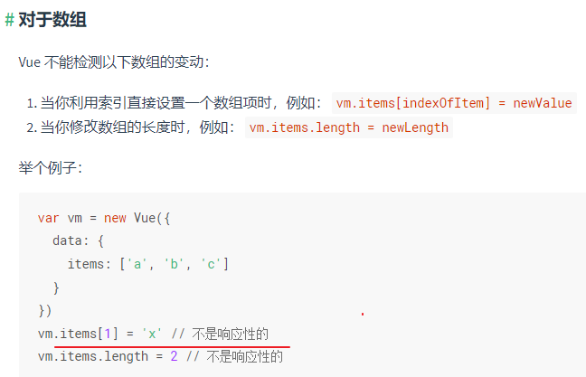
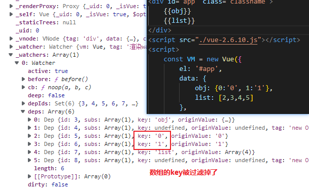
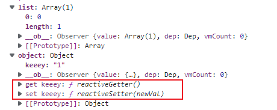
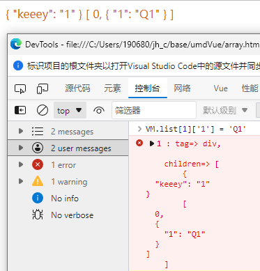
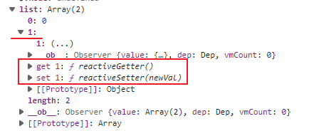
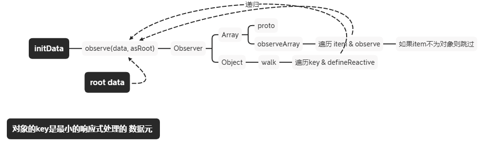

[TOC]

### 新的文件访问 API

[Getting Started With the File System Access API | CSS-Tricks - CSS-Tricks](https://css-tricks.com/getting-started-with-the-file-system-access-api/)

[File System Access (wicg.github.io)](https://wicg.github.io/file-system-access/#api-filesystemfilehandle)


### Vue 监听性能

Vue2 `Vue.config.performance = true`

Vue3 `app.config.performance = true`

设置为 `true` 以在浏览器开发工具的 performance/timeline 面板中启用对组件初始化、编译、渲染和更新的性能追踪。只适用于开发模式和支持 [performance.mark](https://developer.mozilla.org/en-US/docs/Web/API/Performance/mark) API 的浏览器。

```js
// vue2
mark = function (tag) { return perf.mark(tag); }; 
//查看 performance 标记 performance.getEntries()
measure = function (name, startTag, endTag) {
    perf.measure(name, startTag, endTag);
    perf.clearMarks(startTag);
    perf.clearMarks(endTag);
    // perf.clearMeasures(name)
};
```

```js
if (template) {
    /* istanbul ignore if */
    if (config.performance && mark) {
        mark('compile');
    }

    //ANCHOR compileToFunctions [template => render Function]
    var ref = compileToFunctions(template, {
        outputSourceRange: "development" !== 'production',
        shouldDecodeNewlines: shouldDecodeNewlines,
        shouldDecodeNewlinesForHref: shouldDecodeNewlinesForHref,
        delimiters: options.delimiters,
        comments: options.comments
    }, this);
    var render = ref.render;
    var staticRenderFns = ref.staticRenderFns;
    // 挂载到 $options 中, 模板 -> 渲染函数 挂载在 vm.$options.render中, 
    // 可以 toString( ) 查看完整的函数内容
    // 静态渲染函数暂时不清楚是何物
    options.render = render;//template的渲染  函数
    options.staticRenderFns = staticRenderFns; //StaticRoot渲染函数队列,挂载在 $options.staticRenderFns, 在renderStatic中使用

    /* istanbul ignore if */
    if (config.performance && mark) {
        mark('compile end');
        measure(("vue " + (this._name) + " compile"), 'compile', 'compile end');
    }
}
}
```


### Vue2 响应式数组索引更新



为什么不是响应式呢? 数组不是特殊的对象吗?





数组里的 key 没有绑定 get/set

如果数组里自带一个元素, 且为对象, 该对象也会被添加响应式处理





处理对象包括, 对象属性, / 数组元素中的对象.. 

 数组是没有绑定的索引作为key的; 根本就不处理数组的 key .. 



```JS
/**ANCHOR observe
   * Attempt to create `an observer instance` [for a value],
   * returns the new observer if successfully observed,
   * or the existing observer if the value already has one.
   */
function observe (value, asRootData) { 
    /* shouldObserve 是 new Observer(val)的开关 */
    // value.__ob__ => instance => {value, dep, vmCount}
    // __ob__.value => value [value & Observer对象可互相访问]

    // 只能绑定在对象/数组上, 且不能针对 VNode 做响应式处理
    if (!isObject(value) || value instanceof VNode) {
        return
    }
    var ob;
    if (hasOwn(value, '__ob__') && value.__ob__ instanceof Observer) {
        ob = value.__ob__;
    } else if (
        shouldObserve &&  /* toggleObserving(false) -> shouldObserve = false */
        !isServerRendering() &&
        (Array.isArray(value) || isPlainObject(value)) &&
        Object.isExtensible(value) &&
        !value._isVue
    ) {
        ob = new Observer(value);
    }
    if (asRootData && ob) {
        ob.vmCount++;
    }
    return ob
}
```


### 具有并发限制的promise.all

```js
function promsieTask(taskList, maxNum) {
  return new Promise((resolve, rejuct) => {
    let runCount = 0;
    let complated = 0;
    const taskNum = taskList.length;
    const resArr = [];
    let current = 0
    function handler() {
      if(runCount>=maxNum) return
      const a = taskNum - complated;
      const b = maxNum - runCount
      const arr = taskList.splice(0, a>b?b:a);
      arr.forEach((task, index) => {
        const d = current+index
        task
          .then(
            (res) => {
              console.log(current,index,res)
              resArr[current] = res;
            },
            (reason) => {
              resArr[current] = reason;
            }
          )
          .finally(() => {
            complated++;
            runCount--;

            if (complated === taskNum) {
              resolve(resArr);
            }
            handler();
          });
      });
      current += taskList.length
    }
    handler();
  });
}  
```

handler 执行的时机

- 开始时
- task结果出现后finally执行, 

终止时机: 全部完成, 在finally中判断


### 3年前端无力

前端有一句有名的鸡汤 “前端不是因为做交互界面，而是因为站在业务的最前端”，其实这句话是有问题的，我觉得每一位工作经验超过三年的前端同学都有一种**在业务领域的无力感**。

最核心的业务模型天然在后端，这是因为前端只是一个用户与业务系统交互的窗口

为了降低用户上手难度，或者带来更好的用户体验，才需要不断升级 UI 界面，所以 UI 界面和后端往往是多对一的关系，移动端、小程序、网页对应的接口都是一套，目的就是为了方便任何场景用户都能轻松触达业务，所以作为前端，首先要对前端存在的原因有正确的认识。


### Vue SSR 服务端渲染

- [Vue SSR 官网](https://v3.cn.vuejs.org/guide/ssr/introduction.html)
- [Vue SSR 源码解析](https://juejin.cn/post/6844903812700831757)


### HTTP headers

https://developer.mozilla.org/zh-CN/docs/Web/HTTP/Headers

**HTTP 消息头**允许客户端和服务器通过 **request**和 **response**传递附加信息。


#### Expires

**`Expires`** 响应头包含日期/时间， 即在此时候之后，响应过期。

如果在[`Cache-Control`](https://developer.mozilla.org/zh-CN/docs/Web/HTTP/Headers/Cache-Control)响应头设置了 *"max-age" 或者 "s-max-age" 指令*，那么 `Expires` 头会被忽略。

​	(优先级不高)

`示例: Expires: Wed, 21 Oct 2015 07:28:00 GMT`

**Expires 过期控制不稳定，因为浏览器端可以随意修改时间，导致缓存使用不精准。**


#### Cache-Control (继续改进，增加相对时间的控制)

 **`Cache-Control`** 通用消息头字段，被用于在http请求和响应中，通过指定指令来实现缓存机制。

缓存指令是单向的，这意味着在请求中设置的指令，不一定被包含在响应中。

#### [缓存请求指令](https://developer.mozilla.org/zh-CN/docs/Web/HTTP/Headers/Cache-Control#缓存请求指令)

客户端可以在HTTP请求中使用的标准 Cache-Control 指令。

```
Cache-Control: max-age=<seconds>
Cache-Control: max-stale[=<seconds>]
Cache-Control: min-fresh=<seconds>
Cache-control: no-cache
Cache-control: no-store
Cache-control: no-transform
Cache-control: only-if-cached
```

#### [缓存响应指令](https://developer.mozilla.org/zh-CN/docs/Web/HTTP/Headers/Cache-Control#缓存响应指令)

服务器可以在响应中使用的标准 Cache-Control 指令。

```
Cache-control: must-revalidate
Cache-control: no-cache
Cache-control: no-store
Cache-control: no-transform
Cache-control: public
Cache-control: private
Cache-control: proxy-revalidate
Cache-Control: max-age=<seconds>
Cache-control: s-maxage=<seconds>
```

#### [指令](https://developer.mozilla.org/zh-CN/docs/Web/HTTP/Headers/Cache-Control#指令)

##### [可缓存性](https://developer.mozilla.org/zh-CN/docs/Web/HTTP/Headers/Cache-Control#可缓存性)

- `public`

  表明响应可以被任何对象（包括：发送请求的客户端，代理服务器，等等）缓存，即使是通常不可缓存的内容。（例如：1.该响应没有`max-age`指令或`Expires`消息头；2. 该响应对应的请求方法是 [POST](https://developer.mozilla.org/zh-CN/docs/Web/HTTP/Methods/POST) 。）

- `private`

  表明响应只能被单个用户缓存，不能作为共享缓存（即代理服务器不能缓存它）。私有缓存可以缓存响应内容，比如：对应用户的本地浏览器。

- `no-cache`

  在发布缓存副本之前，**强制要求缓存把请求提交给原始服务器进行验证(协商缓存验证)**。

- `no-store`

  缓存不应存储有关客户端请求或服务器响应的任何内容，即**不使用任何缓存**。

#### [到期](https://developer.mozilla.org/zh-CN/docs/Web/HTTP/Headers/Cache-Control#到期)

- `max-age=`

  设置缓存存储的最大周期，超过这个时间缓存被认为过期(单位**秒**)。

  与`Expires`相反，**时间是相对于请求的时间**。 (多少s后该缓存过期)

- `s-maxage=`

  覆盖`max-age`或者`Expires`头，但是仅适用于共享缓存(比如各个代理)，私有缓存会忽略它。

- `max-stale[=]`

  表明客户端愿意接收一个已经过期的资源。可以设置一个可选的秒数，表示响应不能已经过时超过该给定的时间。

- `min-fresh=`

  表示客户端希望获取一个能在指定的秒数内保持其最新状态的响应。

- `stale-while-revalidate=` 

  表明客户端愿意接受陈旧的响应，同时在后台异步检查新的响应。秒值指示客户愿意接受陈旧响应的时间长度。

- `stale-if-error=` 

  表示如果新的检查失败，则客户愿意接受陈旧的响应。秒数值表示客户在初始到期后愿意接受陈旧响应的时间。


#### [示例](https://developer.mozilla.org/zh-CN/docs/Web/HTTP/Headers/Cache-Control#示例)

##### [禁止缓存](https://developer.mozilla.org/zh-CN/docs/Web/HTTP/Headers/Cache-Control#禁止缓存)

发送如下响应头可以关闭缓存。此外，可以参考`Expires`和`Pragma`消息头。

```
Cache-Control: no-store
```

##### [缓存静态资源](https://developer.mozilla.org/zh-CN/docs/Web/HTTP/Headers/Cache-Control#缓存静态资源)

对于应用程序中不会改变的文件，你通常可以在发送响应头前添加积极缓存。这包括例如由应用程序提供的静态文件，例如图像，CSS文件和JavaScript文件。另请参阅Expires标题。

```
Cache-Control:public, max-age=31536000
```

##### [需要重新验证](https://developer.mozilla.org/zh-CN/docs/Web/HTTP/Headers/Cache-Control#需要重新验证)

指定 `no-cache` 或 `max-age=0, must-revalidate` 表示客户端可以缓存资源，每次使用缓存资源前都必须重新验证其有效性。这意味着每次都会发起 HTTP 请求，但当缓存内容仍有效时可以跳过 HTTP 响应体的下载。

```
Cache-Control: no-cache
```

```
Cache-Control: max-age=0, must-revalidate
```

**注意**: 如果服务器关闭或失去连接，下面的指令可能会造成使用缓存。

```
Cache-Control: max-age=0
```


**上面为强缓存**

**下面为HTTP规范添加的Header, 两对协商缓存**

- Last-Modifed/If-Modified-Since

- Etag/If-None-Match


### Last-Modified

The **`Last-Modified`** 是一个响应首部，其中包含源头服务器认定的资源做出修改的日期及时间。 

它通常被用作一个验证器来判断接收到的或者存储的资源是否彼此一致。

**由于精确度比  [`ETag`](https://developer.mozilla.org/zh-CN/docs/Web/HTTP/Headers/ETag) 要低，所以这是一个备用机制。**

包含有  [`If-Modified-Since`](https://developer.mozilla.org/zh-CN/docs/Web/HTTP/Headers/If-Modified-Since) 或 [`If-Unmodified-Since`](https://developer.mozilla.org/zh-CN/docs/Web/HTTP/Headers/If-Unmodified-Since) 首部的条件请求会使用这个字段。

```
Last-Modified: Wed, 21 Oct 2015 07:28:00 GMT
```

- `GMT`

  国际标准时间。HTTP中的时间均用国际标准时间表示，从来不使用当地时间。


### If-Modified-Since

**`If-Modified-Since`** 是一个条件式请求首部，服务器只在所请求的资源**在给定的日期时间之后对内容进行过修改的情况下才会将资源返回**，状态码为 [`200`](https://developer.mozilla.org/zh-CN/docs/Web/HTTP/Status/200) 。

如果请求的资源从那时起**未经修改，那么返回一个不带有消息主体的 [`304`](https://developer.mozilla.org/zh-CN/docs/Web/HTTP/Status/304) 响应**，而在 [`Last-Modified`](https://developer.mozilla.org/zh-CN/docs/Web/HTTP/Headers/Last-Modified) 首部中会带有上次修改时间。 

不同于  [`If-Unmodified-Since`](https://developer.mozilla.org/zh-CN/docs/Web/HTTP/Headers/If-Unmodified-Since), `If-Modified-Since` 只可以用在 [`GET`](https://developer.mozilla.org/zh-CN/docs/Web/HTTP/Methods/GET) 或 [`HEAD`](https://developer.mozilla.org/zh-CN/docs/Web/HTTP/Methods/HEAD) 请求中。

当与 [`If-None-Match`](https://developer.mozilla.org/zh-CN/docs/Web/HTTP/Headers/If-None-Match) 一同出现时，它（**`If-Modified-Since`**）会被忽略掉，除非服务器不支持 `If-None-Match`。 (优先级比 etag 那对头部优先级低)

最常见的应用场景是来更新没有特定 [`ETag`](https://developer.mozilla.org/zh-CN/docs/Web/HTTP/Headers/ETag) 标签的缓存实体。


### ETag

 

**`ETag`**HTTP响应头是资源的特定版本的标识符。

这可以让缓存更高效，并节省带宽，因为如果内容没有改变，Web服务器不需要发送完整的响应。

而如果内容发生了变化，使用ETag有助于防止资源的同时更新相互覆盖（“空中碰撞”）。

如果给定URL中的资源更改，则一定要生成新的Etag值。 因此**Etags类似于指纹**，也可能被某些服务器用于跟踪。 比较etags能快速确定此资源是否变化，但也可能被跟踪服务器永久存留。

#### [语法](https://developer.mozilla.org/zh-CN/docs/Web/HTTP/Headers/ETag#语法)

```
ETag: W/"<etag_value>"
ETag: "<etag_value>"
```

#### [指令](https://developer.mozilla.org/zh-CN/docs/Web/HTTP/Headers/ETag#指令)

- `W/` 可选

  `'W/'`(大小写敏感) 表示使用[弱验证器](https://developer.mozilla.org/en-US/docs/Web/HTTP/Conditional_requests#Weak_validation)。 弱验证器很容易生成，但不利于比较。 强验证器是比较的理想选择，但很难有效地生成。 相同资源的两个弱`Etag`值可能语义等同，但不是每个字节都相同。

- "<etag_value>"

  实体标签唯一地表示所请求的资源。 它们是位于双引号之间的ASCII字符串（如“675af34563dc-tr34”）。 没有明确指定生成ETag值的方法。 通常，使用内容的散列，最后修改时间戳的哈希值，或简单地使用版本号。 例如，MDN使用wiki内容的十六进制数字的哈希值。

#### [示例](https://developer.mozilla.org/zh-CN/docs/Web/HTTP/Headers/ETag#示例)

```
ETag: "33a64df551425fcc55e4d42a148795d9f25f89d4"
ETag: W/"0815"
```


### nginx

Nginx 是一种高性能的`反向代理`服务器，可以用来轻松解决跨域问题。

what？反向代理？我给你看一张图你就懂了。


正向代理帮助客户端**访问**客户端自己访问不到的服务器，然后将结果返回给客户端。

反向代理拿到客户端的请求，将请求转发给其他的服务器，主要的场景是维持服务器集群的**负载均衡**，换句话说，反向代理帮**其它的服务器**拿到请求，然后选择一个合适的服务器，将请求转交给它。

因此，两者的区别就很明显了，**正向代理服务器是帮客户端做事情，而反向代理服务器是帮其它的服务器做事情**。

那 Nginx 是如何来解决跨域的呢？

比如说现在客户端的域名为**client.com**，服务器的域名为**server.com**，客户端向服务器发送 Ajax 请求，当然会跨域了，那这个时候让 Nginx 登场了，通过下面这个配置:

```
server {
  listen  80;
  server_name  client.com;
  location /api {
    proxy_pass server.com;
  }
}
```

Nginx 相当于起了一个跳板机，这个跳板机的域名也是`client.com`，让客户端首先访问 `client.com/api`，这当然没有跨域，然后 Nginx 服务器作为反向代理，将请求转发给`server.com`，当响应返回时又将响应给到客户端，这就完成整个跨域请求的过程。

其实还有一些不太常用的方式，大家了解即可，比如`postMessage`，当然`WebSocket`也是一种方式，但是已经不属于 HTTP 的范畴，另外一些奇技淫巧就不建议大家去死记硬背了，一方面从来不用，名字都难得记住，另一方面临时背下来，面试官也不会对你印象加分，因为看得出来是背的。当然没有背并不代表减分，把跨域原理和前面三种主要的跨域方式理解清楚，经得起更深一步的推敲，反而会让别人觉得你是一个靠谱的人。


