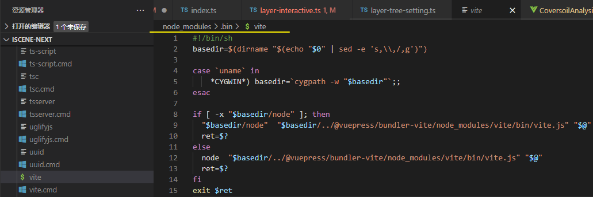
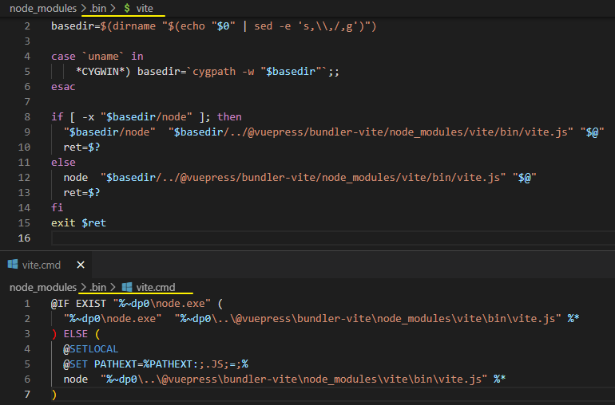
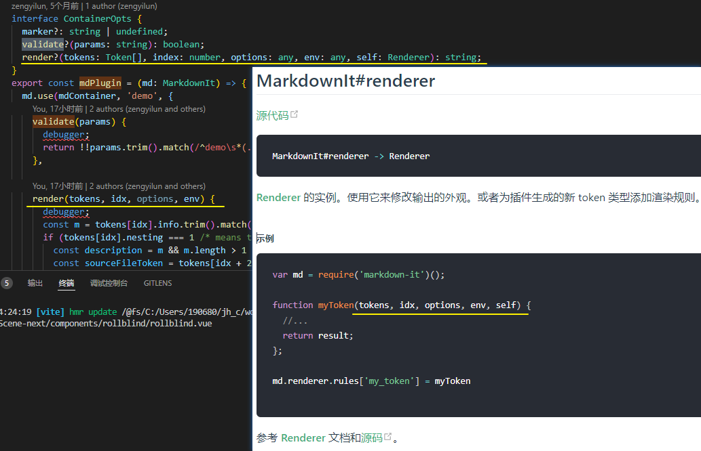

[toc]

### 设置矢量数据图层样式


# 运行 npm run xxx 的时候发生了什么？ 

https://juejin.cn/post/7078924628525056007

面试官: npm run xxx的时候，发生了什么？讲的越详细越好.  (*段子*)

A: npm run xxx的时候，首先会去项目的package.json文件里找scripts 里找对应的xxx，然后执行 xxx的命令，例如启动vue项目 npm run serve的时候，实际上就是执行了vue-cli-service serve 这条命令

Q: 为什么 不直接执行`vue-cli-service serve`而要执行`npm run serve` 呢？

A: 因为 直接执行`vue-cli-service serve`，会**报错**，因为操作系统中没有存在`vue-cli-service`这一条指令

Q: 那既然`vue-cli-service`这条指令不存在操作系统中，为什么执行`npm run serve`的时候，也就是相当于执行了`vue-cli-service serve` ，为什么这样它就能成功，而且**不报指令不存在的错误**呢？

------


**正经思路**

在安装依赖的时候，是通过npm i xxx 来执行的，例如 `npm i @vue/cli-service`，npm 在 安装这个依赖的时候，就会**在`node_modules/.bin/` 目录中创建好`vue-cli-service` 为名的几个可执行文件了**。



**.bin 目录**不是任何一个 npm 包。

目录下的文件，表示这是一个个**软链接**，打开文件可以看到文件顶部写着 `#!/bin/sh` ，表示这是一个**脚本**。

当使用 `npm run serve` 执行 `vue-cli-service  serve` 时，虽然没有安装 `vue-cli-service`的全局命令，但是 **npm 会到 `./node_modules/.bin` 中找到 `vue-cli-service` 文件作为脚本来执行**

则相当于执行了 `./node_modules/.bin/vue-cli-service serve`（最后的 serve 作为参数传入）。


面试官：我还想继续问问，你说.bin 目录下的文件表示软链接，那这个bin目录下的那些软链接文件是哪里来的呢？它又是怎么知道这条软链接是执行哪里的呢？

以`node_modules/vite`举例:


vite/package.json文件中有个字段`bin`

当我们npm i 整个新建的vue项目的时候，**npm 将 bin/vite.js 作为 bin 声明**了

重点在安装依赖时, npm做的操作: **在 npm install 时，npm 读到该配置后，就将该文件软链接到 ./node_modules/.bin 目录下，而 npm 还会自动把node_modules/.bin加入$PATH，这样就可以直接作为命令运行依赖程序和开发依赖程序，不用全局安装了**。

使用 `npm install -g xxx` 来安装全局包，那么会将**其中的 bin 文件加入到全局**，比如 create-react-app 和 vue-cli ，在全局安装后，就可以直接使用如 `vue-cli projectName` 这样的命令来创建项目了。

**npm i 的时候，npm 就帮我们把这种软链接配置好了，其实这种软链接相当于一种映射，执行npm run xxx 的时候，就会到 node_modules/bin中找对应的映射文件，然后再找到相应的js文件来执行。**


面试官：我有点好奇。刚刚看到在node_modules/bin中 有三个vue-cli-service文件。为什么会有三个文件呢？怎么判断运行的哪一个呢?

(vite项目下有两个 `vite` & `vite.cmd`)



```cmd
## vue-cli-service.cmd
@ECHO off
GOTO start
:find_dp0
SET dp0=%~dp0
EXIT /b
:start
SETLOCAL
CALL :find_dp0

IF EXIST "%dp0%\node.exe" (
  SET "_prog=%dp0%\node.exe"
) ELSE (
  SET "_prog=node"
  SET PATHEXT=%PATHEXT:;.JS;=;%
)

endLocal & goto #_undefined_# 2>NUL || title %COMSPEC% & "%_prog%"  "%dp0%\..\@vue\cli-service\bin\vue-cli-service.js" %*

## 简述下大概逻辑, 判断是否存在node.exe 
## 如果有就设置 _prog = node.exe, 
## 如果没有设置 _prod = node
## 去node vue-cli.service.js
```


在 cmd 里运行的时候，windows 一般是调用了 `vue-cli-service.cmd`，这个文件，这是 windows 下的批处理脚本 (主要是跟操作系统相关 .. ? )

当我们运行`vue-cli-service serve`这条命令的时候，就相当于运行 `node_modules/.bin/vue-cli-service.cmd serve`。这个脚本会使用 node 去运行` vue-cli-service.js`这个 js 文件

> 对号入座: 当我们执行 `vite --force` 命令是, 就相当于运行了 `node_modules/.bin/vite.cmd --force`.
>
> 这个脚本会使用 node 去运行 `vite.js` 这个文件


`process.argv` 是读取命令中的参数等 


由于 node 中可以使用一系列系统相关的 api ，所以在这个 js 中可以做很多事情，例如读取并分析运行这条命令的目录下的文件，根据模板生成文件等。


可执行文件:

 windows 系统上，可执行文件是通过组策略和环境变量决定的。在cmd上 使用 set pathext 可以查看


``` sh
# unix 系默认的可执行文件，必须输入完整文件名
vue-cli-service

# windows cmd 中默认的可执行文件，当我们不添加后缀名时，自动根据 pathext 查找文件
vue-cli-service.cmd

# Windows PowerShell 中可执行文件，可以跨平台
vue-cli-service.ps1
```

**总结**

1. 运行 npm run xxx的时候，npm 会先在当前目录的 node_modules/.bin 查找要执行的程序，如果找到则运行；
2. 没有找到则从全局的 node_modules/.bin 中查找，npm i -g xxx就是安装到到全局目录；
3. 如果全局目录还是没找到，那么就从 path 环境变量中查找有没有其他同名的可执行程序。


**疑惑**

感觉不存在软链接的概念, **.bin路径都是可执行文件**, 内部通过路径访问到要执行的js文件;

在 `.bin` 路径下执行 `dir` 命令, 所有的文件的Mode都不是软链接, 那么证明上文里面的软链接


### [在Windows中安装vim - Eric鞠 - 博客园 (cnblogs.com)](https://www.cnblogs.com/Eric-jx/p/10491922.html)


### Windows 硬链接 软链接

**mklink 命令是 Windows 自带的命令**， 需要在管理员的权限下执行


默认创建符号连接(软链接): `mklink d:\_jh\test\h1.txt d:\_jh\test\account.txt`

这个 h1.txt 并不是快捷方式，是一个**符号链接**，我们可以在 Link 文件夹下面正常打开和使用(**打开也是直接打开的Target，也就是account.txt**) 但是实际上这个文件是存储在 Target 文件夹下的。从`类型: .symlink` 可以看出新创建的这个文件是个软链接


这样相当于两个不同的文件夹下面出现了两个相同的文件，**对这两个文件编辑哪个都会同时改变。**


创建硬连接: `mklink /H d:\_jh\test\h2.txt d:\_jh\test\account.txt` (/H)


在test目录下执行`dir` 命令, 输出以下结果:


Mode 存在差异... (.symlink带1后缀)


### 频繁切换导致卡死功能

是各个组件中的setup执行顺序不一致: 预期是组件A先unmount再到B组件mount

结果偶发`A未unmount,B已经mount`导致影响了渲染卡死了问题

使用vue生命周期钩子防止触发异常.. 顺序错乱的问题


### ref vs reactive

```js
function ref(value) {
    return createRef(value, false);
}
function createRef(rawValue, shallow) {
    if (isRef(rawValue)) {
        return rawValue;
    }
    return new RefImpl(rawValue, shallow);
}
class RefImpl {
    constructor(value, _shallow) {
        this._shallow = _shallow;
        this.dep = undefined;
        this.__v_isRef = true;
        this._rawValue = _shallow ? value : toRaw(value);
        this._value = _shallow ? value : toReactive(value);
    }
    get value() {
        trackRefValue(this);
        return this._value;
    }
    set value(newVal) {
        newVal = this._shallow ? newVal : toRaw(newVal);
        if (shared.hasChanged(newVal, this._rawValue)) {
            this._rawValue = newVal;
            this._value = this._shallow ? newVal : toReactive(newVal);
            triggerRefValue(this, newVal);
        }
    }
}
```

```js
function reactive(target) {
    // if trying to observe a readonly proxy, return the readonly version.
    if (target && target["__v_isReadonly" /* IS_READONLY */]) {
        return target;
    }
    return createReactiveObject(target, false, mutableHandlers, mutableCollectionHandlers, reactiveMap);
}
function createReactiveObject(target, isReadonly, baseHandlers, collectionHandlers, proxyMap) {
    if (!shared.isObject(target)) {
        {
            console.warn(`value cannot be made reactive: ${String(target)}`);
        }
        return target;
    }
    // target is already a Proxy, return it.
    // exception: calling readonly() on a reactive object
    if (target["__v_raw" /* RAW */] &&
        !(isReadonly && target["__v_isReactive" /* IS_REACTIVE */])) {
        return target;
    }
    // target already has corresponding Proxy
    const existingProxy = proxyMap.get(target);
    if (existingProxy) {
        return existingProxy;
    }
    // only a whitelist of value types can be observed.
    const targetType = getTargetType(target);
    if (targetType === 0 /* INVALID */) {
        return target;
    }
    const proxy = new Proxy(target, targetType === 2 /* COLLECTION */ ? collectionHandlers : baseHandlers);
    proxyMap.set(target, proxy);
    return proxy;
}
```


### Vue3 & mini-vue


### iScene-next vuepress demo

自定义容器: https://www.vuepress.cn/guide/markdown.html#%E8%87%AA%E5%AE%9A%E4%B9%89%E5%AE%B9%E5%99%A8

**iscene-next cdk 如何展示demo**


ClientOnly:  https://www.vuepress.cn/zh/guide/using-vue.html#%E6%B5%8F%E8%A7%88%E5%99%A8%E7%9A%84-api-%E8%AE%BF%E9%97%AE%E9%99%90%E5%88%B6

使用的demo组件, 通过路径来对应其组件名.


需要注意到 `props` 中的值是如何传到 demo 组件中的呢? 我搜到demo搜到了一个自定义插件 `plugins.ts`

```ts
// config/index.ts
import { mdPlugin } from './plugins';

export const config: UserConfig = {
    // ...
    // eslint-disable-next-line prettier/prettier
  extendsMarkdown: (md) => {
    md.use(mdPlugin);
  },
} 
```

```ts
// plugins.ts
/* eslint-disable no-param-reassign */
/* eslint-disable import/no-extraneous-dependencies */
import path from 'path';
import fs from 'fs';
import { parse } from '@vue/compiler-sfc';
import MarkdownIt from 'markdown-it';
import mdContainer from 'markdown-it-container';
import type Token from 'markdown-it/lib/token';
import type Renderer from 'markdown-it/lib/renderer';
import { docRoot } from '../utils/paths';
import { highlight } from './highlight';

const localMd = MarkdownIt();
const scriptSetupRE = /<\s*script[^>]*\bsetup\b[^>]*/;

interface ContainerOpts {
  marker?: string | undefined;
  validate?(params: string): boolean;
  render?(tokens: Token[], index: number, options: any, env: any, self: Renderer): string;
}
export const mdPlugin = (md: MarkdownIt) => {
  md.use(mdContainer, 'demo', {
    validate(params) {
      return !!params.trim().match(/^demo\s*(.*)$/);
    },

    render(tokens, idx, options, env) {
      const m = tokens[idx].info.trim().match(/^demo\s*(.*)$/);
      if (tokens[idx].nesting === 1 /* means the tag is opening */) {
        const description = m && m.length > 1 ? m[1] : '';
        const sourceFileToken = tokens[idx + 2];
        let source = '';
        const sourceFile = sourceFileToken.children?.[0].content ?? '';

        if (sourceFileToken.type === 'inline') {
          source = fs.readFileSync(path.resolve(docRoot, 'examples', `${sourceFile}.vue`), 'utf-8');

          const hoistedTags: string[] = env.hoistedTags || (env.hoistedTags = []);
          const existingScriptIndex = hoistedTags.findIndex((tag: any) => scriptSetupRE.test(tag));

          if (existingScriptIndex === -1) {
            const soureDest = sourceFile.split('/')[0];
            hoistedTags.push(`
          <script setup>
          const demos = import.meta.globEager('../../../../examples/${soureDest}/*.vue');
          </script>`);
          }
        }
        if (!source) throw new Error(`Incorrect source file: ${sourceFile}`);

        const { html, js, css, cssPreProcessor, jsPreProcessor } = generateCodePenSnippet(source);
        return `<Demo :demos="demos" source="${encodeURIComponent(
          highlight(source, 'vue')
        )}" path="${sourceFile}" html="${html}" js="${js}" css="${css}" css-pre-processor="${cssPreProcessor}" js-pre-processor="${jsPreProcessor}" description="${encodeURIComponent(
          localMd.render(description)
        )}">`;
      } else {
        return '</Demo>';
      }
    },
  } as ContainerOpts);
};

import { parse } from '@vue/compiler-sfc';
function generateCodePenSnippet(source: string) {
  const { template, script, styles } = parse(source).descriptor;
    // 基于 sfc 进行解析
  const css = styles.pop();
  return {
    html: encodeURIComponent(template?.content ?? ''),
    js: encodeURIComponent((script || { content: '' }).content),
    css: encodeURIComponent(css?.content || ''),
    cssPreProcessor: css?.lang || 'none',
    jsPreProcessor: script?.lang || 'none',
  };
}
```

可以在vscode node环境下调试;

相当于是基于每一个md文件进行解析,  然后匹配以`demo`开头的Token进行额外的处理


validate校验需要处理的参数路径 ? / render用来进行覆盖渲染


使用插件的库为 `markdown-it`  [markdown-it | markdown-it 中文文档 (docschina.org)](https://markdown-it.docschina.org/)

vuepress 插件API: https://v2.vuepress.vuejs.org/zh/reference/plugin-api.html#%E6%A6%82%E8%A7%88

mdPlugin作为extendsMarkdown配置的的参数, 会接受一个md实例 (由 [markdown-it在新窗口打开](https://github.com/markdown-it/markdown-it) 提供的 `Markdown` 实例。)

可以用来添加额外的 markdown-it 插件、应用额外的自定义功能。



use里传的插件是 `markdown-it-container`, 终于找到使用的重点了! 

[markdown-it/markdown-it-container: Fenced container plugin for markdown-it markdown parser (github.com)](https://github.com/markdown-it/markdown-it-container)

With this plugin you can create *block containers* like:

```md
::: warning
*here be dragons*
:::
```

.... and specify how they should be rendered. If no renderer defined, `<div>` with container name class will be created:

```html
<div class="warning">
<em>here be dragons</em>
</div>
```

Markup is the same as for [fenced code blocks](http://spec.commonmark.org/0.18/#fenced-code-blocks). Difference is, that marker use another character and content is rendered as markdown markup.

标记与 fence code blocks (md语法中的 ``` 代码块标签) 一样. 不同的是Markup使用另外的字符(默认为":")和渲染内用是 markdown 标记.

**markdown-it-container Example**

```js
var md = require('markdown-it')();

md.use(require('markdown-it-container'), 'spoiler', {

  validate: function(params) {
    return params.trim().match(/^spoiler\s+(.*)$/);
  },

  render: function (tokens, idx) {
    var m = tokens[idx].info.trim().match(/^spoiler\s+(.*)$/);

    if (tokens[idx].nesting === 1) {
      // opening tag
      return '<details><summary>' + md.utils.escapeHtml(m[1]) + '</summary>\n';

    } else {
      // closing tag
      return '</details>\n';
    }
  }
});

console.log(md.render('::: spoiler click me\n*content*\n:::\n')); 
// 与 smart3d-vue 使用一样的标记内容

// Output:
//
// <details><summary>click me</summary>
// <p><em>content</em></p>
// </details>
```

Params:

- **name** - container name (mandatory [mandatory : 强制性的]) 
- options:
  - **validate** - optional, function to validate tail after opening marker, should return `true` on success.
  - **render** - optional, renderer function for opening/closing tokens.
  - **marker** - optional (`:`), character to use in delimiter.

源码部分:

```js
markup = state.src.slice(start, pos);
params = state.src.slice(pos, max);
if (!validate(params, markup)) { return false; }


md.renderer.rules['container_' + name + '_open'] = render;
md.renderer.rules['container_' + name + '_close'] = render;
```

Renderer#rules: https://markdown-it.docschina.org/api/Renderer.html#renderer-rules

执行过程中的


