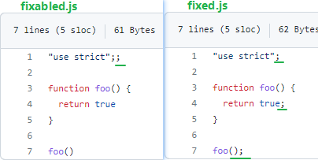

[TOC]

### 埋点 监控 sdk

https://juejin.cn/post/7085679511290773534

#### SDK的设计

在开始设计之前，先看一下SDK怎么使用

```javascript
import StatisticSDK from 'StatisticSDK';
// 全局初始化一次
window.insSDK = new StatisticSDK('uuid-12345');


<button onClick={()=>{
  window.insSDK.event('click','confirm');
  ...// 其他业务代码
}}>确认</button>
复制代码
```

首先把SDK实例挂载到全局，之后在业务代码中调用，这里的新建实例时需要传入一个id，因为这个埋点监控系统往往是给多个业务去使用的，通过id去区分不同的数据来源。


#### 数据发送

数据发送是一个最基础的api，后面的功能都要基于此进行。通常这种前后端分离的场景会使用AJAX的方式发送数据，但是这里使用图片的src属性。原因有两点：

1. 没有跨域的限制，像srcipt标签、img标签都可以直接发送跨域的GET请求，不用做特殊处理；
2. 兼容性好，一些静态页面可能禁用了脚本，这时script标签就不能使用了；

但要注意，这个图片不是用来展示的，我们的目的是去「传递数据」，只是借助img标签的的src属性，在其url后面拼接上参数，服务端收到再去解析。

```javascript
class StatisticSDK {
  constructor(productID){
    this.productID = productID;
  }
  send(baseURL,query={}){
    query.productID = this.productID;
    let queryStr = Object.entries(query).map(([key, value]) => `${key}=${value}`).join('&')
    let img = new Image();
    img.src = `${baseURL}?${queryStr}`
  }
}

```

img标签的优点是不需要将其append到文档，只需设置src属性便能成功发起请求。

**gif 格式的优点**

- 不同格式的的图片中GIF大小是最小的
- 如果返回204，会走到img的onerror事件，并抛出一个全局错误；如果返回200和一个空对象会有一个CORB的告警；
- 有一些埋点需要真实的加到页面上，比如垃圾邮件的发送者会添加这样一个隐藏标志来验证邮件是否被打开，如果返回204或者是200空对象会导致一个明显图片占位符


上面实现了数据发送的api，现在可以基于它去实现用户行为监控的api。

```javascript
class StatisticSDK {
  constructor(productID){
    this.productID = productID;
  }
  // 数据发送
  send(baseURL,query={}){
    query.productID = this.productID;
      let queryStr = Object.entries(query).map(([key, value]) => `${key}=${value}`).join('&')
      let img = new Image();
      img.src = `${baseURL}?${queryStr}`
  }
  // 自定义事件
  event(key, val={}) {
    let eventURL = 'http://demo/'
    this.send(eventURL,{event:key,...val})
  }
  // pv曝光
  pv() {
    this.event('pv')
  }
}
```

用户行为包括自定义事件和pv曝光，也可以把pv曝光看作是一种特殊的自定义行为事件。


#### 更优雅的web beacon

这种打点标记的方式被称web beacon（网络信标）。除了gif图片，从2014年开始，浏览器逐渐实现专门的API，来更优雅的完成这件事：Navigator.sendBeacon

使用很简单

```
Navigator.sendBeacon(url,data)
复制代码
```

相较于图片的src，这种方式的更有优势：

1. 不会和主要业务代码抢占资源，而是在浏览器空闲时去做发送；
2. 并且在页面卸载时也能保证请求成功发送，不阻塞页面刷新和跳转；

现在的埋点监控工具通常会优先使用sendBeacon，但由于浏览器兼容性，还是需要用图片的src兜底。


### Vue3 翻译

[翻译须知](https://github.com/vuejs-translations/docs-zh-cn/wiki/%E7%BF%BB%E8%AF%91%E9%A1%BB%E7%9F%A5)

[协作指南](https://github.com/vuejs-translations/docs-zh-cn/wiki/%E5%8D%8F%E4%BD%9C%E6%8C%87%E5%8D%97)


### github 提交 PR 的流程

https://www.jianshu.com/p/21ce90f2a5b7

重点操作流程: 

- https://juejin.cn/post/6992740541939056677 

- https://juejin.cn/post/6942132016187981837

- https://juejin.cn/post/6949848117072101384

- https://juejin.cn/post/6844903939205267464
- 使用git rebase 提高PR质量: https://juejin.cn/post/6844903497645686797

PR练习: 

[1.fork目标项目](https://juejin.cn/post/6844903939205267464#1fork目标项目)

[2.clone项目到本地](https://juejin.cn/post/6844903939205267464#2clone项目到本地)

[3.修改代码然后commit](https://juejin.cn/post/6844903939205267464#3修改代码然后commit)

[4.pull request](https://juejin.cn/post/6844903939205267464#4pull-request)

> 如果fork本地的项目落后与目标仓库时, 需要连接并同步代码;
>
> 可以提PR, 但是合并时存在冲突
>
> PR在被通过之前是没有不会对目标仓库进行修改的

与目标仓库建立连接

```sh
git remote add upstream https://github.com/element-plus/element-plus.git
```

or 使用 vscode 添加远程存储库... 通过url添加 使用 fetch + 变基 进行同步代码

变基时可以选择 upstream/命名的仓库名 来同步代码


### 单元测试 jest

```js
test("should fix source code", () => {
  fs.writeFileSync(
    "./test/fixtures/fixable-clone.js",
    fs.readFileSync("./test/fixtures/fixable.js")
  );
  return rollup({
    input: "./test/fixtures/fixable-clone.js",
    plugins: [
      eslint({
        fix: true
      })
    ]
  }).then(() => {
    expect(
      fs.readFileSync("./test/fixtures/fixable-clone.js").toString()
    ).toEqual(fs.readFileSync("./test/fixtures/fixed.js").toString());
    fs.unlinkSync("./test/fixtures/fixable-clone.js");
  });
});
```



https://github.com/TrySound/rollup-plugin-eslint/blob/master/test/test.js

开发对 开源仓库 **提交的PR** & test


### 单元测试 jest

**Delightful JavaScript Testing**

开发人员就绪：全面的 JavaScript 测试解决方案。开箱即用，适用于大多数 JavaScript 项目。
即时反馈：快速交互式监视模式仅运行与已更改文件相关的测试文件。
快照测试：捕获大型对象的快照，以简化测试并分析它们如何随时间变化。

[入门 · Jest (jestjs.io)](https://jestjs.io/zh-Hans/docs/getting-started)


### git rebase master 的原理是：

1. 首先找到两个分支（dev 和 master）的最近共同祖先 m1。
2. 对比当前 dev 分支相比 m1 的历次提交，提取修改，保存为临时文件。
3. 将分支指向 master 最新的 m3。
4. 依次应用修改。
