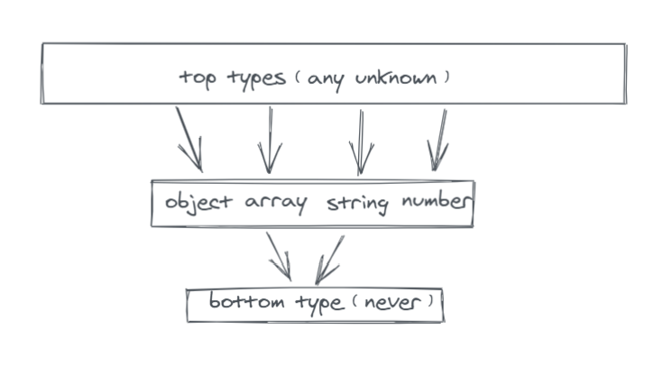
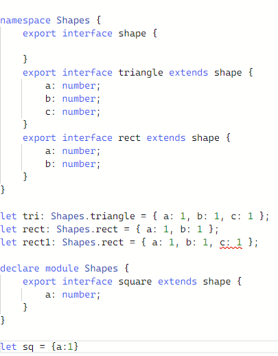

[TOC]

### **Lexical**

[facebook/lexical：Lexical是一个可扩展的文本编辑器框架，可提供出色的可靠性，可访问性和性能。 (github.com)](https://github.com/facebook/lexical)

Lexical 是一个可扩展的 JavaScript Web 文本编辑器框架，强调可靠性、可访问性和性能。


### Sprite.js

在线示例:  http://spritejs.com/demo

3d示例: 粒子效果: http://spritejs.com/demo/#/3d/particles  关注glsl

动态阴影:  http://spritejs.com/demo/#/3d/shadow


### ts never any unknown 

在类型系统设计中，有两种特别的类型：

- Top type：被称为**通用父类型**，也就是能够包含所有值的类型。
- Bottom type：代表**没有值的类型**，它也被称为**零**或**空**类型，是所有类型的子类型。

按照类型系统的解释，在 TypeScript 3.0 中，有两个 top type（any 和 unknown） 和一个 bottom type（never）。



#### The `never` type [#](https://www.typescriptlang.org/docs/handbook/2/narrowing.html#the-never-type)

When narrowing, you can reduce the options of a union to a point where you have removed all possibilities and have nothing left. In those cases, TypeScript will use a `never` type to represent a state which shouldn’t exist.

缩小时，您可以将工会的选项减少到删除所有可能性并没有任何内容的点。 在这些情况下，TypeScript将使用`never `表示不存在的状态。

https://www.typescriptlang.org/docs/handbook/2/everyday-types.html (2.x)

`never`类型表示的是那些永不存在的值的类型。`never`类型是任何类型的子类型，也可以赋值给任何类型；`any`也不可以赋值给`never`。

应用: `never`类型是那些总是会抛出异常或根本就不会有返回值的函数表达式或箭头函数表达式的返回值类型； 变量也可能是 `never`类型，当它们被永不为真的类型保护所约束时。

### `never`

Some functions *never* return a value:

```ts
function fail(msg: string): never {
  throw new Error(msg);
}
```


`any`: 不希望类型检查器对这些值进行检查而是直接让它们通过编译阶段的检查


#### unknown [#](https://www.typescriptlang.org/docs/handbook/2/functions.html#unknown)

The `unknown` type **represents *any* value**. This is similar to the `any` type, but is safer because **it’s not legal** to do anything with an `unknown` value:

“unknown” 类型 代表*任何*值。 这类似于`any`类型，但**更安全**，因为与`unknown`做任何事情**并不合法**：

```ts
function f1(a: any) {
  a.b(); // OK
}
function f2(a: unknown) {
  a.b();
  // Object is of type 'unknown'.
}
```

This is useful when describing function types because you can describe functions that accept any value without having `any` values in your function body.

Conversely, you can describe a function that returns a value of unknown type:

在描述函数类型时，这是有用的，因为您可以描述接受任何值的函数，而不会在函数体中具有`any`值。

相反，您可以描述返回未知类型值的函数：

```ts
function safeParse(s: string): unknown {
  return JSON.parse(s);
}
 
// Need to be careful with 'obj'!
const obj = safeParse(someRandomString);
```


- 代码规范，any虽然可以代表任意类型，但是能不用就不要用，这是默认的代码规范问题，不要用成anyscript!
- 与any任意类型相比，因为unknown是未知类型，所以只能进行**!!,!,?,typeof,instanceof等有限操作**


### ts namespace [#](https://www.typescriptlang.org/docs/handbook/namespaces.html)


#### 多文件中的命名空间


### Typescript声明文件-第三方类型扩展 [#](https://segmentfault.com/a/1190000022842783)

如何扩展第三方模块中的类型，有三条基本原则：

1. 同模块：声明合并只能在同一个模块中进行
2. 同路径：声明的模块路径必须与目标类型（你将要扩展的类型）的**原始声明文件**路径保持一致
3. 同书写方式：声明书写方式必须与目标类型一致

#### 原则一：同模块

声明合并只能在同一个模块中进行。意思是说，在扩展一个类型之前，你需要先引入这个类型所在的模块。

```ts
// 引入`Foo`所在的模块`moduleOfFoo`，这一步非常重要
import 'moduleOfFoo'

// 声明同名模块
declare module 'moduleOfFoo' {
  // 在这个空间内才可以进行声明合并
  interface Foo {
    Bar: any
  }
}

```

需要为接口`Foo`扩展一个属性`Bar`，`Foo`是在`moduleOfFoo`中声明的，为此我们需要先引入`moduleOfFoo`

然后我们需要声明一个**同名的模块**，在模块内部进行`Foo`的声明合并

#### 原则二：同路径

声明的模块路径必须与目标类型（你将要扩展的类型）的**原始声明文件**路径保持一致。
我们来看一个例子：
首先我们在`a.d.ts`中声明了`interface A`, `b.d.ts`引用了`A`然后导出

```ts
// a.d.ts
export declare interface A {
  a: number
}
// b.d.ts
export { A } from './a'
```

```ts
import './b'

declare module './a' {
  interface A {
    test: number
  }
}
```

扩展`interface A`

**这里`declare module './a'`，因为`interface A`就是在`'./a'`中定义的，必须在这个模块中才能够合并声明。**

这里的`import './b'`，改成`import './a'`也是可以的，因为都能达到引入`interface A`的目的。唯有`declare module './a'`不可以改成`declare module './b'`，因为**`'./b'`不是`interface A`的原始声明文件**。

#### 原则三：同书写方式

声明书写方式必须与目标类型一致。这里主要是说**namespace嵌套关系要保持一致**。

```ts
export namespace dia {
  // ...
  export namespace CellView {
    // ... 
  }
  // ...
}
```

要为`joint.dia.CellView`扩展两个方法`getData`和`setData`。
通过观察`joint.d.ts`，我们得知`CellView`嵌套了两层`namespace`：

所以我们在合并声明的时候，也需要嵌套两层同样的`namespace`

```ts
// 扩展jointjs
import jointjs from 'jointjs'

declare module 'jointjs' {
  namespace dia {
    interface CellView {
      getData: (key?: string) => any
      setData: (data: any, value?: any) => void
    }
  }
}
```

Typescript声明合并的规则在官方文档有详细的解释，大家感兴趣可以去看看。需要注意的是：

1. **声明合并无法覆盖原有的类型**
2. **类不能与其它类或变量合并**

```typescript
// a.d.ts
export declare interface A {
  a: number
  b: number
}
export declare let B: number
export declare class C {
  a: number
}
```

我们希望将`A.a`和`B`的类型改为`string`，直接覆盖声明是无效的：

```typescript
// custom.d.ts
import './a'
declare module './a' {
  // 直接覆盖属性a无效
  interface A {
    a: string
  }
  // 直接覆盖类型B无效
  let B: string
}
```

如果你实在需要覆盖`A.a`的类型，可以考虑使用继承：

```typescript
// code.ts // 这里不是声明文件，是实实在在的ts代码
import { A as _A } from './a'
export interface A extends _A {
  a: string
}
```

当然这里也并没有覆盖`A.a`的类型，不过你可以使用这个**新**的`code.ts`中的`interface A`。


需要扩展`class C`的实例属性和静态属性，直接用`class`覆盖是无效的

```typescript
// custom.d.ts
import './a'
declare module './a' {
  // 直接覆盖class无效
  class C {
    b: number
    static c: number
  }
}
```

我们可以用`interface`来扩展`class`的实例属性，用`namespace`来扩展`class`的静态属性：

```typescript
// custom.d.ts
import './a'
declare module './a' {
  // 使用interface扩展class的实例属性
  interface C {
    b: number
  }
  // 使用namespace扩展class的静态属性
  namespace C {
    let c: number
  }
}
```



