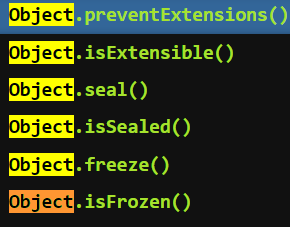

### 控制对象状态

有时需要冻结对象的读写状态，防止对象被改变。JavaScript 提供了三种冻结方法，最弱的一种是`Object.preventExtensions`，其次是`Object.seal`，最强的是`Object.freeze`。



`Object.preventExtensions`方法可以使得一个对象无法再添加新的属性。

```js
var obj = new Object();
Object.preventExtensions(obj);

Object.defineProperty(obj, 'p', {
  value: 'hello'
});
// TypeError: Cannot define property:p, object is not extensible.

obj.p = 1;
obj.p // undefined
```

`Object.isExtensible`方法用于检查一个对象是否使用了`Object.preventExtensions`方法。

使用`Object.preventExtensions`方法以后，再使用`Object.isExtensible`方法，返回`false`，表示已经不能添加新属性了。


`Object.seal`方法使得一个对象既无法添加新属性，也无法删除旧属性。

`Object.seal`实质是把**属性描述对象的`configurable`属性设为`false`**，因此属性描述对象不再能改变了。

```js
var obj = { p: 'hello' };
Object.seal(obj);

delete obj.p;
obj.p // "hello"

obj.x = 'world';
obj.x // undefined
```

`Object.isSealed`方法用于检查一个对象**是否使用了`Object.seal`方法**

若使用`Object.seal()`方法后`Object.isExtensible`方法返回`false`。


`Object.freeze`方法可以使得一个对象无法添加新属性、无法删除旧属性、也无法改变属性的值，使得这个对象实际上变成了常量。

```js
var obj = {
  p: 'hello'
};

Object.freeze(obj);

obj.p = 'world';
obj.p // "hello"

obj.t = 'hello';
obj.t // undefined

delete obj.p // false
obj.p // "hello"
```

对`obj`对象进行`Object.freeze()`以后，修改属性、新增属性、删除属性都无效了。

这些操作并不报错，只是默默地失败。如果**在严格模式下，则会报错**。

`Object.isFrozen`方法用于检查一个对象**是否使用了`Object.freeze`方法**。

使用`Object.freeze`方法以后，`Object.isSealed`将会返回`true`，`Object.isExtensible`返回`false`。

如果属性值是对象，上面这些方法只能冻结属性指向的对象，而不能冻结对象本身的内容。


### [pixijs](https://github.com/pixijs/pixijs)

The aim of this project is to provide a fast lightweight 2D library that works across all devices. 

PixiJS 渲染器让每个人都可以在没有 WebGL 知识的情况下享受硬件加速的力量。而且，它很快。真的很快。


### GDevelop

Make games with GDevelop, a no-code, open-source, free, and easy game-making app.


### React & Next.js
