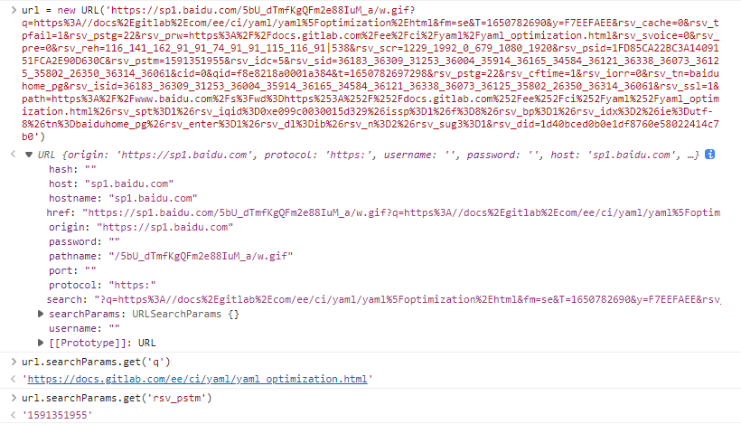
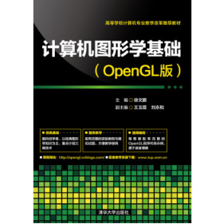

[TOC]

### iScene-next .gitlab-ci.yml

```yaml
# This file is a template, and might need editing before it works on your project.
# Official framework image. Look for the different tagged releases at:
# https://hub.docker.com/r/library/node/tags/
image: node:16.13.0

# This folder is cached between builds
# http://docs.gitlab.com/ce/ci/yaml/README.html#cache
# cache:
#   paths:
#   - node_modules/

before_script:
  - yarn install --registry http://172.16.11.21:4873

stages:
  - lint
  - test
  - publish

lint:
  stage: lint
  script:
   - npx sucrase-node scripts/gen-version.ts
   - npx eslint . --ext .vue,.js,.ts,.jsx,.tsx --max-warnings 0 --fix
  only:
   - /^(feature-)/
   - /^(release-)/
   - /^(fix-)/
   - dev

# 发布开发环境应用
pub-test:
  stage: test
  script:
   - npx sucrase-node scripts/gen-version.ts
   - yarn build-app
   - node ./node_modules/pubt/bin/pubt.js commit -f app/dist/iScene -d http://172.16.11.19:4899/receiver -t D:\\tomcat-8010\\webapps\\web3d-next\\iScene -r
   - yarn build-docs
   - node ./node_modules/pubt/bin/pubt.js commit -f document/dist -d http://172.16.11.19:4899/receiver -t D:\\tomcat-8010\\webapps\\smart3d-vue\\ -r
  only:
    - dev

# 发布版本
publish:
  stage: publish
  variables:
    TAG_VERSION: $CI_COMMIT_TAG
    SSH_USERNAME: $SSH_USERNAME
    SSH_PASSWORD: $SSH_PASSWORD
  script:
    - npx sucrase-node scripts/update-version.ts
    - npx sucrase-node scripts/gen-version.ts
    - yarn build-lib
    - yarn build-docs
    - node ./scripts/pub-document.js
    - npx sucrase-node scripts/pre-publish.ts
    - npm config set //172.16.11.21:4873/:_authToken $NPM_AUTH_TOKEN
    - npm publish --registry http://172.16.11.21:4873 --access public
  only:
    - tags
```


CI持续集成部分的工作，我们常用CI来做一些自动化工作，这种自动化工作会运行在一台集中的机器上，比如程序镜像的打包，单元测试，部署等，它可以节省项目开发迭代过程中维护正确的代码所耗费的时间。

例比如CI中自动测试，在多人协同开发的过程中，可能会有频繁的不同分支的代码推送更新，使用CI管道，可在代码发布的同时触发CI中定义的单元测试操作，以便于在开发早期发现错误，从而确保所有新代码的提交都不影响项目功能。


### 安装 GitLab Runner


### URL 接口




### scene.pickPosition 

跟地形有关. 看源码跟椭球体相关

```ts
/**
 * 屏幕坐标转世界坐标
 * @param position 屏幕坐标
 * @param viewer 视图对象
 *
 * @return 世界坐标
 */
export function screenToCartesian(
  position: Cesium.Cartesian2,
  viewer: Cesium.Viewer
): Cesium.Cartesian3 | undefined {
  if (position && viewer) {
    const cartesian = viewer.scene.pickPosition(position);
      // 如果拾取为undefined; (启明说地形没有加载出来就为 undefined)
    if (cartesian) {
      const cartographic = Cesium.Cartographic.fromCartesian(cartesian);
      if (cartographic.height < 0) {
        const ray = viewer.camera.getPickRay(position)!;
        return viewer.scene.globe.pick(ray, viewer.scene);
      } else {
        return cartesian;
      }
    } else {
      return viewer.camera.pickEllipsoid(position, viewer.scene.globe.ellipsoid);
    }
  }
  return undefined;
}
```

两种拾取方法有什么区别呢?

#### pickEllipsoid [cesium/Camera.js](https://github.com/CesiumGS/cesium/blob/1.92/Source/Scene/Camera.js#L2849)

```js
const pickEllipsoid3DRay = new Ray();
function pickEllipsoid3D(camera, windowPosition, ellipsoid, result) {
  ellipsoid = defaultValue(ellipsoid, Ellipsoid.WGS84);
  const ray = camera.getPickRay(windowPosition, pickEllipsoid3DRay);
  const intersection = IntersectionTests.rayEllipsoid(ray, ellipsoid);
  if (!intersection) {
    return undefined;
  }

  const t = intersection.start > 0.0 ? intersection.start : intersection.stop;
  return Ray.getPoint(ray, t, result);
}

Camera.prototype.pickEllipsoid = function (windowPosition, ellipsoid, result) {
  //>>includeStart('debug', pragmas.debug);
  if (!defined(windowPosition)) {
    throw new DeveloperError("windowPosition is required.");
  }
  //>>includeEnd('debug');

  const canvas = this._scene.canvas;
  if (canvas.clientWidth === 0 || canvas.clientHeight === 0) {
    return undefined;
  }

  if (!defined(result)) {
    result = new Cartesian3();
  }

  ellipsoid = defaultValue(ellipsoid, Ellipsoid.WGS84);

  if (this._mode === SceneMode.SCENE3D) {
    result = pickEllipsoid3D(this, windowPosition, ellipsoid, result);
  } else if (this._mode === SceneMode.SCENE2D) {
    result = pickMap2D(this, windowPosition, this._projection, result);
  } else if (this._mode === SceneMode.COLUMBUS_VIEW) {
    result = pickMapColumbusView(
      this,
      windowPosition,
      this._projection,
      result
    );
  } else {
    return undefined;
  }

  return result;
};
```

#### pickPosition [cesium/Picking.js](https://github.com/CesiumGS/cesium/blob/a02b1a0762935ff709e914867bc3a80371179c44/Source/Scene/Picking.js#L473)

```js
Picking.prototype.pickPositionWorldCoordinates = function (
  scene,
  windowPosition,
  result
) {
  if (!scene.useDepthPicking) {
    return undefined;
  }

  //>>includeStart('debug', pragmas.debug);
  if (!defined(windowPosition)) {
    throw new DeveloperError("windowPosition is undefined.");
  }
  if (!scene.context.depthTexture) {
    throw new DeveloperError(
      "Picking from the depth buffer is not supported. Check pickPositionSupported."
    );
  }
  //>>includeEnd('debug');

  const cacheKey = windowPosition.toString();

  if (this._pickPositionCacheDirty) {
    this._pickPositionCache = {};
    this._pickPositionCacheDirty = false;
  } else if (this._pickPositionCache.hasOwnProperty(cacheKey)) {
    return Cartesian3.clone(this._pickPositionCache[cacheKey], result);
  }

  const frameState = scene.frameState;
  const context = scene.context;
  const uniformState = context.uniformState;

  const view = scene.defaultView;
  scene.view = view;

  const drawingBufferPosition = SceneTransforms.transformWindowToDrawingBuffer(
    scene,
    windowPosition,
    scratchPosition
  );
  if (scene.pickTranslucentDepth) {
    renderTranslucentDepthForPick(scene, drawingBufferPosition);
  } else {
    scene.updateFrameState();
    uniformState.update(frameState);
    scene.updateEnvironment();
  }
  drawingBufferPosition.y = scene.drawingBufferHeight - drawingBufferPosition.y;

  const camera = scene.camera;

  // Create a working frustum from the original camera frustum.
  let frustum;
  if (defined(camera.frustum.fov)) {
    frustum = camera.frustum.clone(scratchPerspectiveFrustum);
  } else if (defined(camera.frustum.infiniteProjectionMatrix)) {
    frustum = camera.frustum.clone(scratchPerspectiveOffCenterFrustum);
  } else if (defined(camera.frustum.width)) {
    frustum = camera.frustum.clone(scratchOrthographicFrustum);
  } else {
    frustum = camera.frustum.clone(scratchOrthographicOffCenterFrustum);
  }

  const frustumCommandsList = view.frustumCommandsList;
  const numFrustums = frustumCommandsList.length;
  for (let i = 0; i < numFrustums; ++i) {
    const pickDepth = this.getPickDepth(scene, i);
    const depth = pickDepth.getDepth(
      context,
      drawingBufferPosition.x,
      drawingBufferPosition.y
    );
    if (!defined(depth)) {
      continue;
    }
    if (depth > 0.0 && depth < 1.0) {
      const renderedFrustum = frustumCommandsList[i];
      let height2D;
      if (scene.mode === SceneMode.SCENE2D) {
        height2D = camera.position.z;
        camera.position.z = height2D - renderedFrustum.near + 1.0;
        frustum.far = Math.max(1.0, renderedFrustum.far - renderedFrustum.near);
        frustum.near = 1.0;
        uniformState.update(frameState);
        uniformState.updateFrustum(frustum);
      } else {
        frustum.near =
          renderedFrustum.near *
          (i !== 0 ? scene.opaqueFrustumNearOffset : 1.0);
        frustum.far = renderedFrustum.far;
        uniformState.updateFrustum(frustum);
      }

      result = SceneTransforms.drawingBufferToWgs84Coordinates(
        scene,
        drawingBufferPosition,
        depth,
        result
      );

      if (scene.mode === SceneMode.SCENE2D) {
        camera.position.z = height2D;
        uniformState.update(frameState);
      }

      this._pickPositionCache[cacheKey] = Cartesian3.clone(result);
      return result;
    }
  }

  this._pickPositionCache[cacheKey] = undefined;
  return undefined;
};

Picking.prototype.pickPosition = function (scene, windowPosition, result) {
  result = this.pickPositionWorldCoordinates(scene, windowPosition, result);
  if (defined(result) && scene.mode !== SceneMode.SCENE3D) {
    Cartesian3.fromElements(result.y, result.z, result.x, result);

    const projection = scene.mapProjection;
    const ellipsoid = projection.ellipsoid;

    const cart = projection.unproject(result, scratchPickPositionCartographic);
    ellipsoid.cartographicToCartesian(cart, result);
  }

  return result;
};
```


### IntersectionTests

[cesium/IntersectionTests.js at a02b1a0762935ff709e914867bc3a80371179c44 · CesiumGS/cesium (github.com)](https://github.com/CesiumGS/cesium/blob/a02b1a0762/Source/Core/IntersectionTests.js)

[IntersectionTests - Cesium Documentation](https://cesium.com/learn/cesiumjs/ref-doc/IntersectionTests.html?classFilter=inter)

射线与平面求交的源码 [cesium/IntersectionTests.js at 1.92 · CesiumGS/cesium (github.com)](https://github.com/CesiumGS/cesium/blob/1.92/Source/Core/IntersectionTests.js#L28)

```js
/**
 * Computes the intersection of a ray and a plane.
 *
 * @param {Ray} ray The ray.
 * @param {Plane} plane The plane.
 * @param {Cartesian3} [result] The object onto which to store the result.
 * @returns {Cartesian3} The intersection point or undefined if there is no intersections.
 */
IntersectionTests.rayPlane = function (ray, plane, result) {
  //>>includeStart('debug', pragmas.debug);
  if (!defined(ray)) {
    throw new DeveloperError("ray is required.");
  }
  if (!defined(plane)) {
    throw new DeveloperError("plane is required.");
  }
  //>>includeEnd('debug');

  if (!defined(result)) {
    result = new Cartesian3();
  }

  const origin = ray.origin;
  const direction = ray.direction;
  const normal = plane.normal;
  const denominator = Cartesian3.dot(normal, direction);

  // #1 如果点乘结果接近于0, 夹角为0, 射线在平面中, 与平面平行, 无交点
  if (Math.abs(denominator) < CesiumMath.EPSILON15) {
    // Ray is parallel to plane.  The ray may be in the polygon's plane.
    return undefined;
  }

  // 
  const t = (-plane.distance - Cartesian3.dot(normal, origin)) / denominator;

  if (t < 0) {
    return undefined;
  }

  result = Cartesian3.multiplyByScalar(direction, t, result);
  return Cartesian3.add(origin, result, result);
};
```

示例: 

```js
const ray = new Cesium.Ray(new Cesium.Cartesian3(0,0,0), new Cesium.Cartesian3(0,0,-1));
const plane = new Cesium.Plane(
    Cesium.Cartesian3.normalize(new Cesium.Cartesian3(0,0,2), new Cesium.Cartesian3()),
    10
);
console.log(ray);console.log(plane);
console.log(Cesium.IntersectionTests.rayPlane(ray, plane));
```

``` 
Ray {
	direction: Cartesian3 {x: 0, y: 0, z: -1}
	origin: Cartesian3 {x: 0, y: 0, z: 0}
    }
Plane {
	distance: 10,
	normal: Cartesian3 {x: 0, y: 0, z: 1}
	}
Cartesian3 {x: 0, y: 0, z: -10}
```

射线: 从原点射向(0,0,-1)

平面: 垂直于法向量(0,0,1), 且距离原点为10, 原点与法向量在平面的同一侧; 即可以理解为平面在z轴负值处.

射线与平面的焦点: `{x: 0, y: 0, z: -10}`


### Plane 的定义


### 图形学书籍: 虎书，计算机图形基础

**Fundamentals Of Computer Graphics(虎书)**

**计算机图形学基础**



