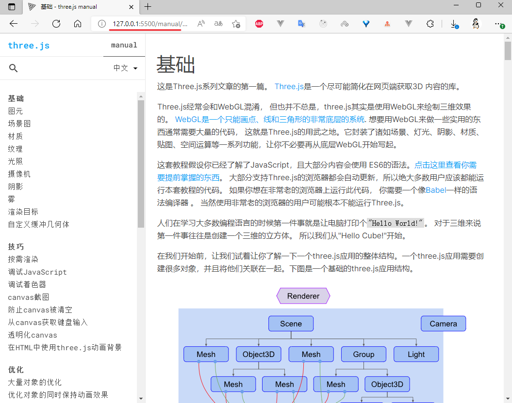

### Three.js系列文章 manual

从 github 上 clone 的代码中 开启 manual/zh 的live-server.

### pbf

[OSM和PBF数据格式说明 - 知乎 (zhihu.com)](https://zhuanlan.zhihu.com/p/362721985)

[mapbox/**pbf**: A low-level, lightweight protocol buffers implementation in JavaScript. (github.com)](https://github.com/mapbox/pbf)

PBF格式(Protocolbuffer Binary Format，协议缓存二进制格式)，主要用于替代XML格式。它的大小约是gzip压缩的一半，比bzip压缩小30%。它的写入速度比gzip压缩快5倍，读取速度比gzip压缩快6倍。这种格式的设计是为了支持未来的可扩展性和灵活性。
