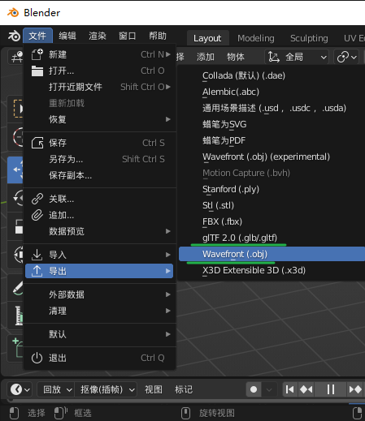
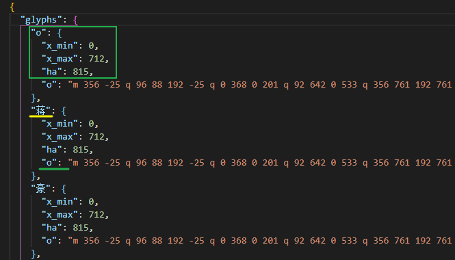
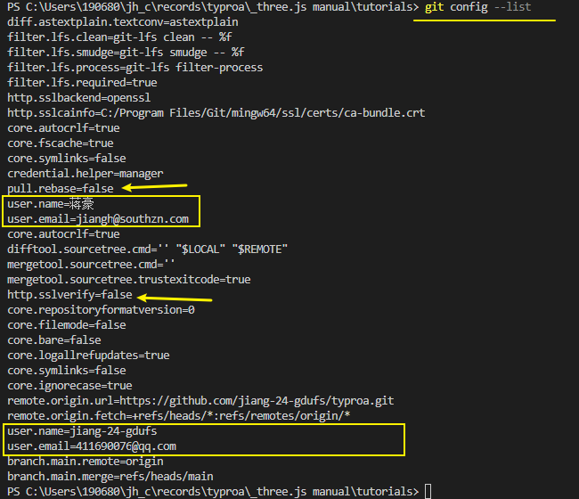

### blender - 创建三维数据

[Blender 3.1 参考手册 — Blender Manual](https://docs.blender.org/manual/zh-hans/3.1/)

### 颜色 HSL

基于色调、饱和度、亮度来设置颜色。

- `hue` 值从 0 到 1，红色在 0 的位置，绿色在 .33 的位置，蓝色在 .66 的位置。 (类似于rgb)
- `saturation` 值从 0 到 1，0 表示没有颜色，1 表示饱和度最高。 
- `luminance` 值从 0 到 1，0 表示黑色，1 表示白色，0.5 表示最大数量的颜色。
  - 换句说话，`luminance` 从 0 到 0.5 表示颜色从黑到 `hue`，从 0.5 到 1.0 表示颜色从 `hue` 到白。

### 字体文件

### git 推送失败

**OpenSSL SSL_read: Connection was reset, errno 10054 #2251**

https://github.com/Kong/insomnia/issues/2251

