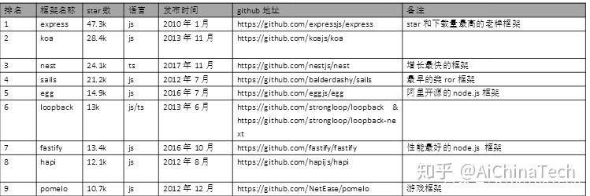
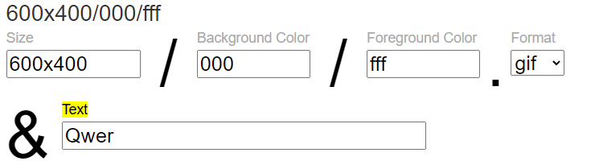
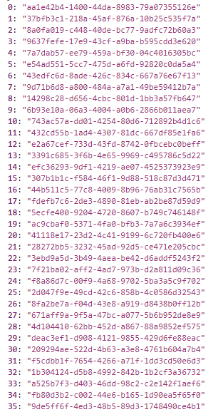

[TOC]

### ali [低代码引擎 | LowCodeEngine (lowcode-engine.cn)](https://lowcode-engine.cn/lowcode)

符合《低代码引擎物料协议规范》的 **Schema JSON**

**出码模块 Schema2Code**：专注于通过 Schema JSON 生成高质量源代码，将符合《低代码搭建基础协议规范》的 Schema JSON 数据分别转化为面向 React / Rax / 阿里小程序等终端可渲染的代码。


### 易知微 [易知微-EasyV数字孪生|智慧城市园区工厂水利双碳|三维地图数据可视化大屏](https://easyv.cloud/)


### 大屏模板参考

[山海鲸数据可视化大屏软件_海量数据可视化大屏模板_免费一键使用 (shanhaibi.com)](https://www.shanhaibi.com/)

### git error
OpenSSL SSL_read: Connection was reset, errno 10054

[Git 错误：OpenSSL SSL_read Connection was reset, errno 10054 - 知乎 (zhihu.com)](https://zhuanlan.zhihu.com/p/499986340)

1. 检查用户名/邮箱配置

   理论上来说修改仓库的用户信息配置即可.. 但是不知道为什么经常提交的时候报错

2. 解除SSL认证(可选) 

   **可能跟 `http.sslVerify` 配置相关, 下次先不调整这个了.**

3. 更改post buffer `git config http.postBuffer 5242880003` (理论上更改这个postBuffer不起作用)

主要是网络隔离的原因

https://stackoverflow.com/questions/68441676/git-push-error-rpc-failed-curl-52-openssl-ssl-read-connection-was-reset-errn

> Some reasons you know(I am a developer from China), and I also encountered this problem, but I have not solved it after seeing many solutions.
>
> Finally, I replaced a vpn and it took effect. 


##### 【掘金夜谈No.1】畅聊 VUE3.0 & 前端技术新趋势

[【掘金夜谈No.1】畅聊 VUE3.0 & 前端技术新趋势（尤雨溪携手字节前端专家，畅聊 Vue 3.0 & 前端技术新趋势） (juejin.cn)](https://live.juejin.cn/4354/vue3)


### vite+ts系统模板

[手把手教你用 vite+vue3+ts+pinia+vueuse 打造大厂企业级前端项目 - 掘金 (juejin.cn)](https://juejin.cn/post/7079785777692934174)


### echarts 图表动效

示例: https://www.cnblogs.com/ttxue/p/13366495.html?ivk_sa=1024320u

`animation` 配置项


### server + mockjs

如何开启一个服务 并能够让前端请求

使用Express写接口: [nodejs express 写一个接口全过程 - 掘金 (juejin.cn)](https://juejin.cn/post/6844904024630624270)


### koa

koa 是由 Express 原班人马打造的，致力于成为一个更小、更富有表现力、更健壮的 Web 框架。使用 koa 编写 web 应用，通过组合不同的 generator，可以免除重复繁琐的回调函数嵌套，并极大地提升错误处理的效率。koa 不在内核方法中绑定任何中间件，它仅仅提供了一个轻量优雅的函数库，使得编写 Web 应用变得得心应手。

[Koa(koa.js)中文网 -- 基于 Node.js 平台的下一代 web 开发框架 (koajs.com.cn)](https://www.koajs.com.cn/#)


### [2021 年最值得使用的 Node.js 框架 - 掘金 (juejin.cn)](https://juejin.cn/post/6955402195311263751)




### [概述 | Egg (eggjs.github.io)](https://eggjs.github.io/zh/guide/)

EGG: 基于koa2的框架, 非常不错的文档


### dummyimage.com

从 mock.js 文档中的 `Random.image()` 示例中发现的

任意尺寸的在线图片API

`https://dummyimage.com/600x400/000/abc.gif&text=qq+_ww`



`bgc~背景颜色默认为 #ccc`

`fgc~前景(文字颜色)默认为黑色`

`图片格式支持: .gif .jpg .png`


### GUID

GUID 的格式为“xxxxxxxx-xxxx-xxxx-xxxx-xxxxxxxxxxxx”，其中每个 x 是 0-9 或 a-f 范围内的一个十六进制的数字。例如：6F9619FF-8B86-D011-B42D-00C04FC964FF 即为有效的 GUID 值。

为什么要用GUID？
世界上的任何两台计算机都不会生成重复的 GUID 值。GUID 主要用于在拥有多个节点、多台计算机的网络或系统中，分配必须具有唯一性的标识符。

```JS
// Cesium.createGuid
function createGuid() {
  // http://stackoverflow.com/questions/105034/how-to-create-a-guid-uuid-in-javascript
  return "xxxxxxxx-xxxx-4xxx-yxxx-xxxxxxxxxxxx".replace(/[xy]/g, function (c) {
    const r = (Math.random() * 16) | 0;
    const v = c === "x" ? r : (r & 0x3) | 0x8;
    return v.toString(16);
  });
}
```

为什么有一个4呢? 为什么又有一个y呢?

`Array(100).fill(0).map(createGuid)`



### [JSON Schema | The home of JSON Schema (json-schema.org)](http://json-schema.org/)
