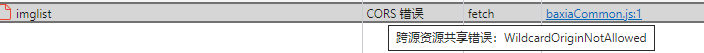
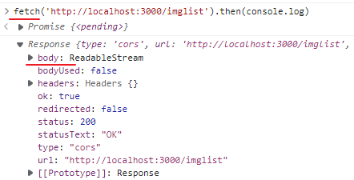

### Vue2 的mixin如何使用在Vue3 setup中

在 Vue 2 中，mixin 是将部分组件逻辑抽象成可重用块的主要工具。但是，他们有几个问题：

- Mixin 很容易发生冲突：因为每个 mixin 的 property 都被合并到同一个组件中，所以为了避免 property 名冲突，你仍然需要了解其他每个特性。
- 可重用性是有限的：我们不能向 mixin 传递任何参数来改变它的逻辑，这降低了它们在抽象逻辑方面的灵活性。

为了解决这些问题，我们添加了一种通过逻辑关注点组织代码的新方法：[组合式 API](https://v3.cn.vuejs.org/guide/composition-api-introduction.html)。


### tooljet

**Introduction**

ToolJet is an **open-source low-code framework** to build and deploy custom internal tools. ToolJet can connect to your data sources such as databases ( PostgreSQL, MongoDB, MySQL, Elasticsearch, Firestore, DynamoDB, Redis and more ), API endpoints ( ToolJet supports OAuth2 authorization ) and external services ( Stripe, Slack, Google Sheets, Airtable and more ). Once the data sources are connected, ToolJet can run queries on these data sources to fetch and update data. The data fetched from data sources can be visualised and modified using the UI widgets such as tables, charts, forms, etc.

ToolJet是一个开源低代码框架，用于构建和部署自定义内部工具。 Tooljet可以连接到您的数据源，例如数据库（PostgreSQL，MongoDB，MySQL，Elasticsearch，Firestore，Firestore，DynamoDB，Redis等），API端点（工具喷气机（Tooljet）（工具喷射支持OAUTH2授权）和外部服务（Stripe，Stripe，STRIPE，SLACK，SLACK，GOOGLE SHAETS，AIRTABLE，AIRTABLE和GOOGLE SHAETS，AIRTABLE等，更多 ）。 一旦连接了数据源，工具开机就可以在这些数据源上运行查询以获取和更新数据。 从数据源获取的数据可以使用UI小部件（例如表，图表，表单）进行可视化和修改。


### express 开启跨域

```js
// app.js
var app = express();

//设置允许跨域访问该服务.
app.all('*', function (req, res, next) {
  res.header('Access-Control-Allow-Origin', '*');
  res.header('Access-Control-Allow-Headers', 'Content-Type');
  res.header('Access-Control-Allow-Methods', '*');
  res.header('Content-Type', 'application/json;charset=utf-8');
  next();
});
```

or

#### 安装`cors`

```js
npm install cors --save-dev

const cors = require('cors');
app.use(cors());
```


配置跨域后 阿里配置数据源仍旧报错



但是控制台发fetch请求不会报错




### ReadableStream

[ReadableStream - Web API 接口参考 | MDN (mozilla.org)](https://developer.mozilla.org/zh-CN/docs/Web/API/ReadableStream)

[ReadableStream.ReadableStream() - Web API 接口参考 | MDN (mozilla.org)](https://developer.mozilla.org/zh-CN/docs/Web/API/ReadableStream/ReadableStream)
