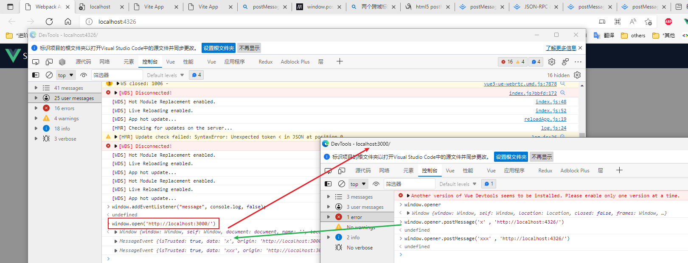
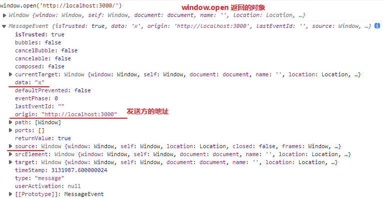
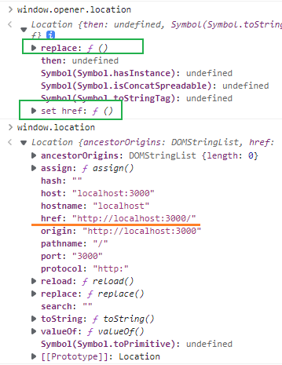
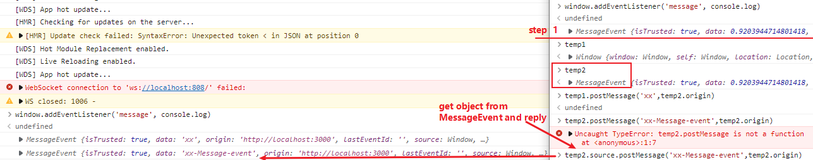
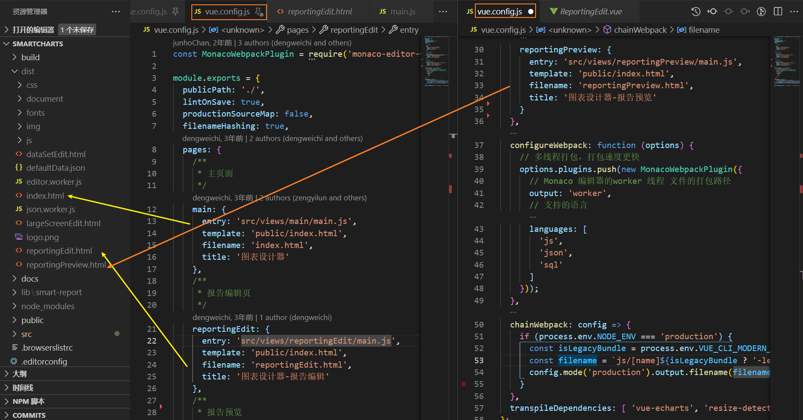
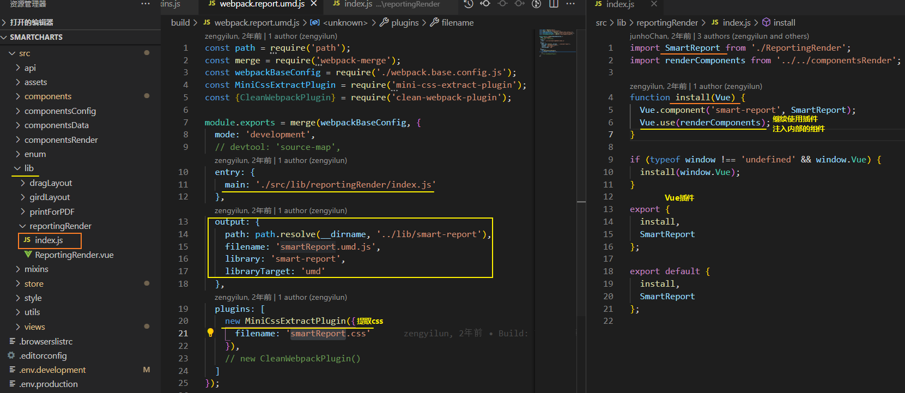

[TOC]

### postMessage 通信

[window.postMessage - Web API 接口参考 | MDN (mozilla.org)](https://developer.mozilla.org/zh-CN/docs/Web/API/Window/postMessage)


通常，对于两个不同页面的脚本，只有当执行它们的页面位于具有相同的协议（通常为https），端口号（443为https的默认值），以及主机 (两个页面的模数 [`Document.domain`](https://developer.mozilla.org/zh-CN/docs/Web/API/Document/domain)设置为相同的值) 时，即满足"同源政策"时,这两个脚本才能相互通信。

**window.postMessage()** 方法提供了一种受控机制来规避此限制可以安全地实现跨源通信，只要正确的使用，这种方法就很安全。

**重点**: 一个窗口可以获得对另一个窗口的**引用**（比如 `targetWindow = window.opener`），然后在窗口上调用 `targetWindow.postMessage()` 方法分发一个  [`MessageEvent`](https://developer.mozilla.org/zh-CN/docs/Web/API/MessageEvent) 消息。





#### window.location vs window.opener.location




#### 父子页面是必须的吗?

在一个服务器上面的两个不相干页面能否使用这种方式通信呢，我看好像都是要获取窗口或者页面的引用才可以使用

可以在**两个页面中**都嵌入一个**相同源 iframe**，使用这个**源做一个中间层**，使用localStorage即可?

- 疑问?: 有两个iframe窗口他们的localStorage是通用的吗, 可以通信吗


## 跨域的两个tab通信方案

- postMessage

  - A tab 使用window.open(`url-B`)打开B tab

  - B tab 使用 `window.opener.postMessage(mes, url-A)` 进行通信; 

    - A tab.postMessage(mes, url-A)  in B tab JS.. 这算postMessage通信的正确打开方式吗?
    - 换个通信发起方,A as opener.postMessage(mes, url-B)

  - 

  - 为了安全需要Tab均知道对方通信地址的source, 用于通信及接受信息后的安全校验(可手动增强_三次握手), 可以考虑使用第三方库;

  - 双方都需要监听 `message` 事件用于双方通信, 

    - opener = window.open(); opener.postMessage(mes, URL-B)

    - B tab 可以在 message 事件中获取到发送方的origin和source, 用于回复

      `source.postMessage('x', origin)`

      

    - 基于此, 只需要父页面opener配置需要打开的地址.

- 


### 原smartCharts多页面打包配置



不同的入口/模板


#### 打包成 lib 

`  "lib:report": "rimraf -rf ./lib && webpack --config build/webpack.report.umd.js"`



#### 以npm安装的方式引入smartCharts

```js
import SmartCharts from 'smart-charts';
import 'smart-charts/lib/smart-report/smartReport.css';

Vue.use(SmartCharts);
```


### 原smartCharts更新vite配置

#### 多页面应用


#### 输出lib
