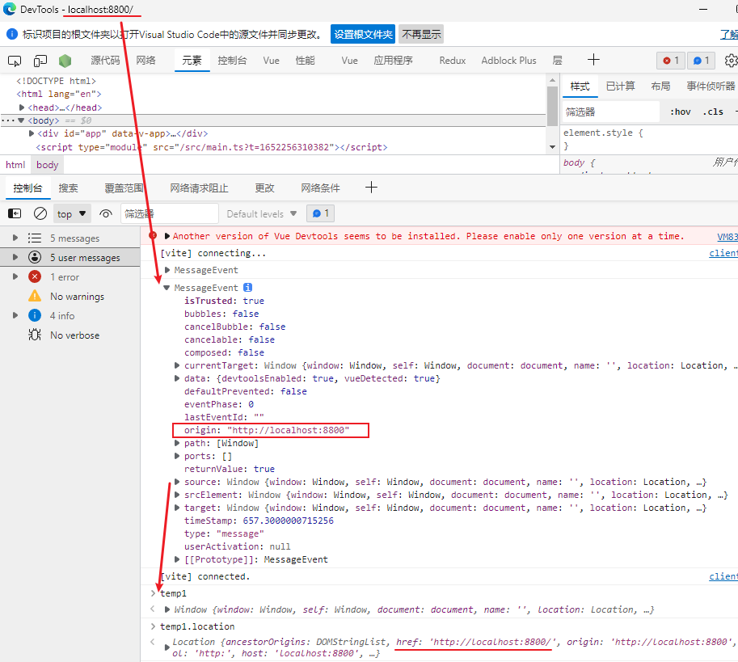

[TOC]

### [window.postMessage - Web API 接口参考 | MDN (mozilla.org)](https://developer.mozilla.org/zh-CN/docs/Web/API/Window/postMessage)

### vuedevtools

如果安装`vue-devtools`, 在vue应用下监听message事件, 可以看到该窗口对自己发送的`message` 

### postmate

[dollarshaveclub/postmate:  A powerful, simple, promise-based postMessage library.](https://github.com/dollarshaveclub/postmate)

### ora

[sindresorhus/ora: Elegant terminal spinner (github.com)](https://github.com/sindresorhus/ora)

### tauri

https://github.com/tauri-apps/tauri

Tauri is a framework for building tiny, blazingly fast binaries for all major **desktop platforms**. 

#### Tauri 是什么

Tauri 是一个跨平台 `GUI` 框架，与 `Electron` 的思想基本类似。Tauri 的前端实现也是基于 Web 系列语言，Tauri 的后端使用 `Rust`。

Tauri 可以创建体积更小、运行更快、更加安全的跨平台桌面应用。

Tauri 主打的 更小、更快、更安全，相较于 `Electron` 让人诟病的包太大、内存消耗过大等问题来看，的确是一个很有潜力的桌面端应用开发框架

前端使用 Tauri 流程: https://juejin.cn/post/7067342513920540686

### appwrite

Appwrite是一个基于Docker的端到端开发者平台，其容器化的微服务库可应用于网页端，移动端，以及后端。

Appwrite 通过视觉化界面极简了从零编写 API 的繁琐过程，在保证软件安全的前提下为开发者创造了一个高效的开发环境。

Appwrite 可以提供给开发者用户验证，外部授权，用户数据读写检索，文件储存，图像处理，云函数计算，[等多种服务](https://appwrite.io/docs).

https://github.com/appwrite/appwrite

### [bitburner](https://github.com/danielyxie/bitburner)

Bitburner is a programming-based [incremental game](https://en.wikipedia.org/wiki/Incremental_game) that revolves around hacking and cyberpunk themes. The game can be played at https://danielyxie.github.io/bitburner or installed through [Steam](https://store.steampowered.com/app/1812820/Bitburner/).

### [naptha/tesseract.js：适用于 100 多种语言📖🎉🖥的纯 Javascript OCR (github.com)](https://github.com/naptha/tesseract.js)

Tesseract.js是一个javascript库，可以从图像中获取[几乎任何语言](https://github.com/naptha/tesseract.js/blob/master/docs/tesseract_lang_list.md)的单词
