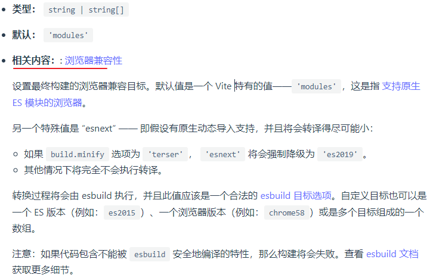
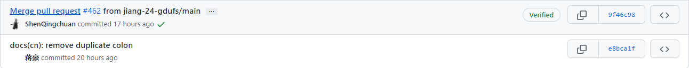
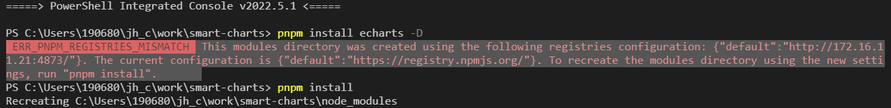

### 新的pr..hia?

多了个冒号..

提交了PR 并且被merge了, 但是没有找到自己 in Contributors

### Contributions未被Github计入的几个常见原因

- 进行Commits的用户没有被关联到你的Github帐号中。
- 不是在这个版本库的默认分支进行的Commit。
- 这个仓库是一个Fork仓库，而不是独立仓库。

可能是因为没有配置成功这个github的账户.. 导致提交用户为企业邮箱的办公环境的用户了.. 这波有点亏..

可能跟 `http.sslVerify` 配置相关, 下次先不调整这个了. 或者使用私人电脑进行处理.

### pnpm 注册地址冲突

### 引入 echarts 

