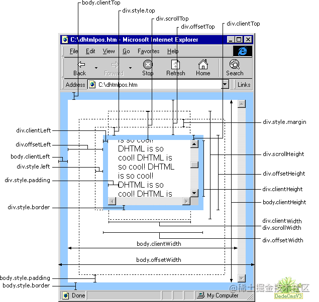

### 浏览器窗口尺寸:

clientX ? clientY?

### 删除 node_modules 的库

rimraf

[isaacs/rimraf: A `rm -rf` util for nodejs (github.com)](https://github.com/isaacs/rimraf)

### vueuse

Anthony Fu 大牛: [VueUse](https://vueuse.org/)

Collection of essential Vue Composition Utilities for Vue 2 and 3

### element-plus 按需引入 & tree-shaking

[# 按需引入](https://element-plus.gitee.io/zh-CN/guide/quickstart.html#%E6%8C%89%E9%9C%80%E5%AF%BC%E5%85%A5)

[# 手动导入](https://element-plus.gitee.io/zh-CN/guide/quickstart.html#%E6%89%8B%E5%8A%A8%E5%AF%BC%E5%85%A5)

### 切换镜像地址后终于不卡了

淘宝镜像NPM 镜像站喊你切换新域名啦。新的Web 站点：[https://npmmirror.com](https://link.zhihu.com/?target=https%3A//npmmirror.com)，Registry Endpoint：[https://registry.npmmirror.com](https://link.zhihu.com/?target=https%3A//registry.npmmirror.com)。随着新的域名已经正式启用，老 [http://npm.taobao.org](https://link.zhihu.com/?target=http%3A//npm.taobao.org) 和 [http://registry.npm.taobao.org](https://link.zhihu.com/?target=http%3A//registry.npm.taobao.org) 域名将于 2022 年 05 月 31 日零时起停止服务。（望周知，求转发）

