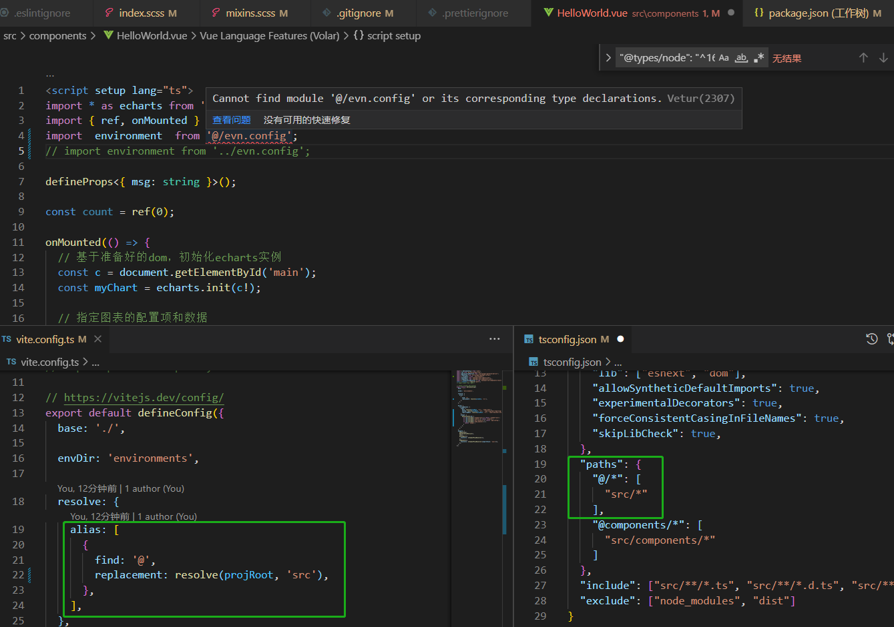

### vite + ts 配置别名如何判断生效?

配置了 vite.config.ts & tsconfig.json 的别名; 

**可以正常访问.. 结果eslint还是报错...**

vite 配置别名可以正常访问 eslint 报错

`tsconfig.json`需要把 `paths` 放在 `compilerOptions`配置项中..

### pretty-quick

Runs [Prettier](https://prettier.io/) on your changed files.

https://www.npmjs.com/package/pretty-quick
