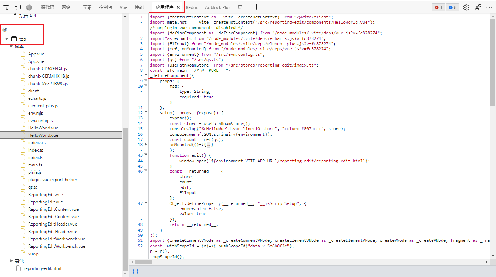
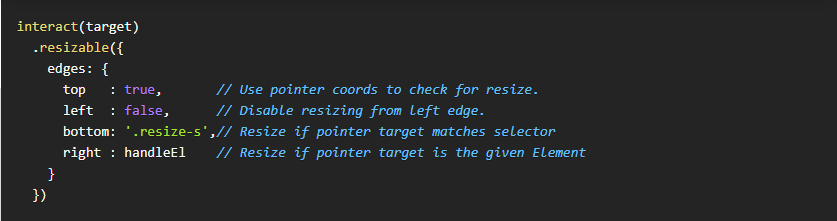

[toc]

### 多页面应用其中一个html的内容

编译后的内容

### Vue3 如何 替换 Vue2 中的 eventbus

`$on`，`$off` 和 `$once` 实例方法已被移除，组件实例不再实现事件触发接口。

### interact.js

https://interactjs.io/

JavaScript drag and drop, resizing, and multi-touch gestures

### Vue 3 监听插槽 内抛出的事件

slot组件和外层组件其实并不是父子组件关系，**非父子组件通信**我们可以考虑**事件总线**（event bus）或者**状态管理模式**（vuex）
